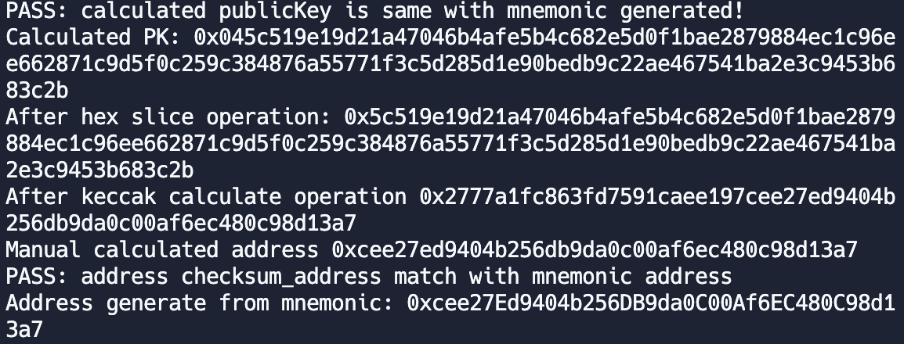

### 杂凑函数背景知识

杂凑函数，通常也被称作哈希函数 (Hash function)，通过对一段消息或数据进行压缩处理，使数据长度从**任意长度**变为**固定长度**的数学函数，杂凑函数的输入被称为预映射或输入数据，杂凑函数的输出被称为哈希值，一个常见的杂凑函数模型如下图所示：


在理论上对于一个 Hash 值，理论上存在若干个输入消息与之对应，这时就产生了**碰撞**。一个好的 Hash 函数应具备抗**碰撞**的特性。

一个好的哈希函数需要满足如下基本需求：

| 需求     | 描述                                       |
| ------ | ---------------------------------------- |
| 输入长度可变 | hash函数可以应用于任意长度的数据                       |
| 输出长度固定 | hash函数的输出长度固定                            |
| 运算效率     | 对于任意的杂凑函数输入 $x$，计算 $H(x)$ 是容易的                 |
| 单向性    | 对于任意哈希值h，想要找到满足$H(x)=h$ 的x在计算上是复杂且难以实现的       |
| 抗弱碰撞性  | 对于任意消息x，找到满足另一消息y，满足$H(x)=H(y)$ ，在计算上不可行 |
| 抗强碰撞性  | 找到任意一对满足 $H(x)=H(y)$ 的消息x和y在计算上不可行      |
| 伪随机性   | 哈希函数的输出满足伪随机性测试标准。                       |

Hash 值存在的目的和作用如下：

- 确保消息的完整性，即确保收到的数据确实和发送时的一样（即没有修改、插入、删除或重放），防止中间人篡改。如**确保区块链交易的完整性，应用程序安装包完整性**
- 数据冗余校验，如**区块链钱包对助记词对应私钥生成的校验信息**
- 单向口令文件，如**linux系统的解锁口令所对应的加密密文**
- 入侵检测和病毒检测中对特征码的检测及生成，如**数字指纹**
- 伪随机数生成器


| 算法类型   | 输出 Hash 值长度       | 备注    |
| ------ | ----------------- | ----------------- |
| MD5    | 128 bit  | 不安全  |
| SHA1   | 160 bit           | 不安全          |
| SHA256 | 256 bit           | 安全           |
| SHA3 | 224 256 384 512 bit | NIST 摘要竞赛优胜算法，与 Keccak-256 在使用的加密参数上存在一些区别 |
| Keccak-256 | 256 bit | 以太坊实现并使用的摘要算法，与 SHA3 在使用的加密参数上存在一些区别 |

为了佐证 SHA3 与 Keccak-256 的区别，我们将给出一个例子，用一个给定输入的已知结果来判断及区分 Keccak-256 与 SHA3 算法，用于测试杂凑函数最通用的方法是使用空的输入。如果使用杂凑函数计算输入的空字符串的哈希值，应得到如下结果，这一例子也很好的佐证了**由于底层使用加密参数存在不同，同一输入产生的杂凑值结果差异极大**：

```
SHA3("") = a7ffc6f8bf1ed76651c14756a061d662f580ff4de43b49fa82d80a4b80f8434a

Keccak-256("") = c5d2460186f7233c927e7db2dcc703c0e500b653ca82273b7bfad8045d85a470
```

### 杂凑函数与区块链

在以太坊中，基于密码学所设计的杂凑函数无处不在，以太坊协议中多处用到了名为 Keccak-256 的密码学杂凑函数。Keccak-256 是 2007 年由 NIST 在 SHA-3 密码学哈希函数竞赛中提出的。 Keccak 胜出并最终在 2015 年成为 FIPS 202 标准。

杂凑函数在区块链中一个重要的应用是利用钱包公钥，生成钱包地址，代码实例如下：

```javascript
const { utils, Wallet } = require("ethers");

let walletMnemonic = Wallet.createRandom();//使用随机生成的私钥

let privateKey = walletMnemonic.privateKey;//获取私钥

let compare_public_key = walletMnemonic.publicKey;//通过调用直接获取公钥

let publicKey = utils.computePublicKey(privateKey);//通过调用 computePublicKey 利用私钥计算对应公钥

if (compare_public_key !== publicKey)//一致性比较
{
  console.log(`ERROR: calculated publicKey is error!`)
}
else
{
  console.log(`PASS: calculated publicKey is same with mnemonic generated!`)
}

console.log("Calculated PK:",publicKey);

let slice_PublicKey = utils.hexDataSlice(publicKey,1);//移除第一个字节 0x04

console.log("After hex slice operation:",slice_PublicKey);

let keccak_result = utils.keccak256(slice_PublicKey);//计算公钥的 keccak256 杂凑函数

console.log("After keccak calculate operation",keccak_result);

let address = utils.hexDataSlice(keccak_result,12);//移除前12个字节，保留后 20 字节，keccack256 的输出结果共 32 字节长

console.log("Manual calculated address",address);

let checksum_address = utils.getAddress(address);//调用 getAddress方法 获取经过校验和修订后的地址

if(checksum_address !== walletMnemonic.address)//地址一致性比较
{
  console.log("ERROR: address does not match");
}
else
{
  console.log("PASS: address checksum_address match with mnemonic address");
}

console.log("Address generate from mnemonic:",walletMnemonic.address);//利用已有 Wallet 库直接获取的公钥
```

上述代码执行结果如下图所示：



