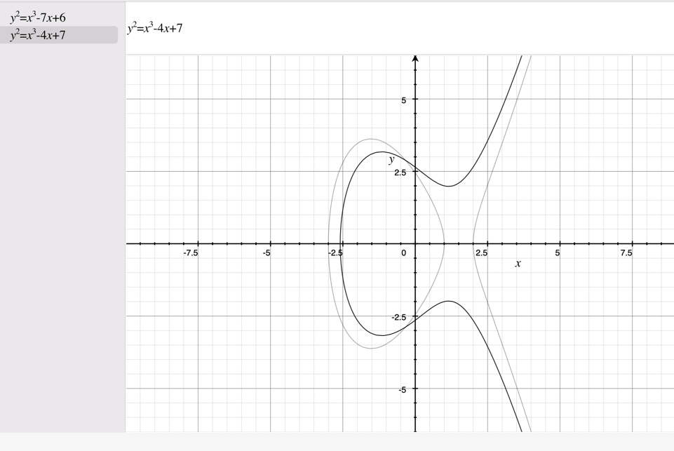
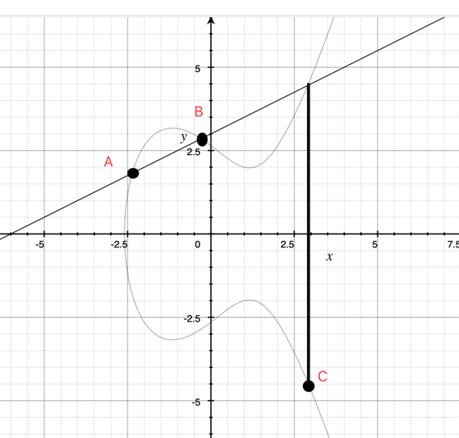
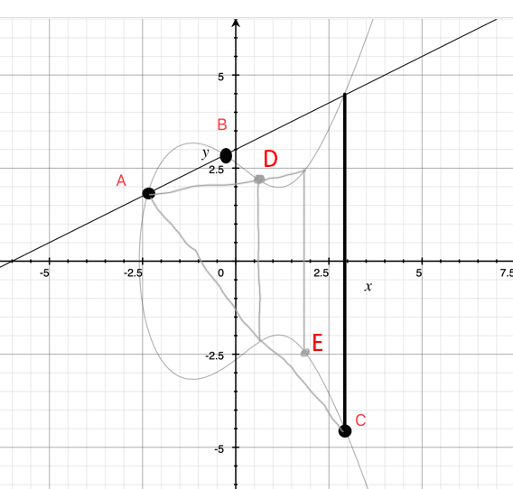
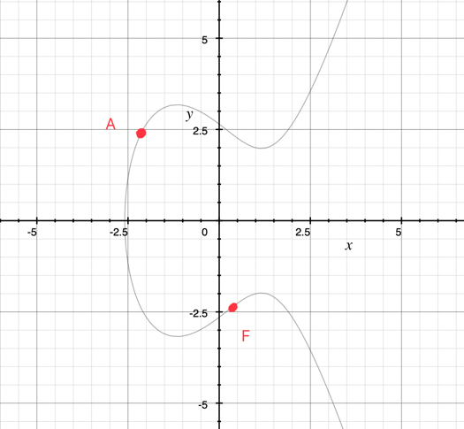
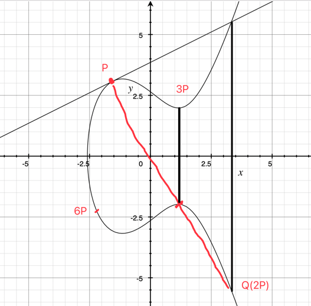
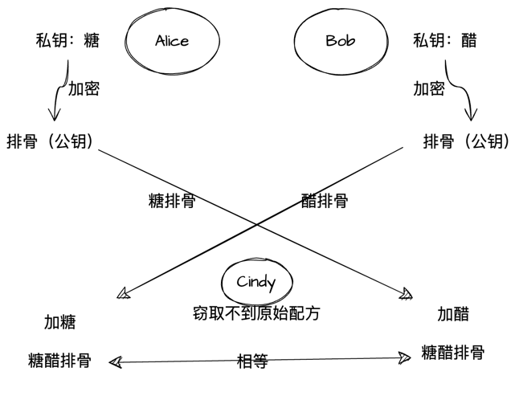
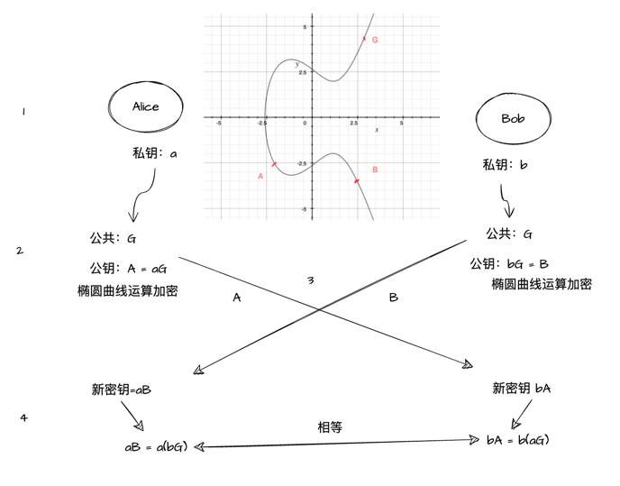

## 简介

ECC(Ellipse Curve Cryptography)又称椭圆曲线密码体制、椭圆曲线加密算法等。 椭圆曲线加密算法在比特币、区块链上有着广泛的应用。

公式：
y^2 = x^3 + ax + b

这里使用简单易懂的方式对大家介绍这部分内容，让大家有个简单的理解

## 原理简介

### 公私钥加密内容
公钥未公开部分，私钥则是不可泄露的
过程就是吧需要加密的信息用公钥进行加密，然后发送给私钥进行解密，且只有私钥可以进行解密
这里就会牵扯出两个问题：
1. 公钥加密的过程是快速的，且简单的
2. 加密后的信息是不可逆的且直接进行解密是困难的，即不可逆。

### 图形讲解

椭圆曲线示例：

1. 椭圆曲线是x轴对称的，在y轴正向随便选择一个点，-y一定会有一个对称点
2. 随便在图形上找两个点，两个点连成线，然后延长会经过第三个点（垂直线除外）

如图，A、B延长线之后，寻找y轴的对称点，会得到点C，即一个运算，A-B得到C
简单的说为点运算（此点运算就是椭圆曲线的加运算）：A点B=C

连接AC，相交于一点，找到其对称点 D，即：A点C=D

依次类推，比如点E，再一次连接AE，可以找到更多的点

假设一个条件：
已知起点为A、终点为F点，请问经过多少次点运算可以得到点F

如果说给出路径来看的话，肯定是可以得出F点的点运算次数，但是如果没有的话就相当困难了，比如你打桌球，让你的朋友看到白球的起点，然后闭眼，
你开始打，停到某个位置后告诉你朋友睁眼，问他：请问我打出白球的路线，这肯定是不知道的，包括有可能你自己都忘记了。
这也就是其中的一个原则：正向容易，逆向难（加密简单，解密困难）

但是有一个特例，比如说上图，点P是一个切点，延长线的对称点为Q点，切点可以当做是2个点的重合点，即P点P=Q = 2P
然后再次延长相交对称：P点2P=3P
再依次对称可以得到6P点，6P就很特殊了，只看此定义，可以这样：
(3p)2 = 6P
(2p)3 = 6p
乘法问题。

### DH算法原理
简单举一个例子糖醋排骨，Alice和Bob都有一个独特的配方，Alice的糖，Bob的醋，Cindy是他们之间的联络员，但是Cindy总想偷他们的配方
Alice这里加糖处理好排骨之后，会通过Cindy发给Bob，Bob使用醋处理好排骨之后会通过Cindy发给Alice，
这时候Cindy是没法获取完全的配方及成品的，然后Alice和Bob获得各自货物后，进行再加工，Alice加白糖，Bob加醋，就形成了糖醋排骨的原始材料，
进行烹制后就是糖醋排骨了，这样就可以拿取卖了，这里会发现，Cindy虽然都接触到了，但是没有拿到核心的配方，也么有办法窃取他们的成果。

其中排骨是公开的，这个就可以类比为公钥，Cindy因为没有其他人的私钥，所以最终也获取不到糖醋排骨。

在此基础上加上椭圆曲线算法

1. Alice生成私钥a，Bob生成私钥b，
2. Alice和Bob都有一个公共的数据G，其是开放的，所有人都可以知道，然后Alice使用私钥经过a次点运算生成公钥A，Bob也是用生成公钥B
3. 然后进行交换，A、B的运算就是使用的椭圆曲线加密运算，因为a次后生成A，这个次数是很难知道的，不可逆的，所以A是不能反向退出a的，相同的B也不能反向退出点b
4. 互换之后，Alice产生一个新密钥，aB，Bob产生一个新密钥bA，然后根据刚才描述的(3p)2 = 6P问题，将aB与bA拆解：
   1. aB = a(bG)
   2. bA=b(aG)
   其中就可以把  a(bG) = b(aG) ，即 aB = bA
ECDHE就是以上的椭圆曲线与DH混合起来的密钥交换算法，正向容易、逆向困难

## 扩展阅读

https://zhuanlan.zhihu.com/p/42629724
https://www.pianshen.com/article/32121018802/
https://www.cnblogs.com/Kalafinaian/p/7392505.html
