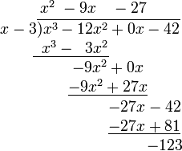
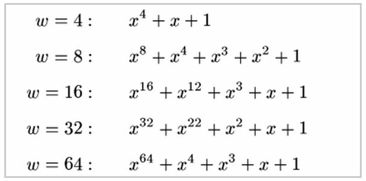
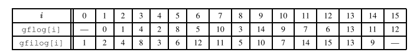

### 伽罗华域（Galois Field）上的四则运算

[原文](https://blog.csdn.net/shelldon/article/details/54729687)

# 域运算

伽罗华域（Galois Field）上的四则运算

Évariste Galois  ，伽罗华（也译作伽瓦罗），法国数学家，群论的创立者。用群论彻底解决了根式求解代数方程的问题，而且由此发展了一整套关于群和域的理论。  
本文介绍伽罗华域，以及在伽罗华域上的四则运算方式。伽罗华域上的四则运算实际上是多项式计算，后文中详细介绍。

## 一、相关数学概念

### 1、域

一组元素的集合，以及在集合上的四则运算，构成一个域。其中加法和乘法必须满足交换、结合和分配的规律。加法和乘法具有封闭性，即加法和乘法结果仍然是域中的元素。<br />域中必须有加法单位元和乘法单位元，且每一个元素都有对应的加法逆元和乘法逆元。但不要求域中的  0 有乘法逆元。

### 2、有限域

仅含有限多个元素的域。因为它由伽罗华所发现，因而又称为伽罗华域。  
所以当我们说伽罗华域的时候，就是指有限域。

GF（2^w）表示含有2^w个元素的有限域。

### 3、单位元

Identity Element，也叫幺元（么元），通常使用e来表示单位元。单位元和其他元素结合时，并不会改变那些元素。  
对于二元运算*，若a*e=a，e称为右单位元；若e*a=a，e称为左单位元，若a*e=e*a=a，则e称为单位元。

### 4、逆元

对于二元运算*，若a*b=e，则a称为b的左逆元素，b称为a的右逆元素。若a*b=b*a=e，则称a为b的逆元，b为a的逆元。

### 5、本原多项式

域中不可约多项式是不能够进行因子分解的多项式， 本原多项式 （primitive polynomial）是一种特殊的不可约多项式。当一个域上的本原多项式确定了，这个域上的运算也就确定了。本原多项式一般通过查表可得，同一个域往往有多个本原多项式。  
通过将域中的元素化为多项式形式，可以将域上的乘法运算转化为普通的多项式乘法再模本原多项式。

## 二、多项式运算

由于GF（2^w）上的四则运算是基于多项式运算的，这里先介绍多项式运算。  
多项式一般长这个样子：f(x) = x^6 + x^ 4 + x^2 + x + 1。

### 1、多项式加减法

将两个多项式中相同阶数的项系数相加或相减。  
例如 (x^2 + x ) + (x + 1) = x^2 + 2x +1

### 2、多项式乘法

将其中一个多项式的各项分别与另一个多项式的各项相乘，然后把相同指数的项的系数相加。  
例如 (x^2 + x) * (x + 1) = x^2 * (x + 1) + x * (x + 1） = x^3 + x^2 + x^2 + x

### 3、多项式除法

使用长除法。例如计算x^3-12x^2-42，除以x-3。使用长除法计算，商x^2-9x-27，余数-123。



### 4、GF（2^w）上的多项式运算

对于GF（2^w）上的多项式计算，多项式系数只能取  0 或1。（如果是GF(3^w)，那么系数可以取  0 、 1、 2）  
GF（2^w）的多项式加法中，合并阶数相同的同类项时，由于0+0=0,1+1=0,0+1=1+0=1，因此系数不是进行加法操作，而是进行异或操作。  
GF（2^w）的多项式减法等于加法，例如x  ^4 – x^4 就等于x^4 + x^4。

## 三、伽罗华域

### 1、有限域GF(p)：

有限域GF(p)，其中p为素数。GF(p)里面的加法和乘法与一般的加法和乘法差不多，区别是结果需要mod p，以保证结果都是域中的元素。GF(p)的加法和乘法单位元分别是  0 和1。  
GF(p)加法是(a+b) mod p，乘法是(a*b)mod p。

对于域中的乘法，当p为素数时，才能保证集合中的所有的元素都有乘法逆元(0除外)。即对于域中的任一个元素a，总能在域中找到另外一个元素b，使得a*b mod p 等于1。

说明：假如p等于10，其乘法单位元为1。对于元素2，找不到一个数a，使得2*a mod 10 等于1，即2没有乘法逆元。这时，在域上就不能进行除2运算。

### 2、有限域GF(2^w)：

GF(p)中p必须是一个素数，才能保证集合中的所有元素都有加法和乘法逆元(0除外)。但实际应用中，很多场合需要  0 到255这256个数字能组成一个域。但256不是素数，小于256的最大素数为251，如果直接把大于等于251的数截断为250，则会丢失一部分数据。  
因此引入了GF(p^w)，其中p为素数，通常取p=2。计算机领域中经常使用的是GF(2^8)，8刚好是一个字节的比特数。为了保证单位元性质，GF(2^w)上的加法运算和乘法运算，不再使用一般的加法和乘法，而是使用多项式运算。

## 四、本原多项式

伽罗华域的元素可以通过该域上的本原多项式生成。通过本原多项式得到的域，其加法单位元都是  0 ，乘法单位元是1。

以GF(2^3)为例，指数小于3的多项式共8个：  0 ， 1， x， x+1， x^2， x^2+1， x^2 + x， x^2+x+1。其系数刚好就是000,001, 010, 011, 100, 101, 110, 111，是 0  到7这8个数的二进制形式。  
GF(2^3)上有不只一个本原多项式，选一个本原多项式x^3+x+1，这8个多项式进行四则运算后 mod (x^3+x+1)的结果都是8个之中的某一个。因此这8个多项式构成一个有限域。  
对于GF(2^3)，取素多项式为x^3 + x+1，那么多项式x^2+x的乘法逆元就是x+1。系数对应的二进制分别为110和011。此时，我们就认为对应的十进制数6和3互为逆元。

部分 GF（2^w）域经常使用的本原多项式如下：



通过本原多项式生成元素  
设P(x)是GF（2^w）上的某一个本原多项式，GF（2^w）的元素产生步骤是：  
1、给定一个初始集合，包含0,1和元素x，即  { 0,1,x}；  
2、将这个集合中的最后一个元素，即x，乘以x，如果结果的度大于等于w，则将结果mod P(x)后加入集合；  
3、直到集合有2^w个元素，此时最后一个元素乘以x再mod P(x)的值等于1。

例如，GF(2^4)含有16个元素，本原多项式为P(x)=x^4+x+1，除了  0 、1外，另外14个符号均由本原多项式生成。  
注意到x^14=x^3+1，此时计算x^15=x^14*x=(x^3+1)*x=x^4+x=1，生成结束。


|生成元素|多项式表示|二进制表示|数值表示|推导过程|
| ----------| --------------| ------------| ----------| ---------------------------------------------------------------|
|0|0|0000|0||
|x^0|x^0|0001|1||
|x^1|x^1|0010|2||
|x^2|x^2|0100|4||
|x^3|x^3|1000|8||
|x^4|x+1|0011|3|x^3*x = x^4 mod P(x) = x+1|
|x^5|x^2+x|0110|6|x^4*x = (x+1)*x = x^2+x|
|x^6|x^3+x^2|1100|12||
|x^7|x^3+x+1|1011|11|x^6*x = (x^3+x^2)*x = x^4 +x^3 mod P(x) = x^3+x+1|
|x^8|x^2+1|0101|5||
|x^9|x^3+x|1010|10||
|x^10|x^2+x+1|0111|7|x^9*x=(x^3+x)*x = x^4+x^2 mod P(x) = x^2+x+1|
|x^11|x^3+x^2+x|1110|14||
|x^12|x^3+x^2+x+1|1111|15|x^11*x=(x^3+x^2+x)*x = x^4+x^3+x^2 mod P(x) = x^3+x^2+x+1|
|x^13|x^3+x^2+1|1101|13|x^12*x=(x^3+x^2+1 )*x = x^4+x^3+x mod P(x)= x^3+1|
|x^14|x^3+1|1001|9|x^13*x=(x^3+x^2+1)*x = x^4+x^3+x mod P(x) = x^3+1|
|x^15|1|0001|1|x^14*x = (x^3+1)*x = x^4+x mod P(x) = 1|

<br />

## 五、伽罗华域上的运算

### 加法和减法：

加法和减法就是多项式计算中说的异或运算。

### 乘法和除法：

伽罗华域上的多项式乘法，其结果需要mod P(x)，可以通过以下方式简化计算。

首先，考虑x^8，x^8 mod P(x) = P(x) – x^8 = x^4 + x^3 +x^2 +1 。

对于一般形式的多项式f(x)=a7*x^7 + a6*x^6 + a5*x^5 + a4*x^4 + a3*x^3 + a2*x^2 + a1*x + a0，乘以x得到  
x*f(x) = (a7*x^8 + a6*x^7 + a5*x^6 + a4*x^5 + a3*x^4 + a2*x^3 + a1*x^1 + a0*x) mod P(x)

这时有两种情况：  
1）a7 == 0，此时结果是一个小于指数小于8的多项式，不需要取模计算。  
2）a7 == 1，则将x^8替换为x^4 + x^3 + x^2 +1，而不用进行除法取模计算，结果为：  
x*f(x) = (x^4 + x^3 + x^2 +1) + a6*x^7 + a5*x^6 + a4*x^5 + a3*x^4 + a2*x^3 + a1*x^1 + a0*x

虽然可以通过替换减少除法计算，但还是过于复杂。尤其是在需要大量运算的场合，比如图像处理。于是牛人提出通过查表来减少计算。

## 六、查表的原理

首先介绍一个概念，生成元。  
生成元是域上的一类特殊元素，生成元的幂可以遍历域上的所有元素。假设g是域GF(2^w)上生成元，那么集合 {g0 ，g1 ， ……，g(2^w-1) } 包含了域GF(2^w)上所有非零元素。在域GF(2^w)中2总是生成元。

将生成元应用到多项式中， GF(2^w)中的所有多项式都是可以通过多项式生成元g通过幂求得。即域中的任意元素a，都可以表示为a = g^k。

GF(2^w)是一个有限域，就是元素个数是有限的，但指数k是可以无穷的。所以必然存在循环。这个循环的周期是2^w-1（g不能生成多项式  0 ）。所以当k大于等于2^w-1时，g^k =g^(k%(2^w-1))。

对于g^k = a，有正过程和逆过程。知道指数k求a是正过程，知道值a求指数k是逆过程。

对于乘法，假设a=g^n，b=g^m。那么a*b = g^n* g^m = g^(n+m)。查表的方法就是根据a和b，分别查表得到n和m，然后查表g^(n+m)即可。

因此需要构造正表和反表，在GF(2^w)域上分别记为gflog和gfilog。gflog是将二进制形式映射为多项式形式，gfilog是将多项式形式映射为二进制形式。

注意：多项式 0  ，是无法用生成元生成的。g^0等于多项式1，而不是  0 。

    根据上文的GF(2^4)的元素表示，生成gflog表和gfilog表如下：



### 查表进行乘法和除法运算的例子

在GF(2^4)域上的乘法和除法，已知2^w-1 = 2^4 -1 = 15：  
乘法：  
7 * 9 = gfilog[gflog[7] + gflog[9]] = gfilog[10 + 14]  
= gfilog[24 mod 15] = gfilog[9] = 10  
除法：  
13 / 11 = gfilog[gflog[13] - gflog[11]] =  gfilog[13 - 7] = gfilog[6] = 12

## 五、生成GF（2^w）gflog表和gfilog表的python代码

```python
# coding=UTF-8
 
# key : value => w : primitive_polynomial
primitive_polynomial_dict = {4: 0b10011,                            # x**4  + x     + 1
                             8: (1 << 8) + 0b11101,                 # x**8  + x**4  + x**3 + x**2 +1
                             16: (1 << 16) + (1 << 12) + 0b1011,    # x**16 + x**12 + x**3 + x    + 1
                             32: (1 << 32) + (1 << 22) + 0b111,     # x**32 + x**22 + x**2 + x    + 1
                             64: (1 << 64) + 0b11011                # x**64 + x**4  + x**3 + x    + 1
                             }
 
 
def make_gf_dict(w):
    gf_element_total_number = 1 << w
    primitive_polynomial = primitive_polynomial_dict[w]
 
    gfilog = [1]  # g(0) = 1
    for i in xrange(1, gf_element_total_number - 1):
        temp = gfilog[i - 1] << 1  # g(i) = g(i-1) * g
        if temp & gf_element_total_number:  # if overflow, then mod primitive polynomial
            temp ^= primitive_polynomial  # mod primitive_polynomial in GF(2**w) == XOR
        gfilog.append(temp)
 
    assert (gfilog[gf_element_total_number - 2] << 1) ^ primitive_polynomial
    gfilog.append(None)
 
    gflog = [None] * gf_element_total_number
    for i in xrange(0, gf_element_total_number - 1):
        gflog[gfilog[i]] = i
 
    print "{:>8}\t{:>8}\t{:>8}".format("i", "gfilog[i]", "gflog[i]")
    for i in xrange(0, gf_element_total_number):
        print "{:>8}\t{:>8}\t{:>8}".format(i, gfilog[i], gflog[i])
 
 
if __name__ == "__main__":
    make_gf_dict(4)
```

参考


http://blog.csdn.net/luotuo44/article/details/41645597  
http://blog.csdn.net/mengboy/article/details/1514445  
http://www.tuicool.com/articles/RZjAB3  
http://ouyangmy.is-programmer.com/posts/41256.html
