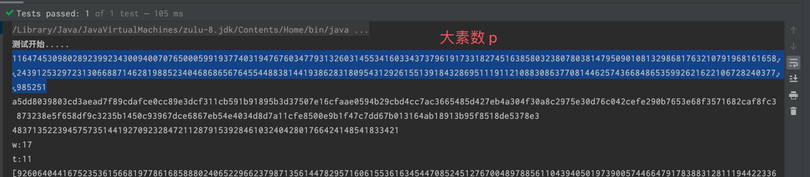
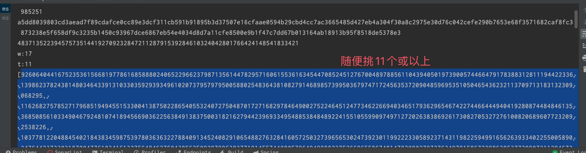

### 门限签名

门限签名（threshold signature）是一种数字签名方案，它允许多个签名者共同签署一个文档或交易，但只有达到预设门限数目的签名者的签名才会被认可。具体来说，门限签名方案将签名者分为若干个组，每个组有自己的私钥，而公钥则是所有组的公钥的组合。当需要签名时，至少需要达到预设的门限数目的签名者合作生成一组有效的签名，否则该签名就被认为是无效的。

门限签名具有分布式、去中心化、高安全性等特点，广泛应用于区块链、多方计算等领域。同时，门限签名也具有抗抵赖性，即任何签名者都不能否认他们签署过某个文档或交易。

它允许一个消息被多个签名者共同签名，只有在足够数量的签名者参与签名后，该消息才能被认为是有效的。

下面是一个简单的图解门限签名的过程：

1. 签名者选择一个门限值T和一个私钥，并将私钥拆分成N份，并指定至少T份才能恢复私钥。
2. 签名者将其公钥发送给其他签名者。 
3. 要签名的消息被发送给所有签名者。 
4. 签名者使用私钥对消息进行签名，然后将签名发送给其他签名者。 
5. 当至少T个签名者都签署了消息并将签名发送回给签名者时，签名者可以使用门限签名方案来恢复私钥。 
6. 签名者使用恢复的私钥对消息进行签名，将其发送给验证者以验证签名的有效性。
7. 通过门限签名，任意数量的签名者都可以签署消息，只要至少T个签名者参与签名，该消息就可以被认为是有效的。

## java实现

```java
/**
 * @Author: ban
 * @Date: 2022/6/20 09:35
 * @Description: Shamir秘密共享方法
 */
public class SecretShare {
    /**
     * 大素数
     */
    public static BigInteger p;
    private static Random random;

    /**
     * 秘密分享算法
     *
     * @param secret 秘密
     * @param t      秘密分享的阈值
     * @return w个用户的秘密数组
     */
    public static BigInteger[] share(BigInteger secret, int w, int t) {
        //储存t - 1次多项系系数
        BigInteger[] coefficients = new BigInteger[t];
        coefficients[0] = secret;
        for (int i = 1; i < t; i++) {
            coefficients[i] = generateRandomBigInteger();
        }

        BigInteger[] userShares = new BigInteger[w];
        //进行秘密分享
        for (int i = 0; i < w; i++) {
            userShares[i] = computeShare(coefficients, (i + 1));
        }

        return userShares;
    }

    /**
     * 为指定用户计算秘密份额
     *
     * @param coefficients 系数向量
     * @param userIndex    用户索引，即对于用户的x值
     *                     这里计算f(x)时x取值为 (下标 + 1)
     *                     如果直接从下标开始不加1会 直接暴露出 f(0)即秘密
     * @return re
     */
    public static BigInteger computeShare(BigInteger[] coefficients, int userIndex) {
        BigInteger index = new BigInteger(String.valueOf(userIndex));
        int len = coefficients.length;
        BigInteger temp = BigInteger.ONE;
        BigInteger result = BigInteger.ZERO;
        for (int i = 0; i < len; i++) {
            BigInteger cur = coefficients[i].multiply(temp);
            temp = temp.multiply(index);
            result = result.add(cur).mod(p);
        }
        return result.mod(p);
    }

    /**
     * 生成小于p的随机数
     *
     * @return 素数
     */
    public static BigInteger generateRandomBigInteger() {
        BigInteger result;
        do {
            result = new BigInteger(p.bitLength(), random);
        } while ((result.compareTo(p) >= 0) && (result.compareTo(BigInteger.ZERO) != 0));
        return result;
    }

    /**
     * 初始化方法，指定模数的bit长度
     *
     * @param bitLen len
     */
    public static void init(int bitLen) {
        random = new Random();
        p = BigInteger.probablePrime(bitLen, random);
    }

    /**
     * 秘密重建算法
     *
     * @param shares 用户输入的秘密
     * @param t      可以恢复秘密的阈值
     * @return ser
     */
    public static BigInteger reconstruction(BigInteger[] shares, int t) throws Exception {
        int n = shares.length;
        if (t > n) {
            throw new Exception("你当前收集的秘密份额不足以恢复秘密");
        }
        BigInteger result = new BigInteger("0");
        for (int i = 0; i < t; i++) {
            result = result.add(interpolation(shares, i + 1, t));
        }

        return result.mod(p);
    }

    /**
     * 秘密重建算法
     *
     * @param pp     大素数
     * @param shares 用户输入的秘密
     * @param t      可以恢复秘密的阈值
     * @return ser
     */
    public static BigInteger reconstruction(BigInteger pp, BigInteger[] shares, int t) throws Exception {
        p = pp;
        int n = shares.length;
        if (t > n) {
            throw new Exception("你当前收集的秘密份额不足以恢复秘密");
        }
        BigInteger result = new BigInteger("0");
        for (int i = 0; i < t; i++) {
            result = result.add(interpolation(shares, i + 1, t));
        }
        return result.mod(p);
    }

    /**
     * 求第i号用户(xK = i + 1)的了拉格朗日插值
     *
     * @param values values
     * @param t      t
     * @return an
     */
    public static BigInteger interpolation(BigInteger[] values, int xK, int t) {
        BigInteger result;
        //常量0，计算f(0)
        BigInteger zero = BigInteger.ZERO;
        BigInteger x_k = new BigInteger(String.valueOf(xK));
        //拉格朗日多项式
        BigInteger up = BigInteger.ONE;
        BigInteger down = BigInteger.ONE;
        //i代表第i个用户的份额
        for (int i = 0; i < t; i++) {
            BigInteger x_i = new BigInteger(String.valueOf((i + 1)));
            if (x_i.equals(x_k)) {
                continue;
            }
            up = up.multiply(zero.subtract(x_i));
            down = down.multiply(x_k.subtract(x_i));
        }
        result = up.multiply(down.modInverse(p));
        result = result.multiply(values[xK - 1]);
        return result;
    }

```

使用方法

```java
    //生成大素数 ,可以先用此方法生成一个大素数，记录
        init(1024);
        System.out.println("测试开始.....");

        System.out.println(p);
        //可以保存16进制
        System.out.println(p.toString(16));
        //生成小于p的随机秘密
        //准备的私钥，这个可以换成web3的私钥
//        BigInteger secret = generateRandomBigInteger();
        BigInteger secret = new BigInteger("48371352239457573514419270923284721128791539284610324042801766424148541833421");
        System.out.println(secret);
        //保存密钥总数量,分配给多人
        int w = 17;
        // 用随机更好
        // int w = (int) (Math.random() * 100) + 5;
        System.out.println("w:" + w);
        //可解密持有用户数量（大于次密钥数量即可解密）
        //  用随机更好
        //  int t = (int) (Math.random() * 50) + 1;
        int t = 11;
        System.out.println("t:" + t);
        BigInteger[] shares = share(secret, w, t);
        Gson gson = new Gson();
        System.out.println(gson.toJson(shares));
        //此数据可以用于保存起来，可以转换为16进制，会生成17个
        String[] keyHash = new String[shares.length];
        for (int i = 0; i < shares.length; i++) {
            BigInteger share = shares[i];
            keyHash[i] = "0x" + share.toString(16);
        }
        System.out.println(Arrays.toString(keyHash));
        
```
记录数据





验证
```java
        BigInteger p = new BigInteger("116474530980289239923430094007076500059919377403194767603477931326031455341603343737961917331827451638580323807803814795090108132986817632107919681616582439125329723130668871462819885234046868656764554488381441938628318095431292615513918432869511191121088308637708144625743668486535992621622106728240377985251");
        int t = 11;
        BigInteger secret = new BigInteger("48371352239457573514419270923284721128791539284610324042801766424148541833421");
        //还原
        //生成出来的私钥，进行还原，数量要 >= t，这里还是用BigInteger类型，正常可以使用16进制转10进制去做，不用全部的17个数据
        //一共11个符合要求（实际上，随意抽出>=11个都可以）
        String[] arr = new String[]{"92606404416752353615668197786168588802406522966237987135614478295716061553616345447085245127670048978856110439405019739005744664791783883128111944223361398623782438148034643391310330359293934961020737957979500588025483643810827914689857399503679747172456353720904859695351050465436232113709713183132309068295",
                "116268275785271796851949455153300413875022865405532407275048701727168297846490027522464512477346226694034651793629654674227446644494041928087448484613536850856103349046792481074189456690362256384913837500318216279442396933495488538484892241551055990974971272026383869261730827053272761008206896077232092538226",
                "103778122048845402184383459875397803636322788409134524082910654882763284160572503273965653024739230119922233058923714311982259499165626393340225500589034764423733031870047761034161327564846275043856250929799638377191455744080579649499882375266965586748147820802797276349791586722986285377299073112946731017398",
                "2695334478270122502913531818367781672320509820652658105977311693969877832916504744634204680219152778220136346521198596423022112823538521877389669213241410225929611736626512351558051902260995638172647197094192550801978340996223554559413396258757282694509910974310677384890812956478995589583663844866742652308",
                "48521409215213465707213858795059352373739848089813244926097075152514592940789838628771139878596981584667253810847704661792625266741981041833664830524014224941355580109423912041248650680941033057150461345082055715252995774669735472692470334211417049812790742256745971327594727196258903677351148459289702685388",
                "17613562311737055777412383607674375661878128172280629073166027794548629371062750844524654138642434179005404709647706796695182315485042848306976896101837564334209301681010914331149688906609661686845775858505937951547760972151176214934560865368033407085820449771717030111596603842586464304842926615505073313199",
                "81535097751101295983488475258813551483385630562822861585113702877575751717581764450844756415749340153520897331189353420559260569934665953815059812184197772756735284039512759725692800013260990614853273117946202039501558258666488587859534879328186794222359501598983293272421498261930820401605091582162669041975",
                "53528663343070479527362597957394278611240393924387182898391389586546259216388144746835228797974918159315198305317069469505796225334151593099744587198920595793761313181692597476120347302768784461599654993495529646861357892525060761796192580472767155763429982894913379210801059563693406488037860555100545958339",
                "100470601927287774582204648774900029720906097966035829039348574193290892796172831385823773170525985453773797905932828668932092286281759722472363815402904038199927926747018676510102041280545798824049683224688632540676595865498371415301703421830563235220888993122235511338910580614738251919694794143091054215016",
                "45439545121598321613977895740092381057338216969391732003633265004609489787226970286704740629120093815619810175298286481541244964294286219376789590039546419778879586136905540756860044008250750678589433417481154448612165804467449481767421284699946146693823782541498183600070179350368177812703993654318066246645",
                "99259130869210566474404952852385460477012928733284584340223424618116288158680895657372323099381982664395897116747999772936093676161524343911455188614497506194765876134852216509158110194002769840364669722936224022178575009628259906950028655274910993446551123300673876909741811571602469779109033023930829164823"};

        System.out.println("length: " + arr.length);

        BigInteger[] shares = new BigInteger[arr.length];
        for (int i = 0; i < arr.length; i++) {
            shares[i] = new BigInteger(arr[i]);
        }
        System.out.println("===============");
        BigInteger reconstruction = reconstruction(p, shares, t);
        System.out.println(reconstruction);
        if (reconstruction.compareTo(secret) != 0) {
            System.out.println("秘密值恢复错误");
        } else {
            System.out.println("RIGHT.....");
        }

```

## python实现

```python
import Crypto.Util.number as numb
import random

from makepic.xiyou.setColor import testHello

from makepic.xiyou import setColor

import sys
import os
print(os.path)
curPath = os.path.abspath(os.path.dirname(__file__))
print(curPath)
rootPath = os.path.split(curPath)[0]
print(rootPath)
sys.path.append(rootPath)

testHello()

setColor.testHello()

print(setColor.base_path)

# 求逆的函数，之前的版本用python2写的，这次用的python3，只把整除符号改了一下
def oj(a, n):
    a = a % n
    s = [0, 1]
    while a != 1:
        if a == 0:
            return 0
        q = n // a
        t = n % a
        n = a
        a = t
        s += [s[-2] - q * s[-1]]
    return s[-1]


# max_length 为p的长度，同时也是秘密的最大长度
# secret_is_text =0 默认输入时文本， 非0时认为是数字
# p 默认为0， 会根据max_length 自动生成，不为0时直接使用，需要保证p为素数， 函数内没有素性检验
def create(max_length=512, secret_is_text=0, p=0):
    print("====")
    if not p:
        p = numb.getPrime(max_length)
    print("===="+str(p))
    w = int(input("请输入秘密保存人数："))
    t = int(input("请输入秘密恢复所需人数："))
    while not (t > 0 and t <= w):
        t = int(input("请重新输入："))
    s = input("请输入你的秘密:")

    if secret_is_text:
        s = numb.bytes_to_long(s.encode("utf-8"))
    else:
        try:
            s = int(s)
        except Exception as e:
            s = numb.bytes_to_long(s.encode("utf-8"))

    x_list = list()
    a_list = list()
    i = w
    while i > 0:
        x = random.randint(p // 2, p)  # 该范围没有特定限制，如果想让xi,yi取小一点儿的话可把范围写小点儿，但是要大于w
        if x not in x_list:
            x_list.append(x)
            i -= 1

    for a in range(t):
        a_list.append(random.randint(p // 2, p))  # 同上

    result = list()
    for x in x_list:
        y = s
        for a_n in range(t):
            a = a_list[i]
            y += a * pow(x, i + 1, p)
        result.append((x, y))
    return t, p, result


# get_text=1 默认恢复为字符串，若想得到数字填0
def restore(p, information, get_text=0):

    x_list = list()
    y_list=list()
    for x, y in information:
        x_list.append(x)
        y_list.append(y)

    ss = 0
    for x_i in range(len(x_list)):
        tmp_num = y_list[x_i]
        x_i_j = 1
        for x_j in range(len(x_list)):
            if x_i != x_j:
                tmp_num = tmp_num * (0 - x_list[x_j]) % p
                x_i_j *= x_list[x_i] - x_list[x_j]
        tmp_num = tmp_num * oj(x_i_j, p) % p
        ss += tmp_num

    ss = ss % p
    print(ss)
    if get_text:
        try:
            ss = numb.long_to_bytes(ss)
            ss = ss.decode("utf-8")
        except Exception as e:
            print(e)

    return ss

t, p, result = create()             #result为秘密碎片的列表
print(result)
print("=======")
print(restore(p, result[:t]))     #这里我取了result的前t个，实际中可以取任意t个。

```
