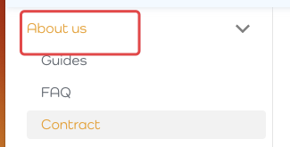
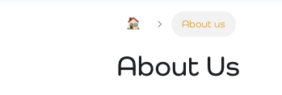
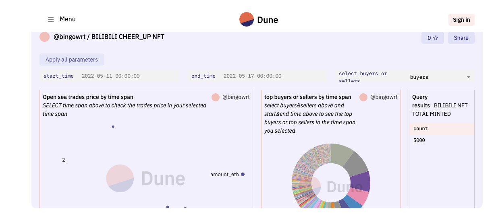
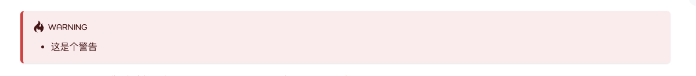
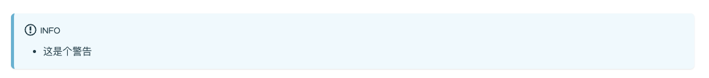
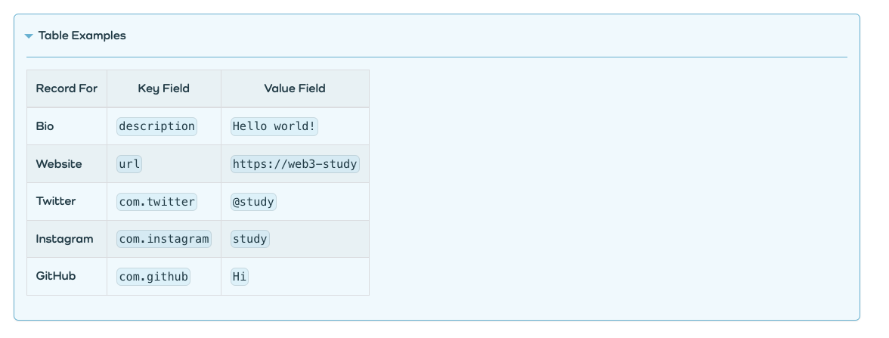
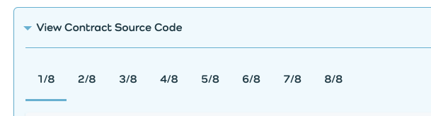

# 教程版式示例

# 🌝文章

## 开头用以下格式

普通文章与日历形式的MD文档开头

```
---
title: About Us
sidebar_label: About us
sidebar_position: 50
image: /img/bac111.png
description: About us
---
```

```
---
title: "Weekly Update: 2022 Week 2222"
description: "Weekly Update: week of January 3rd 2022"
authors: [ban]
tags: [weekly Update]
date: 2022-01-22
image: ./assets/02.png
og_url: https://www.bilibili.com/video/BV1h34y1n7A3
---
```

## 对应左侧【About us】 的sider bar以及文章的标题



## 添加支持iframe的组件使用：

```
<iframe width="100%" height="500" src="https://dune.com/bingowrt/BILIBILI-CHEER_UP-NFT" title="BILIBILI" frameBorder="0" style={{background: "#F3F0FE", borderRadius: "12px"}}></iframe>
```

显示如图：



## 🌼视频引入：

```
<iframe src="https://player.bilibili.com/player.html?bvid=BV1h34y1n7A3" scrolling="no" frameBorder="no" framespacing="0" allowFullScreen={false}></iframe>
```

其中 `bvid=BV1h34y1n7A3` 可以打开bilibili直接引用：如

https://www.bilibili.com/video/BV1h34y1n7A3?spm_id_from=333.851.b_7265636f6d6d656e64.2&vd_source=839fcf3ea3c7dede9ec45bbf0da80d80

bvid就代表：`BV1h34y1n7A3`


## 警告

```

:::warning

- 这是个警告

:::
```

如此显示：



info:



## 可折叠表格

```
<details>

  <summary><strong>Table Examples</strong></summary>

| Record For    | Key Field       | Value Field                        |
| ------------- | --------------- | ---------------------------------- |
| **Bio**       | `description`   | `Hello world!` |
| **Website**   | `url`           | `https://web3-study`          |
| **Twitter**   | `com.twitter`   | `@study`                   |
| **Instagram** | `com.instagram` | `study`         |
| **GitHub**    | `com.github`    | `Hi`                       |

</details>
```



其他部分，按照md格式来编写

# 🌞代码部分

导入table

```
import Tabs from '@theme/Tabs';
import TabItem from '@theme/TabItem';
```

代码使用table包裹，示例多个代码文件：

```
<Tabs>
  <TabItem value="1" label="1/4" default>
	‍‍```js title="xxxx1.sol"
	//1代码
	‍‍```
  </TabItem>
  <TabItem value="2" label="2/4">
	‍‍```js title="xxxx2.sol"
	//2代码
	‍‍```
  </TabItem>
  <TabItem value="3" label="3/4">
	‍‍```js title="xxxx2.sol"
	//3代码
	‍‍```
  </TabItem>
  <TabItem value="4" label="4/4">
	‍‍```js title="xxxx2.sol"
	//4代码
	‍‍```
  </TabItem>
</Tabs>
```

显示：




import {EmbedTweet} from '@site/src/components/Social'

<EmbedTweet class="twitter-tweet" data-dnt="true">
  <a
    href="https://twitter.com/7u3lYyRjnvTlyNq/status/1550291939530244097"
    >Jul 22, 2022</a
  >
</EmbedTweet>