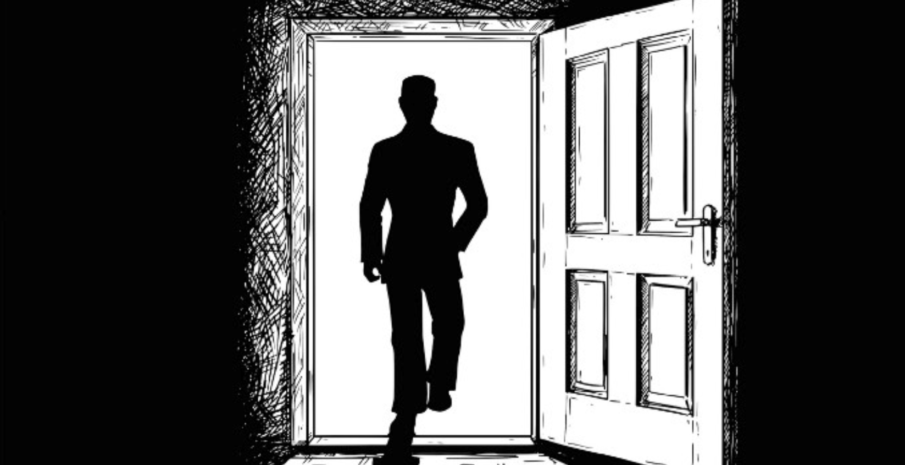
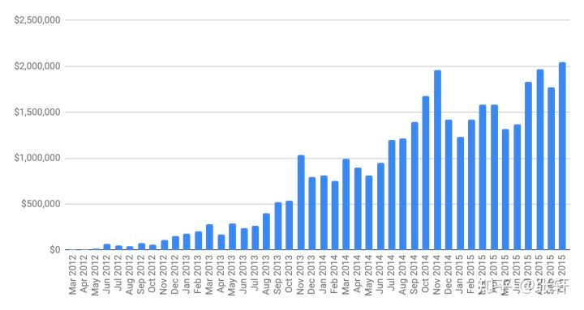
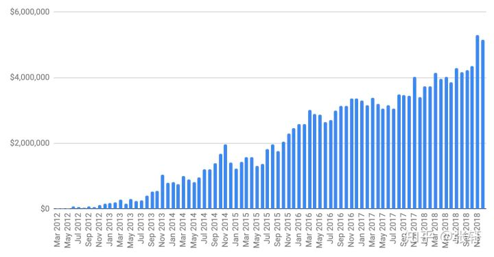

import {EmbedTweet} from '@site/src/components/Social'

[原文链接1](https://sahillavingia.com/reflecting)
[原文链接2](https://marker.medium.com/reflecting-on-my-failure-to-build-a-billion-dollar-company-b0c31d7db0e7)

2011年，我从Pinterest离职，我是当初第二个加入 Pinterest的元老级员工，我为了开始自己的人生事业，连股权都没来得及套现就匆忙离开了。

<EmbedTweet class="twitter-tweet" data-dnt="true">
  <a href="https://twitter.com/shl/status/1093532795438133253">Sahil</a>
</EmbedTweet>

我当初梦想的画面是，Gumroad会成为一家市值几十亿美元并坐拥几百名员工的大公司。我梦想着公司有一天挂牌上市，我这一生都会扑在这项事业上。

当然事实证明，我想多了......

我现在看上去混得还不错，我的软件公司持续增长，保持盈利而且运营成本控制在较低水平，客户也对我的产品很满意。但过去许多年以来我一直都沉浸在失败的挫折中。我在公司发展最困难的时期不得不裁掉75%的员工，包括许多跟我关系很好的朋友。我失败得很彻底。

过了很多年我才意识到我的认知是存在偏差的。在过去很长一段时间内，我都为自己选择的创业这条路而羞愧不已，但我现在已经不这么想了。今天我想跟大家分享我完整的创业经历。

### 我把一个闲暇时间自娱自乐的小项目做成了被VC投资的初创企业
Gumroad最初的想法很简单：人们可以轻松快速把产品直接卖给有需要的人，而无须在线下开实体店。

我在一个周末产生了这个想法，然后就立刻着手打造Gumroad平台，周一一早，我就在Hacker News上发布了。我的发布引来了许多人关注，第一天就有超过52000人次浏览。

那一年我离开了Pinterest，我当年是第二个加入Pinterest的元老级员工，我为了开始我的人生事业，连股权都没有来得及套现就离职了。

我几乎不费吹灰之力就从几个天使投资者和风投公司融到了110万美元。几个月以后，也就是2012年5月，我又筹到了700万美元。顶级风投公司Kleiner Perkins Caufield的Mike Abbott负责此轮融资。

我真的觉得自己要走上人生巅峰了。我那时才19岁，单独创业，银行账户里有800万美元，手下管理着3名员工。我要火了！

随后团队又招了更多人，我们专注于做自己的产品。每月运营数据开始增长，但数字涨了一段时间就停下来了。

为了保住产品，我裁掉了公司75%的员工，其中很多都是跟我关系非常好的朋友，整个过程就像噩梦一样。但是我告诉自己，一切都会好起来，产品会持续增长，局外人也永远不会看出我搞砸了。

之后，TechCrunch得到了我公司裁员的消息，发了一篇名为《Gumroad转型中开始大裁员》的文章。一时间，我的失败成为了众人皆知的新闻。随后的一周内一堆人给我发来了慰问，我一概置之不理；客户也前来了解情况，我解答了他们的一些关切，这些客户中许多人都依靠Gumroad的服务来维持业务。他们想知道自己是否需要赶紧寻找替代产品。一些在Gumroad上做的最成功的创作者离开了，这让我很心痛，但我不会怪他们，因为毕竟他们要将商业风险最小化。

那么到底哪里出了问题？又是什么时候出的问题呢？

### 后劲不足
我们先看一下经营数据。下图是我们一直到裁员之前的每月营业额：

数字看起来还不错吧？图中每月的数字是一路上涨的。

但当时我们拿的是风投资金，其实就是一场豪赌，要么翻倍要么倾家荡产。当你一直赢的时候感觉好极了，但如果一路输那就会生不如死。我们当时增长得不够快，没法融到B轮的1500万美元，如果没有这些钱就没办法扩张团队。

### 我们当时的业务，如果每个月增速达不到20%，就完蛋了。

但当时我没觉得这是个问题。我银行里有存款，而且我的产品也迎合了市场需求。所以应该可以持续发布产品，顺利经营下去。当时虚拟商品市场刚刚起步，增速慢不是我们导致的，但我们总感觉马上就要出现拐点了。

但现在再回头来看，我意识到纠结到底是谁的错已经没什么意义了，我们在2014年11月达到峰值，然后就陷入了停滞阶段。我们有一群死忠的创作者，但他们人数不够多，不足以支撑平台增长。我们的产品确实跟市场契合度很高，但我们仍需要找到更有潜力的业务支点才能继续下一轮融资（然后再循环往复，直到被别人收购或上市为止）。

2015年1月，在最后一轮豪赌后，公司银行账户余额只能支撑最多18个月的运营了。我跟团队的20个同事说要为之后的苦日子做好心理准备。我们的数据没有达到b轮融资的门槛，未来九个月我们要非常辛苦才能勉强接近目标。因此，我们把所有资源都放到了可以直接提升收入的功能上。许多功能并不是我们的核心业务，但我们必须要竭尽全力提高每月营业额。

如果成功了，我们将再次从顶级风投获得一笔投资，招更多人，然后继续往前走。但如果失败了，我们将被迫大幅缩减公司规模。

在那九个月中，团队所有人都意识到这是公司生死存亡的时刻，那期间没有一个人离职。大家的认知迅速从“苦日子要来了”调整成了“苦日子已经来了”，每个人都加足马力拼命工作。

我们推出了“小产品实验室”，教新加入的创作者如何提升销售。我们还推出了许多新功能，包括每周付款、付款到借记卡、付款到英国、澳大利亚和加拿大、新的email功能、产品推荐、基于用户浏览/下载行为进行搜索和分析、以及添加至购物车。以上所有功能都是在八月到十一月之间推出的。

但不幸的是，我们还是没能达到目标。

### 缩小规模还是关门大吉?
说句马后炮的话，我很庆幸我们当时没有达到目标。因为如果我们成功获得了b轮融资，获得了更多投资，再次出现在报纸头条中，之后我们注定会遭受更惨重的失败。

融资是不可能了，当时我们面临以下几个选择：

一，把公司关了，把剩下的钱退给投资人，然后转型做别的

二，缩小公司规模，保存实力

三，把公司卖出去

一些投资人想让我把公司关了，他们跟我说预期浪费时间让Gumroad勉强保持盈利不如用赚来的钱和他们的投资做点别的回报率更高的事。

说实话我差点被他们说服了，但我当时要为平台用户、员工和投资者负责。我们让几千名创作者每月有了收入，创作者的总收入高达250万美元，这笔钱可以用来付房租和房贷、缴学生贷款或存入子女大学基金。而且这个数字还在不断增长！我不能就这么把他们的收入来源切断。

我为了保存团队，可以把公司卖掉，但这样的话我也失去了对产品的控制权。许多公司被收购之前都以为自己前景一片光明，但一年后发现原有产品被做得稀烂。

把公司卖给下家确实是一个很有吸引力的选项，我可以跟别人说我把第一家公司卖了，拿到一大笔钱，然后再次转型创业。但是我过不了自己这一关。我一直对每个新员工和投资人说，我们首先要为平台上的创作者负责。我不希望为了做连续创业者而抛弃我的客户。

我们决定不惜一切代价扭亏为盈。第二年非常难熬：我将公司规模从20名员工缩减到了5名，把办公司搬到了一个月租25000美元的地方，并将剩余资源都用于开发高级付费服务。

2015年6月，也就是裁员前几个月，我们的财务数据如下：

· 月收入：89000美元

· 毛利：17000美元

· 运营成本：364000美元

· 净利润：-351000万美元

一年之后，也就是2016年6月，我们的财务数据如下:

· 月收入：176000美元

· 毛利：42000美元

· 运营成本32000美元

· 净利润：+10000美元

过程很艰难，但我们保住了平台创作者的收入。同时，我们也保住了自己命运的掌控权。

### 从孤军奋战到佛系创业
之后我们经历了一段更加煎熬的日子。

Gumroad失去了VC投资，不再是投资人和员工最初看好的独角兽企业。所有人都离开另谋高就了，团队规模从五人再次缩减至一人。

所以，公司只剩下我一个光杆司令了，我没有团队，也没有办公室。旧金山仍有许多初创企业继续走融资、建团队、做产品这条路。我一些朋友变成了亿万富翁，而我还在经营着一个微不足道的“小本生意”。这并非我的本意，但是我必须要把这个业务继续做下去。

我现在理解为什么有些人梦想过这样的生活，但当时我感觉自己被困住了。我不能停下来，但我一个人孤军奋战能做的很有限。

过去许多年，我一直觉得打造出亿万级公司才是成功的标志。而现在我意识到这是一个很糟糕的目标。

我整个人完全自闭了，我没告诉我妈公司裁员的事，她是在推特上看到的。我朋友很担心我，我向他们保证我不会抑郁也不会自杀。我时不时会离开旧金山去别的地方呆一段时间，我以为旅行会让我找回内心的平静，但事实上这反而让我感到更加孤独。

我每天早上起来就开始解决Gumroad上的技术问题。我尽可能修复所有bug，而且经常需要向Gumroad以前的工程师寻求帮助。他们当时全都找到了新工作，但还是会抽空帮忙。解决完Gumroad上的问题后，我会去健身房运动。如果运动完还剩下一点意志力，我会去写我的玄幻小说，只不过大部分时间我都无法做到。

对我来说，当你期待好事会发生时，就会产生一种幸福感。2016年之前的每一年，我对我的团队、产品和公司都充满期待，相信一切会变得越来越好。而接下来的几年，我第一次有了一年不如一年的感觉。

在旧金山生活本来就很艰难，特朗普上台后我就彻底离开了。

### 重新开始

突然有一天，一切都改变了。我不知道应不应该跟你们分享这个故事，因为我不确定从中能得出什么道理。但这件事确实发生了。

2017年11月27日，Gumroad的主要投资人KPCB给我发了一封邮件：

我想要跟你讨论一下我们几个月之前谈到的话题。KP希望将我们的股权以1美元的价格卖回给Gumroad。这周你是否有空聊聊？

Mike从KPCB离职，成立了一家新公司，KPCB不想再委任新的董事会成员。而且出售Gumroad股权可以帮他们减税。因此，我们的优先清算权（注：优先清算权指员工开始获得清算收益的门槛）从1650万美元一下降低至了250万美元。突然间我看到了一丝希望，虽然这个希望很渺茫，但它仍然是希望。我面前突然出现了一条独立创业的道路，而且这项事业不再被规模和效益捆绑。

另一个投资人也要求卖出股权，我们之后又回购了一部分。我每几个月会发一封简短的邮件给剩余的投资人，告诉他们公司最新近况。

公司未来发展路线逐渐明朗起来：我要建立一个小团队，逐步回购投资人手上的股权，将Gumroad发展成一项有意义的事业，专注于为创作者提供价值。我们永远不可能成为一家亿万级企业，我开始接受了这一现实。而且我肯定Gumroad上的几千个创作者也不会介意。

### 寻找新模式
我在Gumroad工作的八年中经历了人生的大起大落。有几个月我每天工作16个小时，也有几个月我每周只工作4小时。那段时间可以用下面这张图表来描述：

你可以看出哪几个月我工作的时间长哪几个月工作的时间短吗？反正我看不出来。我们原本的销售团队组建了几年后被解散了。你可以看出是什么时候解散的吗？我反正是看不出来。

无论你产品做得多好功能出得多快，你所在的市场很大程度上决定了你的增速。Gumroad的增长基本上就是跟市场增速保持一致的。

我放弃了做亿万级公司的想法，我现在只想为我们的现有用户提供越来越好的产品服务，因为是他们让我们一直活到了现在。

### 价值创造和价值捕捉
多年前在一场CEO峰会上，我的偶像比尔盖茨曾登台发言。有人问他怎么看公司未能捕捉到的价值？虽然微软已经发展成了大公司，但与它为人类创造的巨大价值相比，它赚到的钱微不足道。

比尔盖茨是这么回答的：“所有公司都会面临这个问题。它们创造了一些价值，但最终只捕捉到其中很小一部分的价值。”

我现在更关注创造价值而不是变现。我仍希望尽可能地对世界产生价值，但我不需要以收入或估值的形式来捕捉价值。

比如Austen Allred，他的公司Lambda School最近募集了4800万美元投资，而他的第一本书是在Gumroad卖出去的。

一些前Gumroad员工离开后开始自己创业，还有一些人加入了其他企业，并创造了巨大价值。除此之外，我们的一些产品创意，比如信用卡支付和inline checkout功能都在各大网站广泛应用，并造福了所有人，包括从未使用过Gumroad的人。

Gumroad公司规模虽小，但影响力却不小。当然其中包括我们付给创作者价值1.78亿美元的回报。另外，这些影响也产生了连带效应，平台上的创作者为其他人也创造了新的机会。

### 公开财务报表
我也找到了其他创造价值的方式。那次裁员之后，我没有跟任何人提起过Gumroad，包括我妈妈在内。从旧金山搬走后，我跟创业圈彻底切断了联系。

为了重新与社区建立联系，我决定公开我们的财务报表。其他创业者可以从我们的失败中吸取教训，并参考我们的财务数据更理智地做决策。

公开财务数据需要很大地勇气，如果我们不能每个月都实现增长怎么办？这样可能会吓走一部分潜在客户。如果初创企业要拉投资，千万不要这么做。如果要拉投资、招人、与其他初创企业竞争客户，那么就必须得把财务数据捂得严严实实的。

但是，Gumroad的处境已经不一样了，所以我们可以公开财务数据。我们已经实现了盈利，所以一两个月的零增长或负增长没太大影响。2018年4月，我开始公开我们的财务报表。

讽刺的是，我们公开财务报表之后吸引了更多投资者（谢啦，不过目前我们只对客户的钱感兴趣），更多人想要加入Gumroad，我们也跟创作者拉近了距离。

我本以为创作者们会对Gumroad规模缩水而感到惊恐，但他们不仅没有，反而对平台更加忠诚了。他们与我们一起有难同当，将我们热爱的这份事业共同做下去。

很快，我们会计划像WordPress一样将整个产品开源。所有人都能定制化自己的Gumroad页面，无须经过我们，直接向终端用户出售内容。

2018年，我们将8%的利润（即23775美元）捐赠给不同慈善机构。我们为波多黎各的海啸和克拉拉邦的洪水募款，还资助了Presence-of-Blackness项目以及Mexicanx出版刊物。

### 世界并不是非黑即白
多年以来，我一直以为打造亿万级公司是衡量成功的唯一标准。现在我意识到这个目标有多么糟糕。盲目追求把公司做大的目标既不理智，也无法准确衡量实际影响。

我不是要为自己的失败找借口，也不是在打肿脸充胖子说失败的感觉好极了。所有人都知道初创企业的失败率相当高，拉到投资的初创企业失败率甚至更高，但当你真的体验失败的时候，还是会很难受。

我虽然失败过，但我也做成了许多其他事。Gumroad用投资者的1000万美元为创作者带来了1.78亿美元的收入。我们目前没有计划筹集资金，因此可以专注于为客户提供最好的产品。除此之外，我还很高兴看到我们在收入之外创造的额外价值。

我现在觉得自己很成功。这个成功的定义跟我当初想的不太一样，但我觉得我现在做的事情也算是成功了。

我的亿万级企业梦想一开始是怎么形成的呢？我认为这是生活在一个崇拜财富的社会被长期洗脑的结果。我一直以来的偶像是比尔盖茨，而他是世界首富，我想这应该不是一个巧合吧。自从我有记忆以来，就一直将成功与个人净资产划等号。如果我听到有人说“你看那个成功人士”，我不会认为他们成功是因为改善了周围人的生活水平，而是因为他们赚了很多钱。

拥有财富的人有能力改善周围人的生活，比如比尔盖茨花了很多钱做慈善。但财富不应该是衡量成功的唯一标准，也不是最重要的标准。

你想做下一个微软公司，这个目标无可厚非。我个人不认为亿万富翁都是坏蛋，我甚至内心深处还会时不时幻想自己也能走上这条发财之路。

但无论怎样，我现在走在另一条路上。这条路的方向不是做亿万级企业。世界上有千千万万条路，而这条是我自己选的路。
