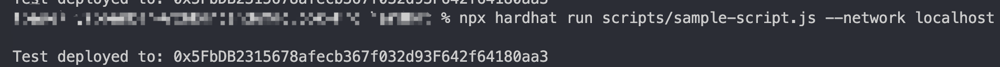
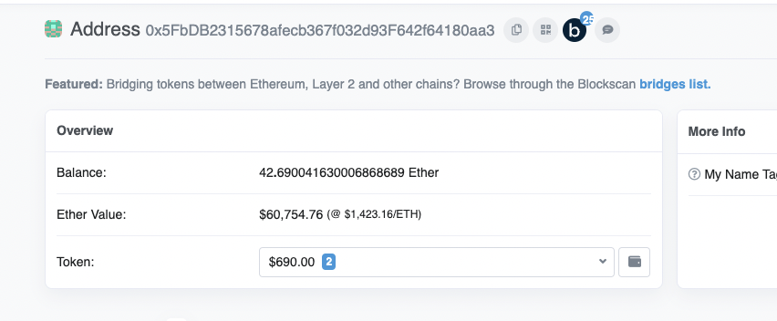
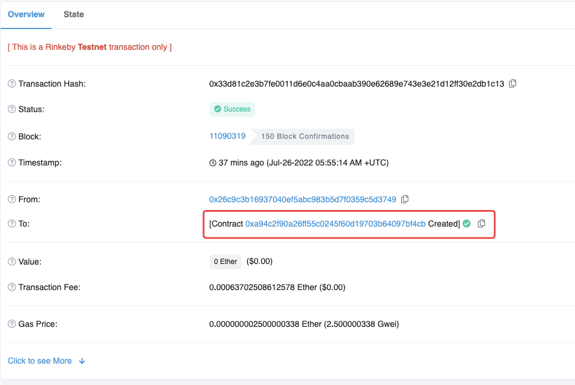
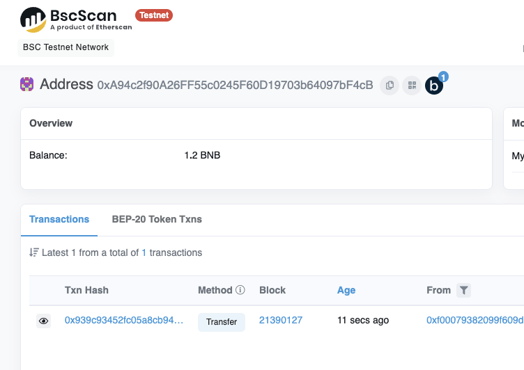
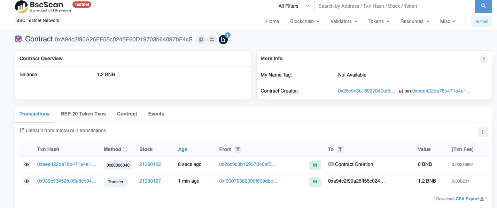
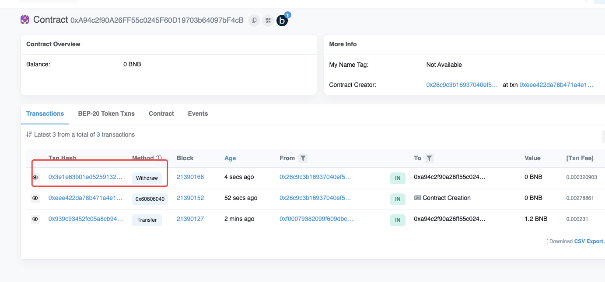
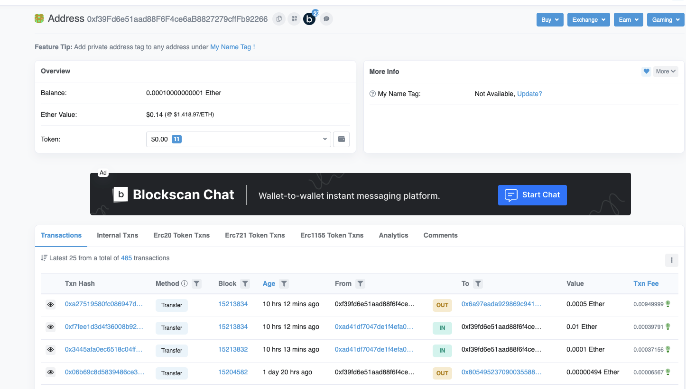

import {EmbedGiscus} from '@site/src/components/Talk'

## 小记

扩展阅读：
一人学习中无意中发现了 hardhat 通用测试地址主网地址有 42eth，考虑样把它拿走，于是走上了测试之路，当然最后的结果是个悲剧


小伙伴在学习 hardhat 的时候，再执行部署命令时



得到了一个地址 `0x5FbDB2315678afecb367f032d93F642f64180aa3`，然后就随意去 [etherscan](https://etherscan.io/address/0x5FbDB2315678afecb367f032d93F642f64180aa3) 浏览器查看了下，竟有资产



还不少，于是想到一个念头，是不是可以吧 eth 的这个地址也变成合约（功能就是提取），然后把资产都取出来。

合约是签名地址 +nonce 的结果，理论有，去实践

于是找到另一个小伙伴，想要去实验，以下是实验过程

1. 在 bsc 测试网络与 rinkeby 网测试
2. 创建一个新地址（为了 nonce 一样）`0x26C9c3B16937040Ef5ABC983B5D7F0359c5D3749`
3. 分别给地址的两个网络打币，但是先不做任何其他的交易
4. 一个简单的合约，内容就是取币

    1. ```js
      function withdraw(uint256 _aa) public{
              payable(msg.sender).transfer(_aa);//当然也可以取出所有balance，这里只是测试，所以简单的写
      }
      ```

5. 先在 rinkeby 部署合约：得到合约 `0xA94c2f90A26FF55c0245F60D19703b64097bF4cB`



得到之后查看 bsc 测试网络，此网络下显示的是一个正常的地址，然后给他打 1.2 个 bnb，没错这只是一个正常的地址。



然后同样用 `0x26C9c3B16937040Ef5ABC983B5D7F0359c5D3749` 地址在 bsc 测试网络部署刚才的合约，一定会得到同样与 rinkeby 同样的合约 `0xA94c2f90A26FF55c0245F60D19703b64097bF4cB`



接下来就是直接取资产了：



直接去走

理论可行，那我们去看看 `0x5FbDB2315678afecb367f032d93F642f64180aa3`（eth 上有资产的地址）这个合约是 hardhat 是用的哪个地址部署的

Account #0: 0xf39Fd6e51aad88F6F4ce6aB8827279cffFb92266
Private Key: 0xac0974bec39a17e36ba4a6b4d238ff944bacb478cbed5efcae784d7bf4f2ff80

就是这个了，好那就可以开始测试了，让我们查看一下 `0xf39Fd6e51aad88F6F4ce6aB8827279cffFb92266` 在 eth 上的状态


#￥#%！@ 没了，需要的哪个 nonce 早就没了，好吧，去看看 bsc 的主网呢，好的非常好，nonce 也没了



嗯，结果是个悲剧了，好的大家，再见了~

<EmbedGiscus>w01</EmbedGiscus>
