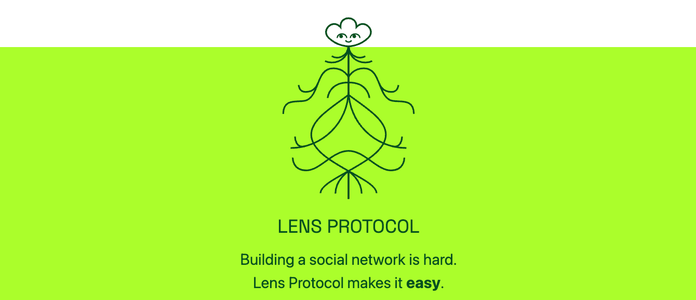

原文引用：[medium jerga](https://medium.com/eincode/differences-between-web-2-0-and-web-3-0-dcc045b07eef)

在过去的几十年中，网络世界发生了重大变化。围绕区块链技术的炒作自然导致了人们对 Web 3.0 的好奇。在本文中，我们将了解 Web 自诞生以来是如何演变的、新的革命性思想 Web3.0 以及 Web 2.0 和 Web 3.0 之间的区别。

### Web 2.0 — 特性和优势
Web2.0 是互联网发展的第二阶段。Web2.0 为我们提供了能够阅读和获取我们信息的网站以及个性化的体验。一个典型的例子是我们每天使用的社交网站。

Adobe Flash 和 Javascript 等编程语言的引入使开发人员更容易构建用户友好的应用程序。此类网页的示例包括视频发布网站（如 Youtube）、博客网站（如 WordPress）以及社交网站（如 Facebook、Twitter 和 Instagram）。

Web2.0 为我们带来了新的连接浪潮，它的功能帮助用户创建内容并将其发布给更广泛的受众。除了用户生成的内容，Web2.0 的其他一些值得注意的特性包括：

>1. 易于使用和知识共享。
>2. 制作和发布动态内容的能力。 
>3. 实时交互。 
>4. 使用流行应用程序的 Web API 来开发我们的应用程序的能力增加了交互性。

### Web2.0 限制
Web2.0 时代是超定向广告的时代。Web2.0 的主要限制包括大公司利用个人数据提供个性化广告。

这些第二代网站还存在许多导致网络攻击和黑客事件的安全问题。此类恶意攻击会导致用户个人信息泄露。这进一步需要一种更分散的方法来处理敏感信息。

Web2.0 的另一个限制是第三方应用程序会调节两端之间的通信。例如，这在支付网关的情况下很明显。支付应用程序有权自行决定不批准某些交易。

### 什么是 Web3.0？
Web3.0 是利用区块链技术和去中心化方法的网络发展的下一个阶段。
使用它构建的应用程序称为去中心化应用程序或 DApps。他们使用以太坊的去中心化方法来存储、共享和访问数据。

世界上最近看到的值得注意的 Web3.0 应用程序是 Apple Siri、Wolfram Alpha、Odysee 等视频网站等。
由于 Web3.0 处于采用的早期阶段，该领域的应用程序主要是在进行中。

### Web 3.0 的特点和优势
Web3.0 服务具有自己的一组功能和优势，可有效克服 Web 先前迭代的限制。
Web3.0 应用程序的主要特点之一是数据不受任何私人或政府组织的控制。
因此，未经适当访问，任何人或组织都不能更改或删除所存储的数据。

如前所述，使用服务和数据的许可平等地授予网络上的所有人，单个实体不能对其提出要求。
这也确保了任何人都不会被拒绝访问网络上的数据。从网络上的机器上删除的数据并不能保证从网络上的所有设备中删除。

最后，Web3.0 上的数据不仅限于单个服务器，而是在整个区块链网络中共享。
这意味着服务器故障或关闭不会影响 Web3.0 服务或数据访问。
在 Web3.0 上运行的支付应用程序也可以独立运行，无需访问用户的个人信息，从而进一步提高了匿名性。

### Web3 的缺点
以下是需要注意的 Web3.0 的一些限制

#### 技能
开发 Web 3.0 应用程序需要了解区块链如何运作的专业知识。开发人员将需要克服这一障碍，专门为 Web3.0 构建和调整应用程序。但我们现在明白这是值得的。

#### 延迟交易
当事务活动变得非常耗时时，作为一个分布式系统变得具有挑战性。例如，支付的不同阶段将需要由网络中的其他节点处理，这使得方法很麻烦。

#### 更难监管
Web3.0 应用程序会给组织带来一整套监管问题。我们将需要更智能的解决方案来解决这些问题，以避免网络犯罪。

### Web2.0 与 Web3.0比较

|            | web2.0                                                                                                                          | web3.0                                                                                                                                                                                                             |
|:----------:|:--------------------------------------------------------------------------------------------------------------------------------|--------------------------------------------------------------------------------------------------------------------------------------------------------------------------------------------------------------------|
|   **定义**   | 这一带网络专注于构建交互式和动态网页                                                                                                              | 互联网下一个最重要的演变是服务和数据的分散化                                                                                                                                                                                             |
|   **特点**   | 1. 动态网页   2. 更好的社区建设  3. 一种集中式的方法，其中系统币网络中的其他系统具有更大的权限  4. 中心化控制对网络的参与，并可以迫使参与者选择升级、更新等 5. 解决冲突很容易，因为是中心化有最终决定权 | 1. 拥有自主式的数据共享和访问 2. 用户拥有数据的权利受到保护 3. 审查已经进入区块链网络的数据要困难 4. 用户的个人数据收到保护，以避免网络犯罪 5. 去中心化的方法，整个网络崩溃的可能性极低 6. 没有看守者，因为任何人都可以成为数字网络的一部分 7. 没有一个单一实体可以有权控制网络的决策 8. 如果网络参与者提出索赔、解决冲突，则需要很复杂的协议 |
|  **数据访问**  | 数据归大型公司或者是营的网络组织                                                                                                                | 个人拥有用户自己的数据和使用权                                                                                                                                                                                                    |
|   **限制**   | 1. 科技公司利用个人数据来制造利润 2. 单一故障点-- 中心化 言论自由收到严格监管，因为中心化可以审查数据                                                                | 1. 对于初学者来书很复杂 2. 在新技术适应方面设计风险                                                                                                                                                                                  |

### 结论
Web3.0 将给我们的生活带来的改变或许缓慢但值得。
这种演变更有可能是自主想法的叠加。也有可能出现更多去中心化的组织或 DAO 来取代现有的大公司。

Web3.0 最令人兴奋的事实是围绕它的想法的新颖性。有了合适的系统和协议，Web3.0 无疑可以成为未来的新标准。
此外，像谷歌或 Facebook 等现有的科技公司可能会采取拆分的方法来保持在竞争激烈的市场中的相关性。

