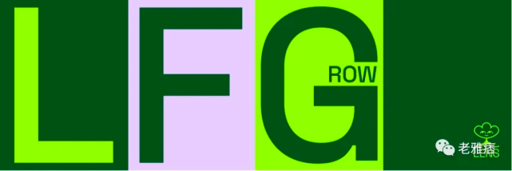
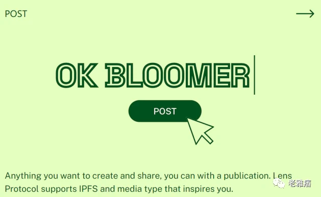
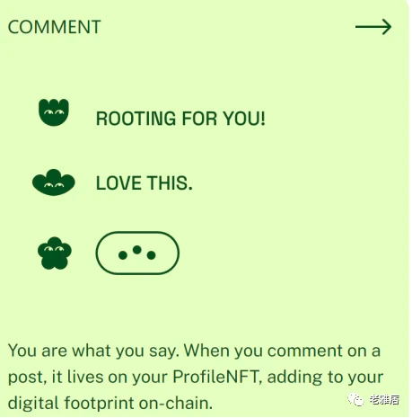
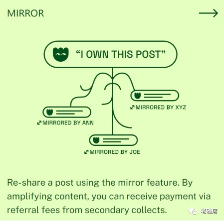
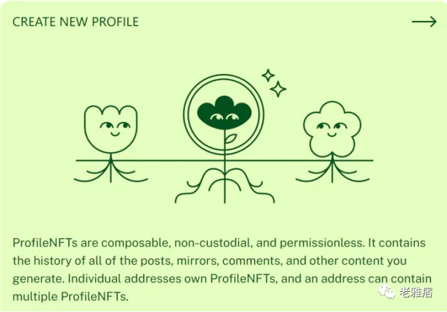
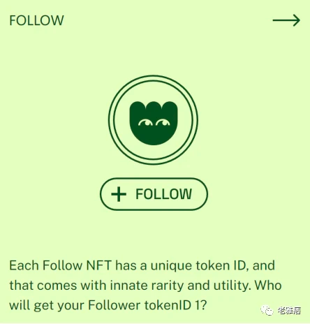
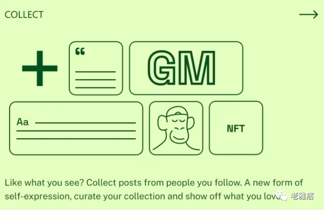
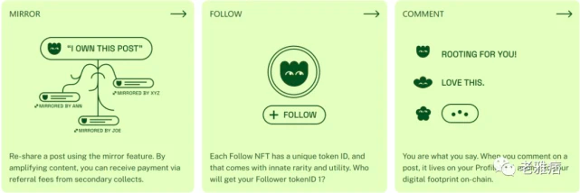

[原文](https://xw.qq.com/cmsid/20220607A04QOI00)

Lens Protocol——可组合的去中心化社交图谱

Web3时代下，社交产品的全新特性

Web3时代下的社交产品同传统社交产品在根本上存在很大的区别，它们最为根本的两大区别在于上链与否以及所有权经济的归属。

1. 社交内容开放化
>在传统的社交产品中，一切社交行为都在链下进行，社交平台之间是一种相对封闭的关系，当用户在某一社交平台发布讯息时，其他平台的用户几乎不可能进行跨平台交互。
而在Web3时代，社交方式可能会从根本上发生转变，用户的行为地点从链下转为链上，一切都变得开放透明，社交平台的不同将不再成为交互的壁垒。当社交关系成为公共设施，用户就可以带着沉淀的社交关系体验任何新的产品，而不会被任何一个产品所捆绑。

2. 社交内容产权化
>在传统的社交产品中，用户的一切行为都要基于一个高度中心化的平台才能进行。而这也意味着用户的一切产出都在平台的掌控之中，不论是内容推送还是操作权限，用户均不存在掌控力。而Web3则致力于夺回用户的对自己社交的掌控力，社交内容产权化是极为重要的方式。
社交内容产权化的意义绝不在于判断社交内容值多少真金白银（实际也无法界定），而是用于界定所有权的归属。当一切社交内容都表现为资产的形式，那么就必然涉及资产的归属问题。这时用户们就可以厘定自己社交行为的产权归属，从而争取自己的利益。真正实现Web3时代下掌控自己网络的愿景。
而今天我们所要讨论的项目——Lens Protocol在上述两方面都有自己独到的应对策略，接下来就让我们一起看一下Lens Protocol到底是个怎样的项目。

Lens Protocol——可组合的去中心化社交图谱

2022年2月8日，Aave团队推出Web3社交协议Lens Protocol。5月18日，Lens Protocol终于在Polygon正式上线，目前其生态内已经有50多个应用程序，其中包括Lenster、Lens Booster、SpamDAO、GoldenCircle、PeerStream、Swapify、Social Link等。

我们不难发现，Lens本质上是一个软件堆栈，它使得开发人员能够搭建分散内容和用户帐户所有权的社交网络。

Lens Protocol致力于成为一个可组合的去中心化社交图谱，可供用户创建社交媒体资料并从中构建新的社交媒体应用程序。该协议通过使用加密地址和NFT进行身份验证和货币化。

在传统Web2网络中，用户的一切个人资料、好友数据和发布的内容都被储存在集中式数据库中，归网络运营商所有。当用户需要使用时，不得不从数据库中读取数据，对用户来说极其缺乏便携性。而当数据库被攻击时，这些数据也极易被影响和破坏。

Lens Protocol则是希望通过开放的社交图谱来改变这一点，使用户真正拥有自己的数据，并可以将其带入任何基于Lens构建的应用程序中。Lens Protocol旨在使创作者创建与社区之间的联系，形成一个完全可组合的、由用户拥有的社交图谱。作为全新的Web3社交平台，免许可、可组合、去中心化是其最为主要的特性。

Lens Protocol具有用户熟悉的一般社交媒体功能，比如可以编辑个人资料，发帖、评论、转发帖子等。但同其他的社交媒体不同的是Lens Protocol中这些功能以及交互都是由NFT提供支持的，所以用户可以实现完全拥有自身账号的所有内容并可对其随意控制。

用户行为形成的交互数据一般都通过NFT表示，Profile NFT则是Lens协议的主要原语。比如当用户关注某人时，就会获得Follow NFT。创建者和社区可以对其进行编码从而附加价值，使每个NFT都获得独特的Token ID，持有这些NFT可以用于粉丝治理，比如通过投票委托，而允许使用Lens协议创建社交DAO。具体治理策略用户可自行进行设置。不仅如此，该NFT还可以用于在公开市场上进行交易，发挥其内在资产价值。

Lens的主要功能是发布帖子（毕竟是社交协议），用户可通过该功能分享文字、图片、音乐、视频或其他艺术作品，且支持IPFS托管。除此之外，其附加功能还有评论和镜像（mirror）。在Lens中将帖子、评论和镜像统称为Publications，即出版物。出版物会直接发布到用户的Profile NFTs中，从而确保用户创建的所有内容都归属用户，并保存在自身的钱包中。

这些动态NFT都是可组合的，比如评论。评论本身很好理解，不过评论作为在其他用户原始作品上发布的附加物，会引用原始作品的原始地址（URI），且受原始出版物的参考模块条件的约束。比如用户A发布了一条帖子，将这条帖子的评论限制功能设置为需关注原始发布者账户。而用户B想要评论这条帖子时，如果没有持有其关注NFT，则会评论失败。

Mirror则是在新分享中扩散原始作品，类似转发功能。不过同上文中的评论功能一样，Mirror功能也受原始出版物参考模块条件的约束。如果Mirror成功，Mirror用户可以定义哪些账户可以Mirror或评论Mirror。若有其他用人通过此用户的分享来收集原始内容，则该用户会从其他人那里获得“Mirror费”。

社交行为NFT化
Lens在架构层面高度依赖NFT，用户在Lens上的所有行为都会以NFT的形式被记录下来。所有代表用户行为的NFT都是采用ERC-721标准，具体包括三类：

1、个人主页NFT（Profile NFT）

Profile NFT本质上类似一个完整的个人账户。在铸造了个人主页NFT后，用户可以创建账户名，并围绕这个账户下进行发帖、评论、转发等操作。而这些操作信息都从属于Profile NFT，换言之用户发布过的内容都储存在用户的钱包里，从而实现了用户对内容的绝对拥有。
关于这些内容的储存方面，并非是将所有内容都按照原本的形式进行储存。而是仅在链上保存一个URL地址，地址指向存储在链下的具体内容，而链下的存储方式由前端产品自行决定，可以是去中心化的IPFS/Arweave，也可以是中心化的AWS S3。

2、关注NFT（Follow NFT）

在用户实施关注其他用户的操作之后，关注者会获得一个Follow NFT，同时关注顺序也会被记录下来。这一特性给未来的用例提供了许多可能性，如用于设置门槛：社区管理人可以规定持有编号前1000 Follow NFT的用户才能进入社团、大V也可以规定只有关注自己的用户才可以转发自己的内容等。

3、收藏NFT（Collect NFT）

在Lens上收藏（Collect）功能相当于把别人发布的内容铸造为NFT（Collect NFT），这里的内容包括任何人发布的帖子或者评论，但不包括转发。每一个内容的收藏NFT也都有个编号，记录了收藏顺序。当然，对于收藏行为也可以设置门槛，比如可以设置只有关注者才可以收藏。
功能模块化

功能模块化是Lens的另一大特色。目前，Lens为开发者提供了一些基础的功能模块，开发者可以在此基础上进行应用开发和功能延伸。这意味着基于Lens的开发将是可定制、可延展的，这对开发者而言相当友好。Lens现有的功能模块包含：关注（Follow）、收藏（Collect）、引用（Reference）等。而它们的作用也相当好理解。
关注模块可以帮助开发者实现关注功能，并帮助用户在关注完成后铸造Follow NFT；

收藏模块可以帮助用户允许其他用户将内容收藏并铸造为NFT；

引用模块主要涉及对内容的引用关系，通过该模块能够决定哪些用户可以评论（Comment）或转发（Mirror）原有的内容。

除了现成的模块之外，Lens还鼓励开发者创建更多的功能模块。今年3月，在Lens举办的黑客松中，基于Lens开发的功能模块就被单独设置为一类主题，其中NFT拍卖、广告主自动支付给推广内容等功能模块也纷纷现身。

在我看来，功能模块化是相当具有NFT2.0色彩的一大功能。它既具备可组合性（多个模块共同开发），又具备可拓展性（支持开发者创建）。这一特性无论是对于应用的开发还是对项目的发展都具有非凡的意义。

结语——Web3社交产品的机遇与挑战

目前，打着Web3旗号的社交产品已经为数不少了，包括我们今天讨论的Lens以及之前讨论过的FaceDAO在内，它们往往都面对着共性的问题——即如何吸引用户持续使用。而对此往往具有以下策略：

1、优质的用户体验
>这一点其实可以说是目前Web3社交应用的最大痛点之一了。虽然相较于过去，Web3社交应用的用户体验已经好了太多，但无奈其竞争对手可不仅仅是自己。想从成熟的Web2社交平台争夺用户，无疑是虎口夺食。因此简洁易用、洞悉人性、充满巧思的产品设计已经算不上是加分项，而是刚需。这方面，Web3社交应用还有很长的路要走。

2、社交内容资产化（代币化）
>“天下熙熙皆为利来，天下攘攘皆为利往”。本就日常的社交活动如果能给用户带来经济上的利益绝对是件相当具有吸引力的事。而这也恰好是Web社交应用擅长的赛道。例如FaceDAO对用户的社交行为进行代币奖励；再比如今天讨论的Lens将社交行为NFT化等，都是吸引用户的利器。
但我们也要意识到这种方式是存在极大的风险的。所谓“欲戴王冠，必承其重”，当项目决定对用户采取经济层面的吸引，也就意味着对其经济模型的要求也会水涨船高，稍有不慎可能就会陷入死亡螺旋。
除此之外，项目方在引入代币后还不得不考虑真实用户率的问题。我们永远无法知道，用户使用产品到底是为了社交还是薅羊毛。这对产品质量的要求也就更高。

3、具有广泛传播效应的事件
>比如V神公开使用ENS域名作为推特名，无疑有利于推广ENS，马斯克对狗狗币的亲近，也使得这一项目大大出圈。这种事件要么太过偶然，要么太过刻意，参考意义不大，故不再讨论。
回到Lens身上，这无疑是个值得关注的产品，产品方面，社交行为NFT化、功能模块化都是相当亮眼的设计。而团队上，其由Aave的团队推出，可以说是背靠大树好乘凉了，开发实力和关注度方面都不用担心。而目前社交赛道尚未出现具有绝对统治力产品，在我看来，具备诸多优势的Lens，或许可以争一争。
