# 去中心化衍生品交易所研究报告 2022 Q3

[原文](https://tokeninsight.com/zh/research/market-analysis/crypto-decentralized-derivatives-exchange-2022-q3-report)

# # 去中心化衍生品交易所研究报告 2022 Q3

December 6, 2022**Wayne**

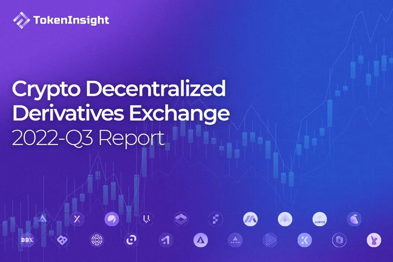

我们希望梳理清楚去中心化衍生品交易所的市场情况，特别是最受用户喜欢的永续合约产品。报告会从几个头部的协议，包括 dYdX，GMX，Perpetual Protocol 等厘清去中心化永续合约交易的现状，进行数据分析，并展望这个细分赛道未来的发展趋势。

目录

1. [要点总结](https://tokeninsight.com/zh/research/market-analysis/title-1)
2. [引言](https://tokeninsight.com/zh/research/market-analysis/title-2)
3. [去中心化衍生品交易所的发展](https://tokeninsight.com/zh/research/market-analysis/title-3)
4. [Crypto 市场为什么需要衍生品？](https://tokeninsight.com/zh/research/market-analysis/title-4)
5. [历史数据回顾](https://tokeninsight.com/zh/research/market-analysis/title-5)
6. [去中心化永续合约交易协议](https://tokeninsight.com/zh/research/market-analysis/title-6)
7. [我们为什么需要去中心化衍生品交易所？](https://tokeninsight.com/zh/research/market-analysis/title-7)
8. [去中心化衍生品交易所目前面临的挑战？](https://tokeninsight.com/zh/research/market-analysis/title-8)
9. [头部项目研究以及数据分析](https://tokeninsight.com/zh/research/market-analysis/title-9)
10. [**未来发展方向**](https://tokeninsight.com/zh/research/market-analysis/title-10)
11. [后浪](https://tokeninsight.com/zh/research/market-analysis/title-11)
12. [最后总结](https://tokeninsight.com/zh/research/market-analysis/title-12)

## 要点总结

* Crypto 衍生品交易最早始于 2011 年，但是在 BitMEX 发明了永续合约之后才算正式开始新的篇章。市场百花齐放于 2019 年，并且在 2021 年牛市达到交易量的巅峰
* 2019 年衍生品交易所前三名为 BitMEX，OKX，Huobi；2020 年为 Huobi，Binance，OKX；2021 年为 Binance，Huobi，Bybit，2022 年为 Binance，OKX，Bybit（本来有 FTX 一席之地）
* 去中心化衍生品交易所在资产透明度、用户资产控制权、抗审查/隐私性、链上可组合性等方面，相较传统中心化衍生品交易所有着明显优势
* 流动性不足、交易成本偏高、产品易用性较低、功能丰富度较差等是去中心化交易所面临的主要问题
* 过去大约 10 个月的时间内，去中心化衍生品交易所的总交易量达到 $478B。虽然这个数字大约相当于当前市场环境下 Binance 衍生品两周的交易量，但这个数字在去年年初时还基本为零
* dYdX 在 2022 年 Q3 以前处于去中心化交易所的龙头地位，但是在 Q3 之后交易量方面有被 GMX 超越的迹象；在平台收入方面部分时候已经被 GMX 超越，而 TVL 方面 GMX 已经排名第一
* 按照现在的市场发展趋势，去中心化交易所的市场规模在一年内有望增长 10 倍以上
* 从去中心化程度来看，dYdX 相较于 GMX、Perpetual 和 Drift 是最低的。同时，Perpetual 和 Drift 的 vAMM 机制相较于另外两个协议对市场的适应程度较差
* 从费用结构上来看，相比之下 GMX 和 Perpetual 的费用来源更加丰富，为协议的良好发展提供助力，并且在费用模式上也更优，利于用户激励。而 dYdX 则将所有的平台收入收为己有
* dYdX、GMX 和 Perpetual 都有完善的通证经济，鼓励用户参与协议治理和代币质押。不过在效果上dYdX 和 Perpetual 会略逊于 GMX， 主要因为用户参与后收到的实际收入较低
* 去中心化衍生品交易所接下来的发展方向主要包括提供更多样的交易机制及产品，争取市场份额，以及部署新链，实现完全去中心化的构想（特别是 dYdX）等
* 大部分新入局者的核心机制在本质上仍旧逃不脱目前头部项目制定下的架构，即订单簿、多资产流动性池以及 vAMM 机制

## 引言

FTX 由于挪用用户资金而[申请破产](https://tokeninsight.com/zh/news/ftx-files-for-bankruptcy-protections-in-us)，导致大约 $80 亿用户资金无法弥补，数百万用户受到影响的事件对行业造成了剧烈的影响。作为事件的导火索，整个 Crypto 市场对用户资金安全的担忧也逐渐升级。受此影响，越来越多的中心化交易所用户将自己存放在机构中的资金取出。同时，部分交易所为了提升用户信心，增强自己的透明度，也逐步进行了资产证明（Proof of Reserve）或发布了审计报告，公开了交易所的钱包地址。

虽然此类举措在一定程度上能够缓解市场的焦虑，但是不景气的行情依然在传递着寒冷的信号。受到 FTX 的影响，其他中心化交易所也出现了所谓的“流动性危机”，并且进行了暂停提币甚至出现了破产的传闻。如 AAX 交易所的副总裁已经宣布[离职](https://tokeninsight.com/zh/news/vice-president-of-crypto-exchange-aax-has-announced-his-resignation)，其交易所提币自从 11 月 13 日[暂停提币](https://tokeninsight.com/zh/news/aax-exchange-suspends-operations-needs-7-10-days-to-restore-user-assets)以来，截止到 29 日仍然没有恢复提币。日本交易所 [Bitfront](https://tokeninsight.com/zh/news/japanese-social-giant-line-s-crypto-exchange-bitfront-to-close) 宣布停止运营。Genesis 聘请了[重组顾问](https://tokeninsight.com/zh/news/genesis-has-hired-restructuring-advisors-to-explore-all-possible-options)，传言其将破产重组。[BlockFi](https://tokeninsight.com/zh/news/crypto-lender-blockfi-officially-files-for-chapter-11-bankruptcy) 也于 28 日申请了破产重组。

所谓“君子不立于危墙之下”，在有选择的情况下，许多用户还是会选择将自己的资产转移到自己更为放心的地方。

而对于交易这样的需求，在 [DeFi](https://tokeninsight.com/zh/cryptocurrencies/?tag=DeFi) 尚未发展起来的时候，用户完全没有任何其他选择，只能选择充钱到[中心化交易所](https://tokeninsight.com/zh/cryptocurrencies/?tag=Exchanges)，然后在交易所内交易。在 DeFi Summer 之后，去中心化交易所迅速发展起来，由于解决了长尾币种的流动性问题而迅速受到用户的欢迎。同时，部分主流币种的流动性已经不亚于中心化交易所。因而去中心化现货交易所已经成为了众多用户的选择，用户不再需要将资金存到中心化机构，而是保存在自己的钱包中就能完成交易。

现货交易的流动性相对于衍生品来说稍好解决一些，AMM（Automated Market Maker，自动化做市商）在衍生品交易中就略显乏力。此前有所尝试的 vAMM 也因为市场价格单边趋势的时候导致池子中的资产严重倾斜，交易价格无法锚定指数价格而以失败告终。

Crypto 衍生品交易自从 2019 年爆发开始，市场规模不断扩大，越来越多的公司出现并且注重于这个领域。去中心化的世界也从去年开始出现大量专注于衍生品交易的协议。作为一个具有强烈用户需求的产品，去中心化衍生品交易所在目前为止距离中心化的产品仍有不小的差距。但是或许这正是机会所在，去中心化衍生品交易尚未出现一个类似于 [Uniswap](https://tokeninsight.com/zh/coins/uniswap/overview) 的产品出现，不断地有越来越多的协议加入进来。

我们写这篇报告的目的就在这里，我们希望梳理清楚去中心化衍生品交易所的市场情况，特别是最受用户喜欢的永续合约产品。报告会从几个头部的协议，包括 dYdX，GMX，Perpetual Protocol 等厘清去中心化永续合约交易的现状，进行数据分析，并展望这个细分赛道未来的发展趋势。

## 去中心化衍生品交易所的发展

### Crypto 衍生品交易的发展史简略回顾

第一家比特币衍生品交易平台 [ICBIT 诞生于 2011 年](https://en.bitcoin.it/wiki/ICBIT)，提供以比特币为主的交割期货交易。后续 Huobi，OKEx 等交易所也都模仿推出了类似的交割产品。那时候的衍生品交易市场仍处于萌芽阶段，市场规模较小。

[BitMEX](https://tokeninsight.com/zh/exchanges/bitmex) 则是真正意义上将比特币（Crypto）衍生品交易发展壮大的关键交易所。BitMEX 成立于 2014 年，在一开始只提供比特币的交割期货交易。直到 2016 年，BitMEX 发明了永续合约（Perpetual Swap），那是一种没有到期日的期货合约。交易双方通过缴纳资金费（Funding Fee）来尽可能的将期货价格和现货指数价格的差距收敛。

2017 年底，CBOE 和 CME 也开始提供数字货币的衍生品交易，同时他们也是第一批合规的数字货币衍生品交易所。

2019 年以后，Crypto 的衍生品交易开始出现了大的爆发。在当年，Crypto 衍生品交易市场主要由 BitMEX，[Huobi DM](https://tokeninsight.com/zh/exchanges/huobi) 以及 [OKEx](https://tokeninsight.com/zh/exchanges/okx) 占领。

2020 年开始的 DeFi Summer 点燃了以太坊，使得 $ETH 成为了除比特币以外备受欢迎的资产，巨大的波动也使得其在衍生品交易市场放大了交易量。

2020 年八月，Binance 发布了“U 本位”和“币本位”两种合约产品。其中“币本位” 就是反向合约（Inverse contract）指抵押品和结算都是用数字货币；而“U 本位”合约则是使用法币/稳定币作为抵押资产和结算的产品，更加类似于传统金融行业的形式。

2021 年 4 月，dYdX Layer2 产品正式发布，允许在一个去中心化的平台交易永续合约。同年 8 月，dYdX 基金会发行了 $DYDX，用于作为平台激励，交易量随后大增。

2021 年 9 月，GMX 在 Arbitrum 上正式发布了产品，支持用户参与部分币种的现货和永续合约交易，也可通过铸造 $GLP 参与做市。该产品的 Avalanche 版本于 2022 年 1 月正式上线。

FTX 交易所成立于 2019 年五月，在两年后到达鼎盛时期，拥有超过 100 万用户。但是在 2022 年 11 月，由于挪用用户资金并且产生大量亏损，FTX 申请了 Chapter 11 破产程序。

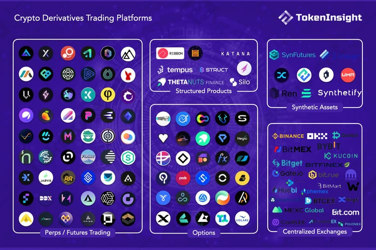

## Crypto 市场为什么需要衍生品？

### **对冲风险**

Crypto 市场对衍生品的需求和传统金融市场对衍生品的需求类似，其中最重要的一点便是风险对冲。如，对于矿工而言，在未来一段时间内获得的比特币数量基本是可以确定的，同时挖矿的成本也是可预测的，但是比特币的价格却无法预测。为了消除这样的不确定性，矿工们就可以使用比特币的衍生品交易来锁定未来的价格，同时保证自己的收益。

类似的交易行为还有很多，比如对于短时间内需求量大的币种，如参加交易所的 IEO，或者是参与公链节点投票都需要大量的币种。而这些币在事件前后都可能会发生巨大的价格波动。通过使用衍生品交易的方式就能够在一定程度上消除这些波动带来的风险，管理自己的风险敞口。

### **投机赚钱**

Crypto 交易与传统金融行业不同，Crypto 支持 24*7 不间断交易，并且具有更大的波动性。这也使得这个市场成为了投机者的天堂。衍生品交易本身的灵活性吸引了大量投机者进入，通过有限的保证金，利用合约交易的“以小搏大”特点来赚钱。

### **加杠杆放大收益**

Crypto 衍生品交易的杠杆倍数普遍较高，市场上曾出现最高 500 倍杠杆，使用 100 倍杠杆交易的用户也大有人在。在市场波动本来就比较大的时候，更高的杠杆率能够带来更多的潜在收益（当然，也会带来更高的潜在风险）。而在市场冷清的时候，也能够通过加大杠杆来人为地制造波动。

Crypto 市场使用高杠杆是一个普遍的情况，这也是一个合约用户的平均使用周期并不长的原因。

## 历史数据回顾

我们总结了 Crypto 衍生品历史的交易数据，一如我们之前所说，衍生品交易所市场在 2019 年之后被正式打开，并且在 2021 年的牛市期间到达顶峰。

从季度交易量上来看，2019 年 Q1 的交易量仅为 $264B，2020 Q1 增长了接近 8 倍，而到了 2021 年 Q1，交易量达到了惊人的$16,590B，是 2019 年 Q1 的 62.8 倍。

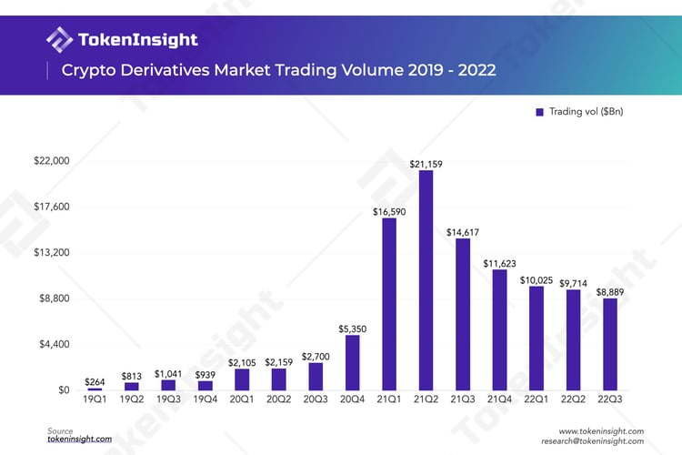

> 如果你对之前的衍生品报告有兴趣，可以点击下面的链接查看：
>
> [TokenInsight 2021 数字资产交易年度报告](https://tokeninsight.com/zh/research/reports/tokeninsight-2021-crypto-trading-annual-review)
>
> [TokenInsight 2020 数字资产期货交易所年度报告](https://tokeninsight.com/zh/research/reports/2020-crypto-futures-exchanges-research-report)
>

2021 年 Q2 衍生品交易量达到顶峰之后便开始下降。同年 Q4，交易量仅有 Q2 的约一半。而随着牛市在去年 Q4 的结束，后续交易量继续萎缩。但是由于今年从 [Terra](https://tokeninsight.com/zh/news/defi-tvl-on-terra-has-fallen-to-840-million) 崩塌， 到 [3AC](https://tokeninsight.com/zh/news/crypto-hedge-fund-three-arrows-files-for-chapter-15-bankruptcy) 破产，再到 FTX 申请破产保护等事件不断，价格虽然持续下跌，但是剧烈的波动也使得交易量虽然下降，却也没有萎缩得十分厉害。

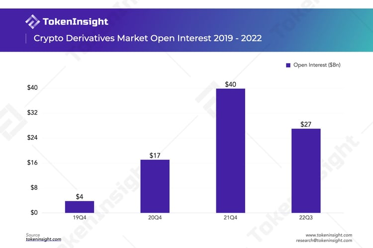

市场总未平仓量的历史走势也和交易量走势大致相同。尽管最近市场去杠杆的程度很大，但是目前的未平仓量的水平仍有 2019 年同期的约 7 倍。

在市场份额方面，我们选取了过去四年衍生品市场的前三名，它们的市场份额情况如下图所示。

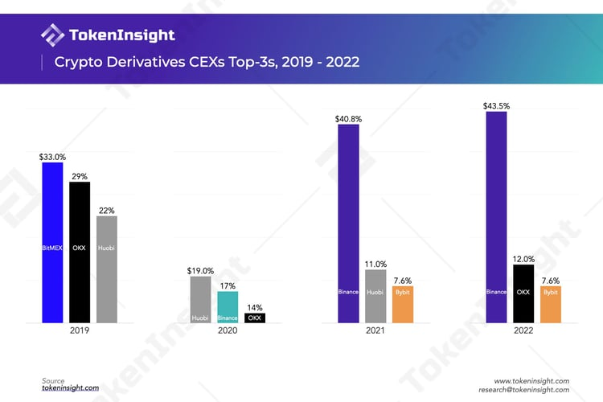

在 2020 年以前，由于永续合约的发源地是 BitMEX，因而 BitMEX 一直占据着最大的市场份额。2020 年以后，中心化衍生品交易所百花齐放，市场集中度相比之前有所下降。彼时 Huobi 占据着市场第一的位置，后面跟着的则是 [Binance](https://tokeninsight.com/zh/exchanges/binance)，OKX（当时还叫做 OKEx），这三者在当时也被并称为“三大”。2021 年以后，随着 Binance 的发力，开始超越其他交易所并牢牢占据了市场第一的位置。此外，随着当年 Huobi 宣布退出中国大陆市场并清退用户，虽然还是第二名但是距离 Binance 的差距已经很大，Huobi 在当年第四季度时交易量已经下滑非常之多。

OKX 在今年则表现良好，虽然也受到了中国大陆政策的影响，但是 OKX 在 2022 年开始发力海外市场。同时，在 FTX 挪用用户资金的事件出现之后，迅速反应，很快公布了交易所的钱包地址以及可以让用户自己去验证的的[资产默克尔树证明](https://tokeninsight.com/zh/research/miscellaneous/can-okx-s-por-self-audit-feature-improve-transparency)。在衍生品的市场份额方面已经成为了第二名。

## 去中心化永续合约交易协议

真正意义上标志着去中心化衍生品交易的开始应该是在 Layer2 正式开始运行之后。其中主要的两个代表是 dYdX 的 Layer2 上线，以及 GMX 和 Perpetual Protocol 在 Arbitrum 上部署以后。当然，我们这里主要讨论永续合约类型的交易产品，期权，合成资产等类别暂时不考虑。

dYdX 在 2021 年 8 月份发行了 $DYDX 之后，其平台的交易量也大幅度上涨。在 8 月 1 日，[dYdX 的累积交易量为$3.4B](https://tokeninsight.com/zh/exchanges/dydx)，4 个月后，也就是同年年底，累计交易量已经达到了 $322.6B，增长接近 95 倍。

而 GMX 最近两个月的日均交易量大约为 $250M。这个数字和中心化交易所对比的话，差不多是 BitMEX 交易所交易量一半的水平（2022.12.1）。

上面去中心化永续合约交易的数据在去年年初的时候还几乎为零。根据 TokenInsight 币种收录的数据，我们发现了越来越多专注这个领域的去中心化协议，并且在未来还会看到更多。当然，我们也有理由相信未来去中心化衍生品的交易份额会和现货交易的情况一样，从小打小闹到成为市场组成中的重要一部分。

## 我们为什么需要去中心化衍生品交易所？

### 去中心化的优势

**去中心化的协议往往能够提供更高的透明度**

DEX 上所有交易数据均透明公开，任何人都可以在区块链浏览器上查到每一笔交易记录。通过链上数据分析，用户甚至可以洞察到许多有价值的一手信息，如观察巨鲸交易、识别老鼠仓、验证交易所是否存在刷量交易（Wash-Trading）等等。而在 CEX，用户的每一笔交易及交易所资金储备等信息均不会被公开，类似于黑箱，用户需要完全信任 CEX，而这也给了 CEX 许多作恶的可能。

**去中心化的协议允许用户始终掌握自己的资产控制权**

CEX 往往要求交易者的资产托管于平台，平台负责管理用户资金。用户需信任平台不会滥用自己的资产、不会发生挤兑危机等可能损害到自身资产完整性的中心化作恶事件。而 DEX 需用户在使用前连接自己的加密货币[钱包](https://tokeninsight.com/zh/cryptocurrencies/?tag=Wallet)，并对自己的资金拥有控制权（Self-Custody）。

**去中心化的协议提高了抗审查/隐私的能力**

随着加密货币的经济与政治影响力不断扩大，政府监管也呈日益严苛的趋势。CEX 由于自身公司主体的特性，更易受到业务所在国法律法规的约束，如 KYC（Know Your Customer）和反洗钱 AML（Anti-Money Laundering）等，用户在注册时往往被要求上传个人信息、证件等。美国用户在拥有本国牌照的 CEX 交易甚至需像股票交易一样进行年度报税工作。而 DEX 可以看做是一个由代码组成的协议，而非公司法人，因此天然具有抗审查的特质，用户也几乎无需进行 KYC 认证。

### 链上可组合性

由于 [DEX](https://tokeninsight.com/zh/cryptocurrencies/?tag=DEX) 本身无需准入（Permissionless）的特性，许多 DEX 产品不仅可以被视作一个单独的产品，更可被其他应用层的 DeFi 产品取用并为其提供底层的流动性。这样，DEX 便处于介于区块链与应用层之间的流动性层，未来能在 DeFi 生态中扮演类似乐高积木的作用，具有极高的链上可组合性。以下我们以 GMX 为例来分析。

**收益聚合器**

[**Umami Finance ($UMAMI)**](https://tokeninsight.com/zh/coins/umami-finance/overview)

2022 年 7 月，Umami Finance 与 GMX 和 TracerDAO （现在已改名为 Mycelium）合作 推出 [USDC Vault](https://twitter.com/UmamiFinance/status/1544320386015404032?s=20&t=gHG_J2X7AaM2ox2waicCbQ)，其原理是用户存入的 $USDC 中 50% 会 mint 为$GLP 获得收益，另外 50% 用于在 TracerDAO 中对冲 $GLP 的风险敞口。同年 Q4，Umami Finance 将推出 GLP Vault。

同时，截至 2022 年 11 月 23 日，Umami 通过 GMX 的 Referrals 计划 （即，新用户使用 “umami” 的推荐码可获 10% 的手续费减免）帮助其引流高达 $160,000,000 的交易量至 GMX，获得了$18,000 的奖励，并均将存入 Treasury。

**DeCommas**

DeCommas 是一个跨链 DeFi 自动化层。它根据 $GLP 开发了一套 [Delta 中性策略](https://twitter.com/decommas/status/1588558656366600196?s=20&t=0nX5KKzRAXKaXg6_AdBXxg)，即用户存入的$USDC 中 50% 将 mint 为 $GLP；另外 50% 会抵押进 AAVE，借出加密货币如$ETH 或 $BTC，然后出售为稳定币，从而对冲投资组合中风险资产的市场波动影响。该策略预计将于 2023 年 Q1 发布。

[**Yield Yak ($YAK)**](https://tokeninsight.com/zh/coins/yield-yak/overview)

在 Yield Yak 的 [$GLP 挖矿项目](https://yieldyak.com/farms/detail/0x9f637540149f922145c06e1aa3f38dcDc32Aff5C)下，用户可质押$GLP 进行挖矿，平台可进行自动复投，而 GMX 官方平台则需要用户手动复投并支付 gas 费。Yield Yak 的方案可使用户获得比质押在 GMX 平台更高的 APY，前提是 $GLP 在该平台会被兑换为$fsGLP。

**借贷**

[**Vesta Finance ($VSTA)**](https://tokeninsight.com/zh/coins/vesta-finance/overview)

Vesta Finance 是一个建立在 Arbitrum 上的超额借贷协议。目前平台设有 [$GMX Vault 和$GLP Vault](https://vestafinance.xyz/products)，用户可以抵押 $GMX 或$GLP，借出平台稳定币 $VST。

**“保险”/Cover**

[**Nexus Mutual ($NXM)**](https://tokeninsight.com/zh/coins/nexus-mutual/overview)

$GMX 的持有者可以在 Nexus Mutual 上购买 [Cover](https://app.nexusmutual.io/cover/buy/get-quote?address=0x3D6bA331e3D9702C5e8A8d254e5d8a285F223aba)，即当发生合约故障、经济攻击（含预言机失效等）、治理攻击时，用户可以在该平台获得相应赔付。

## 去中心化衍生品交易所目前面临的挑战？

**流动性相对于中心化交易所较差**

CEX 通常平台会提供做市商服务，作为对手方为用户加密货币交易的买与卖提供更多流动性，不单单依靠用户自身的交易需求，因此有更高的流动性。而许多 DEX 产品受限于 LP 与 交易者规模，流动性池的规模较小，还会为参与者带来较高的滑点与无常损失。

**交易成本较高**

用户仅需向 CEX 支付极低的交易费用，如 [BitMEX](https://www.bitmex.com/wallet/fees/derivatives) 的吃单手续费为 0.075%，挂单手续费甚至达到了负数 -0.010%，这意味着用户可以从平台获得返佣。而 DEX 往往交易成本较高，且由于其去中心化特性，还需承担额外的链上交易处理成本，但这部分成本在 Arbitrum 等 Layer 2 中可以很低。

**产品使用体验和上手门槛较高**

CEX 往往有更好的用户体验，近似于传统投资者进行股票买卖的操作，因此用户能较快上手。而 DEX 由于产品的创新，用户需要学习新的交易规则和交易步骤，这无疑增加了用户的学习成本和进入门槛。

**产品丰富度不足**

目前，去中心化衍生品交易所赛道仍处于发展早期，产品功能主要为永续合约与现货交易；而 CEX 经过多年的发展，目前的衍生品产品功能更加多样化。如币本位合约、网格策略等等，可以满足丰富的用户需求。同时，目前 DEX 的交易对数量远少于 CEX，如 Binance 可支持上百个交易对，而 dYdX 和 GMX 分别只支持 38 和 8 个交易对。

## 头部项目研究以及数据分析

本节我们将主要介绍四个去中心化衍生品交易赛道的头部项目，GMX、dYdX、Perpetual Protocol 以及 Drift。首先，我们会从项目现阶段的基本情况引入，希望让读者先简单了解项目。接下来，我们会从项目机制、费用结构及分配、通证经济和安全性进行深入的分析，对比项目，从而使读者形成更加全面的对现阶段的去中心化永续合约交易赛道的认知。

### 快速了解这四个项目

**GMX**

[GMX](https://tokeninsight.com/zh/exchanges/gmx) 是一个由匿名团队创建的去中心化衍生品交易协议。GMX 于 2021 年 9 月 1 日在 [Arbitrum](https://tokeninsight.com/zh/coins/arbitrum/overview) 上推出，并于 2022 年 1 月 5 日上线 [Avalanche](https://tokeninsight.com/zh/coins/avalanche/overview)。GMX 目前支持现货交易和最高 50 倍杠杆的永续合约交易。GMX 支持的订单包括市价单、限价单、和触发订单（获利/止损订单）。

GMX 的核心机制是 GLP 流动性池。GLP 池由一篮子资产组成，它在交易中作为交易者的对手方存在并为平台上的所有交易提供流动性。GMX 使用动态定价机制，以 [Chainlink](https://tokeninsight.com/zh/coins/chainlink/overview) 提供的动态聚合预言机进行喂价，从而实现以零滑点执行交易。

GMX 包含两种原生通证。其中，[$GMX](https://tokeninsight.com/zh/coins/gmx/overview) 是 GMX 的实用和治理通证，$GMX 通证的持有者可以获得 GMX 的治理投票权或选择质押通证以获得奖励。$GLP 是 GMX 的流动性提供者通证，$GLP 的持有者，即流动性提供者可以获得一定比例的平台交易费用作为其提供流动性的奖励。

**dYdX**

[dYdX](https://tokeninsight.com/zh/exchanges/dydx) 是部署在[以太坊](https://tokeninsight.com/zh/coins/ethereum/overview)网络上的去中心化衍生品交易协议，由 [Antoni Juliano](https://www.linkedin.com/in/antoniojuliano) 于 2017 年 8 月创建。dYdX 的核心团队由来自 [Coinbase](https://tokeninsight.com/zh/exchanges/coinbase) 等知名加密货币公司的软件工程师组成。

dYdX 使用传统做市商熟悉的订单簿模型执行交易，为交易者提供多种类的订单产品和流动性。目前，dYdX 的交易产品以永续合约为主，支持最高 20 倍杠杆、可以自定义滑点的永续合约交易。

除了广为熟知的订单簿交易机制，dYdX 的另外一个特点是，它利用了 [Layer2](https://tokeninsight.com/zh/cryptocurrencies/?tag=Layer-2) 解决方案 Starkware 的交易引擎来提高交易的吞吐量并降低交易费用。但订单簿机制以及对外部交易引擎的依赖在某种程度上增加了 dYdX 的中心化程度。在接下来的的 [v4](https://dydx.exchange/blog/v4-full-decentralization) 开发计划中，dYdX 计划从 Starkware 过渡到自己开发的基于 [Cosmos](https://tokeninsight.com/zh/coins/cosmosatom/overview) 的原生区块链，dYdX Chain，以建立一个完全去中心化的衍生品交易所。

$DYDX 是 dYdX 的原生治理通证。除了治理的投票权，通证的持有者还可以根据其持有的资产规模获得交易费用折扣。此外，持有者可以质押$DYDX 到安全池以获得奖励。

**Perpetual Protocol**

[Perpetual Protocol](https://tokeninsight.com/zh/coins/perpetual-protocol/overview) （前身为 Strike）是由 [Yenwen Feng](https://tw.linkedin.com/in/tempofeng) 和 [Shao-Kang Lee](https://tw.linkedin.com/in/shaokanglee) 共同创立的去中心化衍生品交易协议。Perpetual Protocol 最初于 2020 年 12 月在 [Gnosis Chain](https://tokeninsight.com/zh/coins/gnosis/overview)（前 xDai）上推出。其 v2 版本，[Curie](https://blog.perp.fi/introducing-perpetual-protocol-v2-curie-730d3e9aa609)，于 2021 年 11 月在 Arbitrum 上推出。

Perpetual Protocol 的交易产品以永续合约为主。目前，Perpetual Protocol 支持的订单包括市价单、限价单和止损订单。它支持最高十倍杠杆、自定义滑点的永续合约交易。

Perpetual Protocol 使用虚拟 AMM （vAMM）交易模型。虽然 vAMM 同样使用 AMM 的常数函数方程，但与传统的 AMM 模型不同，vAMM 仅作为价格发现工具，不存在真实的流动性，交易中也不存在交易对手方。但是，vAMM v1 存在未平仓合约的多空倾斜问题以及高滑点问题。针对高滑点问题，Perpetual Protocol 推出了 v2 版本，使用 [Uniswap v3](https://tokeninsight.com/zh/exchanges/uniswap-v3) 作为执行层提供集中流动性以降低交易滑点。此外，v2 增加了全仓保证金机制并丰富了抵押品种类，同时允许用户进行无许可的市场创建。

$PERP 是 Perpetual Protocol 的原生实用通证。$PERP 的主要功能是治理。通证的持有者可以参与治理投票或质押通证以获得奖励。

**Drift**

[Drift Protocol](https://tokeninsight.com/zh/coins/drift-protocol/overview) 是由 [David Lu](https://au.linkedin.com/in/daluie) 和 [Cindy Leow](https://sg.linkedin.com/in/cindyleowtt) 共同创立的去中心化衍生品交易协议。Drift 背后的核心贡献团队是 Drift Labs。

Drift v1 于 2021 年 11 月在 [Solana](https://tokeninsight.com/zh/coins/solana/overview) 上推出。目前，Drift v2 已经在其内部主网上线，计划将于不久后正式公开上线。现阶段，Drift 支持现货交易、最高十倍杠杆的永续合约交易、借贷以及被动流动性供应。Drift 支持的订单类型包括市价单、限价单和高级条件订单（例如止损限价订单等）。

Drift v1 与本文中提到的 Perpetual Protocol 类似，使用 vAMM 作为其核心机制。但最大的不同点在于其 vAMM 的流动性是动态可变的，可以围绕价格提供更深层的流动性以解决滑点问题。同时，Drift v1 与订单簿相结合，允许用户针对 vAMM 提交限价订单。Drift v2 是 v1 的升级版本。与 v1 相比，v2 增加了[即时（JIT，Just-In-Time）流动性拍卖](https://docs.drift.trade/just-in-time-jit-auctions)机制和[被动流动性资金池](https://docs.drift.trade/liquidity-provision)，以激励做市商为交易提供更加充足的流动性。关于详细的机制说明请移至下面的项目机制章节进行阅读。

目前，Drift Protocol 尚未发行自己的原生通证。

### 项目机制

衍生品交易最核心要解决的问题之一便是流动性。在这个核心机制方面，dYdX，GMX，Perpetual Protocol 和 Drift 采用了几种完全不同的方式实现。

**dYdX 的传统模式吸引做市商提供流动性，但去中心化程度相较 GMX 更低。**

dYdX 更加偏向于传统的中心化交易所，采用的是订单簿（Orderbook）的方式。交易用户互为对手方，而协议本身只作为平台提供功能。但仅依赖于普通用户来提供流动性肯定是不足的，因而 dYdX 在启动直至现在，都有指定的数个机构做市商在协议中提供流动性。dYdX 也给这些指定的做市商预留了一定比例的 $DYDX 作为激励。

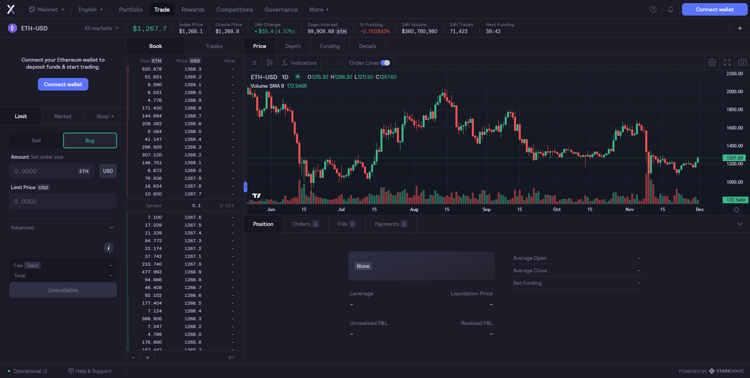  
dYdX 交易界面，来源：dYdX 官方网站

dYdX 的链上订单簿的实现依赖于其搭建在 Layer2 上。订单簿不同于 AMM， 它降低了用户和做市商参与交易的壁垒，同时可以长期持续提供流动性，也是传统做市商熟悉的既定模式。dYdX 的交易和匹配引擎通过[亚马逊网络服务](https://aws.amazon.com/cn/free/?trk=19773016-af12-4fcd-adc3-a4ad304022d4&sc_channel=ps&s_kwcid=AL!4422!3!450873684891!e!!g!!aws&ef_id=Cj0KCQiA4aacBhCUARIsAI55maF0nooISChT43J0sQttIFxWRLzV72HjBrWm00DAs19MvIaevQvp45saAsCVEALw_wcB:G:s&s_kwcid=AL!4422!3!450873684891!e!!g!!aws&all-free-tier.sort-by=item.additionalFields.SortRank&all-free-tier.sort-order=asc&awsf.Free%20Tier%20Types=*all&awsf.Free%20Tier%20Categories=*all) (AWS) 托管，值得注意的是，dYdX 不能严格意义上算作完全去中心化的衍生品交易所，其订单簿和交易匹配引擎还是中心化的。但是 dYdX 正在积极开发 v4，预计 2023 年 Q2 上线，届时将具有一个完全去中心化的订单簿和匹配引擎，并实现极高的订单簿吞吐量。

GMX 没有采用 dYdX 的订单簿模型，而是创新了一种 [GLP](https://gmxio.gitbook.io/gmx/glp) 机制。GLP 流动性池为交易提供流动性，由多种资产组成，其中包括 [wBTC](https://tokeninsight.com/zh/coins/wrapped-bitcoinwbtc/overview)、 [wETH](https://tokeninsight.com/zh/coins/weth/overview) 和[稳定币](https://tokeninsight.com/zh/cryptocurrencies/?tag=Stablecoins)等。在这种机制下，平台将用户分成两类，分别是交易者和流动性提供者。

对于交易者而言，如果要做杠杆交易，需要先向 GLP 池中存入抵押品。根据交易所的规则，开空和开多的抵押品不同。

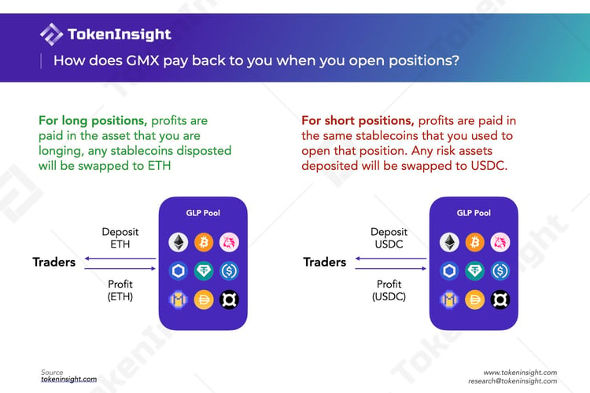

举例来讲，当交易者做多 ETH 时，可以描述为交易者从 GLP 池中“借出” ETH；而当交易者做空 ETH 时，则从 GLP 池中“借出” ETH 对应的稳定币，由此对应两种不同的抵押品，而实际上池中资产并未被借出。在多头平仓时，如果交易者盈利，将会从池中提取做多的资产（此例中为 ETH）作为利润给交易者，亏损时则会扣除一开始存入的资产并放入 GLP 池中，即盈亏的币种与抵押品币种一致。因此 GLP 池相当于交易者的交易对手方。

对于流动性提供者而言，可以通过向 GLP 池注入/取出某种特定的资产来铸造/销毁 $GLP，铸造和销毁都会收取一定的费用。每一种池中的资产有对应的目标权重，根据市场情况调整。如果某种资产的当期权重高于目标权重，则在存入该资产时会收取更高的费用，而作为激励，取出资产的费用将减少，反之亦然。

GLP 池的价格由 Chainlink 的预言机提供，其价格基于一些中心化交易所如 Binance 和 [Bitfinex](https://tokeninsight.com/zh/exchanges/bitfinex)。这使得 GLP 具有极高的资本效率，实现交易零滑点（预言机喂价提供最优交易执行价格），同时流动性提供者因无需发现价格从而不会面临无常损失。

**Perpetual 和 Drift 基于 AMM 进行迭代，但效果暂未达到预期**

由 Uniswap 提出的 AMM 机制利用 x*y=k 的常量函数来实现通证互换，但这个机制并不适用于衍生品交易，同时也存在高滑点和无常损失等问题。为了解决 AMM 的局限性，Perpetual Protocol 提出了[虚拟 AMM](https://blog.perp.fi/a-deep-dive-into-our-virtual-amm-vamm-40345c522eeb)（virtual AMM）。虽然采用相同的公式实现，但并没有实际存在的资产存储池（k）。通证会经由清算所最终被存储在保险库中，vAMM 只用于价格发现。由于流动性无需流动性提供者来提供而是由交易者自己提供，所以不存在无常损失。加之 k 值由操作员根据市场情况手动设置，一定程度上实现了滑点管理。

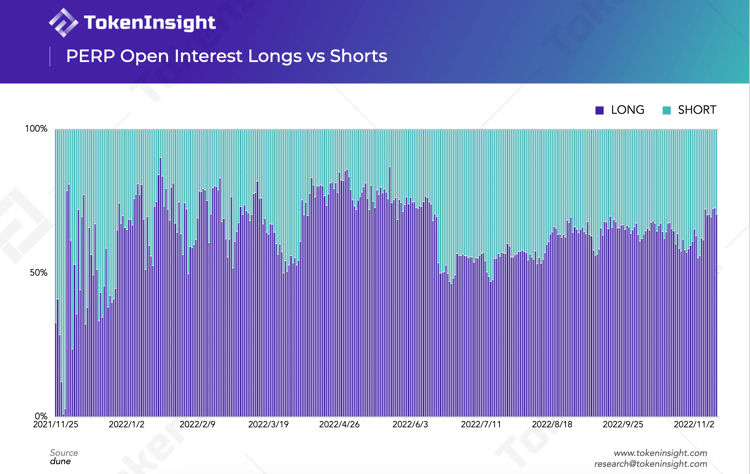

但是，vAMM v1 并不适用于高波动性的市场，在未平仓合约严重倾斜时依赖于保险金，同时交易者仍面临高滑点。为了解决这些问题，vAMM v2 与 Uniswap v3 相结合作为执行层，引入了流动性提供者，使每笔交易通过流动资金池直接发生在交易者和做市商之间，减少了保险金对倾斜市场的参与，使协议更加安全。针对滑点，Uniswap v3 允许流动性提供者在自定义的范围区间内提供流动性，各个头寸再汇聚到池子中，大额交易也因此会分散在多个头寸上，由此达到减少滑点的效果。但新的问题是，流动性提供者只有在初始阶段（价格未发生偏离）时才没有损失，这对他们十分不友好，使得 vAMM v2 对 LP 没有吸引力。目前 Perpetual Protocol 团队在自己为市场提供流动性以引导深度和活跃度。

Drift 最开始也专注于 vAMM 模型 —— 和 Perpetual 一样。基于 Perpetual Protocol v1 模型，Drift 引入了动态的 k 值，实现了[动态 AMM](https://driftprotocol.medium.com/deep-dive-into-drifts-dynamic-vamm-part-1-3-c2121fbce3c4)（Dymatic AMM）。通过这种方式，流动性重新平衡，并在当前价格提供更深层次的流动性，流动性深度不会随着价格越来越远离永续合约的初始价格水平而失控，确保在任何市场条件下流动性都很强。同时 Drift 也与订单簿相结合，允许用户提交限价订单。

但是，静态 k 存在的问题完全被解决了吗？

并没有。虽然 Drift 上的头寸可以不用达到最终价格而直接平仓，但其资金费率已经严重偏离了 CEX 上永续合约的资金费率，因为市场倾斜的问题未被真正解决。举例来说，当 [LUNA](https://tokeninsight.com/zh/coins/terra-luna/overview) 价格暴跌时，Drift 需要大量的空头头寸保持价格准确，意味着多头要支付极高的资金费率来实现。总体来看，vAMM 模型导致这类 DEX 难以反映真实市场价格。这次失败让 Drift 决定停用 v1 转而专注第二代产品。

Drift v2 在原先去中心化订单簿基础上加入了两种流动性机制 —— 及时流动性拍卖和 AMM 流动性。当交易者提交市价订单时，会针对该订单生成拍卖使做市商互相竞争，以实现更优的价格来满足客户。如果做市商在最初 5 秒内没有介入，将通过 DAMM 来满足客户。此举改进了定价和流动性深度，使订单以最小滑点成交，同时减少了 AMM 多头/空头不平衡的风险，但具体效果如何还需等待市场检验。

整体而言，从机制角度来看，虽然订单簿模式为 dYdX 带来了很高的交易量，但去中心化程度远低于 GMX、Perpetual 和 Drift。通过分析不难发现，vAMM 模型存在一定弊端，暂时并不适用于当前的市场，Perpetual 和 Drift 还需针对此模型进一步探索。

### 费用结构及分配

由于采用订单簿的方式，dYdX 使用 [Maker-Taker](https://help.dydx.exchange/en/articles/4798040-perpetual-trade-fees) 价格模型来决定交易费用。根据过去 30 天内的交易量，Maker 会被收取 0-2bps 的费用，而 Taker 则会被收取 2-5bps 的费用。值得注意的是，当过去 30 日内交易量小于 10 万美元时不会收取交易费，此举是鼓励散户参与交易，而且仅对已经满足的订单才会收取费用。此外，根据用户持有的 $DYDX 和$stkDYDX 通证的数量，还可以享受最高 50% 的交易费用折扣。与其它协议不同的地方在于，收取的全部费用均归属于 [dYdX 基金会](https://dydx.foundation/)，并不会分配给通证持有者。

相较于 dYdX，GMX 的交易费用来源更为丰富，主要有两部分：一部分是铸造/销毁 $GLP 和互换时产生的费用，如前文所述，根据当期权重的不同收取 0-80bps 费用；另一部分则来自于保证金交易，交易费为总仓位的 0.1%。与此同时，在保证金交易中还会收取“借款费用”给 GLP 池，其计算公式为 (Assets Borrowed) / (Total Assets in GLP) * 0.01%，每小时会收取一次。平台收取的费用会分配 70% 给$GLP 的持有人，余下的 30% 则分配给 $GMX 的质押人。

由于对模型进行了升级，Perpetual 和 Drift 的收费机制也发生改变。在 Perpetual Protocol v2 上的每笔交易都会收取 0.1% 的交易费。v2 与 v1 相比拓宽了收费渠道：v1 费用收入只来自公开市场，v2 在此基础上还包括私人市场以及再抵押（保险金中的基金可被用于低风险协议以增加回报）。费用分配有两种情况，当保险金余额小于保险金阈值时，20% 的费用会存入保险金，80% 会分配给流动性提供者（做市商）；如果保险金余额大于保险金阈值，流入保险金的费用会平均分配给 DAO Treasury 和 $vePREP 持有者。

因为 Drift 的部分流动性来源于订单簿，其[费用结构](https://docs.drift.trade/trading-fees)更类似于 dYdX，同样根据过去 30 日交易量来决定。Taker 会被收取 5-10bps 的费用，值得注意的是，Maker 的费用为固定的 -2bps —— 这与 dYdX 有很大差异。此外，DAMM 收取的 [90%](https://docs.drift.trade/liquidity-provision) 的交易费则会根据流动性提供者提供的流动性比例而分配。

总而言之，dYdX 和 Drift 在收费结构上有很大程度的相似，但整体上 Drift 成本会略高于 dYdX。相较于这两家 DEX，GMX 和 Perpetual 的费用来源则更加丰富。此外 dYdX 并未将收入分配给通证持有人或流动性提供者，即便持有通证可享受交易折扣，但从这个角度上看在用户激励方面会稍逊色于其他三个协议。

### 通证经济

除 Drift 以外，GMX、dYdX 和 Perpetual 都有各自的治理通证，也可以通过质押通证以获得奖励。具体奖励分配存在差异：

GMX 的收入 100% 分配给 $GMX 和$GLP 持有者。$GMX 持有者的总收益为 30% 的交易费（以 ETH 或 AVAX 的形式）加上质押所获得的 [$esGMX](https://gmxio.gitbook.io/gmx/rewards) 通证和[乘数点](https://gmxio.gitbook.io/gmx/rewards)。$esGMX 同样可以像$GMX 再次质押，获得相同的收益，或者在一年锁定期之后换成普通的 $GMX 通证。同时$GMX/$esGMX 质押者还能每秒获得 100% APR 的乘数点，它同样可以被再次质押以激励持有者持续质押$GMX，而一旦用户取消质押 $GMX，则会销毁相应比例的乘数点。类似的，$GLP 持有者也能获得收益，其总收益为 70% 的交易费（以 ETH 或 AVAX 的形式）加上质押所获得的 $GMX。值得注意的是，$GLP 币价与 GLP 池中的资产价格呈正相关，流动性提供者间接享受了池中资产潜在的升值空间。

与 GMX 类似，dYdX 的 $DYDX 持有者可以将通证质押到[安全池](https://docs.dydx.community/dydx-governance/staking-pools/safety-staking-pool)来铸造$stkDYDX。$stkDYDX 在治理上享有和$DYDX 一样的提案和投票权。安全模组主要用于激励持有者正确地治理协议，同时充当系统中的风险管理者。作为激励奖励，$DYDX 初始供给中的 2.5% 会被分配给质押$DYDX 的用户，其标准基于用户交易产生的费用，以及未平仓合约所占的比例。此外，7.5% 和 25% 的初始通证还会用于流动性提供者奖励和交易奖励，激励他们参与 dYdX 上的交易活动。

$PREP 通证在 Perpetual Protocol 上同样可用于治理和质押。$PREP 持有者可将其锁定在质押池一段固定时间，获得 $vePREP。其风险在于如果保险金在极端市场情况下耗尽，会通过协议出售质押的通证；而作为补偿，质押者可以每周获得奖励（费用分配）。

不难发现，三个协议都鼓励通证持有者参与协议治理和通证质押，但效果差别较大：GMX 引入了 $esGMX 和乘数点鼓励持有者持续进行质押活动，对通证和协议的发展有积极作用；dYdX 则分配初始通证供给激励用户，但伴随而来的问题是部分交易者会在通证分配的前一天（每 28 天分配一次）大量交易提高交易量，从而获得更多的通证奖励，导致代币价格的波动；虽然$vePREP 也能获得奖励，但仅为交易费的 10% 而且还有前提，因此也不利于激励质押者。

### 安全性

如前文所述，用户在 GMX 上交易需要先存入对应的抵押品。GMX 采用的是[部分清算](https://gmxio.gitbook.io/gmx/trading#partial-liquidations)，清算价格是在抵押品减去损失和借款费用的值低于头寸规模的 1% 时的价格。如果通证价格变化超过这个点就会触发清算，该头寸将自动平仓。由于交易者可以选择最高 50 倍杠杆，杠杆越高，清算价格也就越高。随着借款费用的增加，清算价格将逐步增加，需要用户持续关注清算价格避免清算。

除清算机制以外，GMX 还针对平台攻击者采取了相应的安全措施。起因源自 2022 年 9 月的[攻击行为](https://twitter.com/gmx_io/status/1571439325413511169)：攻击者先在 GMX 开立合约，然后在 FTX 操纵了 AVAX 价格，最后通过在 GMX 平仓获益，攻击致使流动性提供者损失约 57 万美元。针对此次事件，GMX 通过限制 AVAX/USD 的空头和多头持仓量，让操纵成本高于潜在收益，以保护交易所免受进一步操纵。此外，GMX 在 10 月还推出了[漏洞赏金计划](https://immunefi.com/bounty/gmx/)，奖励根据漏洞的严重程度及影响而分配，以防止智能合约和应用程序出现资金盗窃、价格操纵和盗取治理金等问题。

与 GMX 不同，dYdX 根据账户价值和保证金要求来决定是否清算：账户会在其总价值小于维持保证金要求时，根据头寸采用不同的公式进行清算。清算造成的盈利和损失会进入保险金，而如果保险金耗尽，则采用去杠杆机制作为最后的保护手段：通过减少高利润高杠杆账户的头寸来抵消水下账户，由此维持系统的稳定性。

Perpetual 的清算机制和 dYdX 类似，清算时会先用抵押品价值除以头寸的名义价值得到保证金比率，只有当比率大于 [6.25%](https://blog.perp.fi/perp-v2-liquidation-mechanism-update-7cb960524f96) 才能避免被清算。如果触发清算，根据保证金比率不同，最大可清算比例也有不同：当保证金比率在 6.25% 和 3.125% 之间，会清算交易者 50% 的头寸；而当保证金比率小于 3.125% 时，则会清算 100% 的头寸。

除此之外， Perpetual 的保险金也用于保护永续合约市场，当永续市场倾斜严重时保险金将用于支付高额的资金费率。如果保险金耗尽将触发智能合约，通过铸造新的 $PREP 通证并出售以作为金库中的抵押品，从而保护系统的偿付能力。

Drift 同样计算保证金比率，当账户维持保证金比率小于最低维持保证金比率时将触发清算。此外，在 Drift 上还会通过 log(max(0, margin ratio - maintenance ratio) + 1) 的公式计算 “[Health](https://docs.drift.trade/liquidations)”。用户可以通过界面上的 Health 值来判断账户和清算的距离，当 Health 为 0 时，账户将触发清算，头寸将以保证金引擎的价格进行清算。

整体来看，dYdX、Perpetual 和 Drift 都通过保证金判断是否清算。除清算以外，GMX 和 Perpetual 还有针对攻击和市场情况的相关安全措施，虽然 dYdX 也有类似的安全模块用于处理协议破产或其他问题，但经社区投票决定在 2022 年 11 月 28 日后已经[不再有效](https://docs.dydx.community/dydx-governance/staking-pools/safety-staking-pool)。

### 数据表现

本小节我们比较了几家去中心化交易所过去一段时间的市场表现，包括市场交易量、未平仓合约量、平台收入和活跃用户量等指标，旨在分析有哪些类似的发展趋势，以及哪些交易所市场认可度更高。

#### 去中心化衍生品交易所交易量

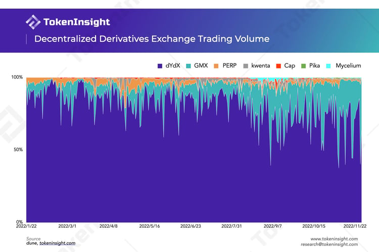

从交易量占比来看，dYdX 相较与其它去中心化衍生品交易所有着绝对的优势，整体上持续控制着超 70% 的市场。特别是从年初开始 GMX 尚未被广泛熟知的时候。dYdX 的交易量较高和其订单簿以及拥有指定做市商来提供流动性密不可分。用户可以使用和中心化交易所类似的交易策略，并且低廉的交易成本，对 API 交易的加持也可以支持更加频繁的交易。

GMX 作为“后起之秀”，创新的机制，可观的真回报（ETH 奖励）以及 Layer2 本身用户量的扩大都促进了 GMX 的发展。从今年第三季度以来，GMX 的市场份额占比明显上升，在部分时间段甚至能够获得超越一半的市场份额。

而其余协议则只占总交易量很小一部分，现阶段竞争力较弱。

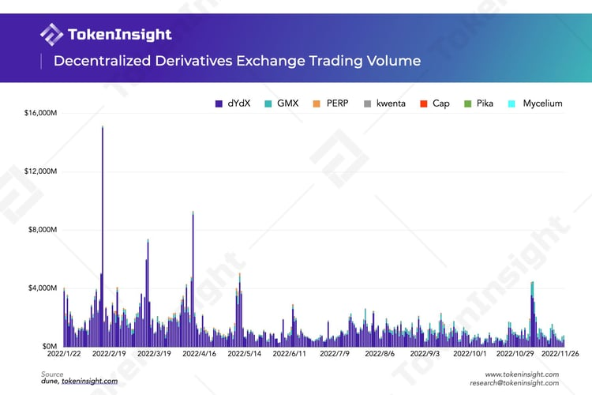

2022 年各交易所交易量变化趋势基本保持一致，过去大约 10 个月的时间内，去中心化衍生品交易所的总交易量达到 $478B。dYdX 前期一直处于主导地位，单日交易量甚至超越$15B。自 Q2 以后受熊市及 Terra 等事件的影响，整体交易量有所下滑。11 月初 [FTX 暴雷事件](https://tokeninsight.com/zh/news/ftx-files-for-bankruptcy-protections-in-us)的发生，导致大量交易者撤出中心化交易所并转向去中心化协议，由此交易量在这段时间出现小峰值，随后又回落到较低水平。

#### 历史未平仓合约量

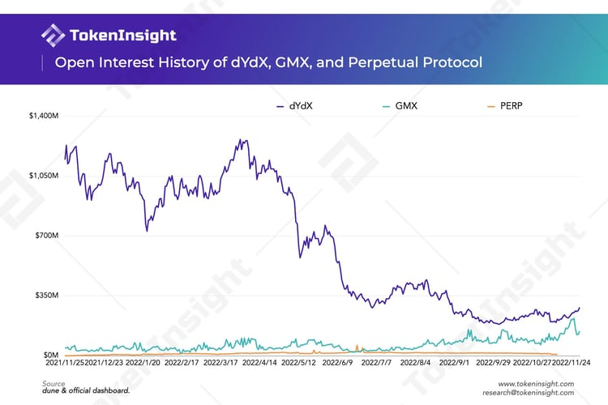

2022 年 Q3 以前，[dYdX](https://tokeninsight.com/zh/exchanges/dydx) 未平仓合约量（OI）远超其他两家交易所，而后一路下滑至最低 1.9 亿美元左右，仅为峰值的约 15%。当然，这不是 dYdX 自己的原因，而是市场大环境的影响。今年以来，由于市场整体处于熊市并且夹杂着各种暴雷，在去年牛市中的高杠杆以及市场信用的扩张都在今年逐步被迫破裂。这个过程明显是残忍且血腥的，因而我们能够看到 dYdX 这样从去年便开始吸引大量用户的交易协议和中心化的交易所一样，未平仓量也跟着暴跌。

反观 [GMX](https://tokeninsight.com/zh/exchanges/gmx)， 该交易所的 OI 一直在稳步增长，甚至一度有超越 dYdX 的趋势。核心的催化剂之一当然是许多用户开始转向去中心化的交易协议。GMX 中的 GLP 资产规模增加，也使得其平台能够支撑起更大的流动性，能够为用户提供更多的敞口规模。而更多的用户涌入与交易行为又会吸引更多的用户来 GMX 提供流动性以赚取收益。相比之下， PREP 则表现平平，竞争力相对较弱。

#### dYdX、GMX 和 Perpetual Protocol 平台历史收入情况

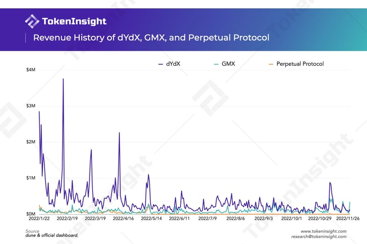

与市场交易量类似，今年上半年 dYdX 的平台收入也远超其它两家去中心化交易所。分析其原因，一方面，dYdX 平台交易量远高于这两家交易所，即便交易费用较少同时还有一定折扣，但交易量方面的压倒性优势还是为 dYdX 带来了可观的收入。

另一方面，如前文所述，dYdX 并没有将费用收益分配给通证持有者，所有收入均归属 dYdX 基金会。而其它交易所都会将全部或部分费用分配给通证持有者或流动性提供者，由此导致较大的收入差距。而随着时间的推移这种差距正在逐步收窄，在今年 11 月甚至有几日被 GMX 反超，GMX 的收入也有望继续增长。

#### 累积用户量及总锁仓价值对比

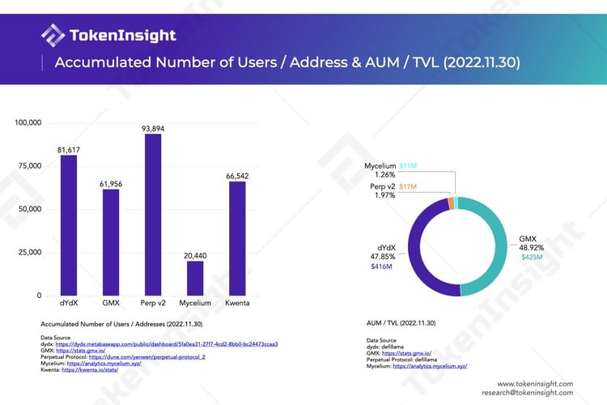

比较 2022 年 11 月 30 日各交易所累积用户量可以看到，Perp v2 的用户量最高，达 93,894。这个数据来自于 Perp 创始人 [Yenwen 创建的 Dune Dashboard](https://dune.com/yenwen/perpetual-protocol_2)。最高的用户量和较低的交易量以及 TVL 有些反常。

抛开 Perp v2，其他的协议中，dYdX 拥有最多的累积用户量。Mycelium 在从 Tracer DAO 改名之后，目前在用户量方面处于较低的位置。在 TVL 方面，GMX 的 GLP 资产规模最高，已经略微超越 dYdX。但是两个协议基本各自占据着一半的市场份额。

#### 通证情况

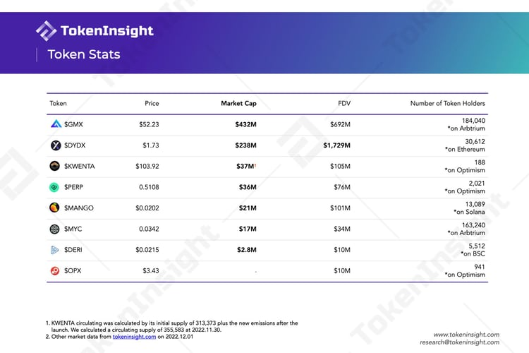

上面的表格总结了部分去中心化衍生品交易协议的 Token 表现情况。

就流通市值而言，$GMX 最高，紧随其后的是$DYDX。值得注意的是 $GMX 的市值甚至有$DYDX 的两倍之多。而 [$KWENTA](https://tokeninsight.com/zh/coins/kwenta/overview) 的市值也有$37M 之高，但 $KWENTA 刚刚发行不久，目前的流通量只有初始发行量和开始几个星期的少量释放。作为一个新的 Token，$KWENTA 的持有人数量也是最少的，只有不到两百人。

在完全稀释市值（价格 * Token 总量）方面，$DYDX 最高，这主要是因为有大量的$DYDX 尚未解锁。初始分配给团队，投资人，员工等份额的 $DYDX 将会在明年 2 月份开始解锁，届时$DYDX 的流通量将会大增。TokenInsight 已经更新了 [$DYDX 的解锁计划](https://tokeninsight.com/zh/coins/dydx/tokenomics)，点击链接即可查看。

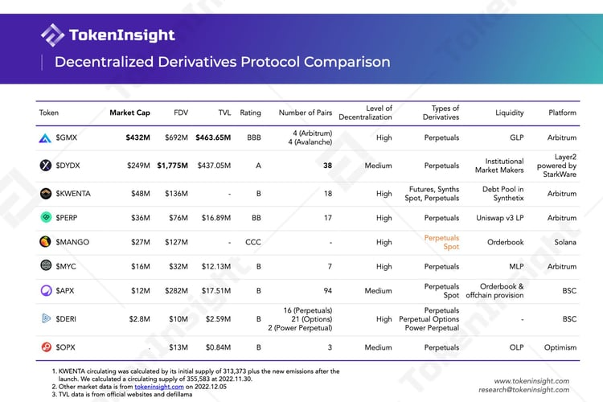

## **未来发展方向**

本节旨在基于各交易所路线图及相关披露文件，对它们的发展路径进行简单的对比。通过这种对比，我们希望可以为读者对于去中心化衍生品交易所这个赛道的未来发展趋势提供进一步的认知。

**提供更多样的交易机制及产品，争取市场份额**

根据 [GMX DAO ](https://gov.gmx.io/t/task-prioritization-2022/325)在论坛中关于 2022 年度开发计划的讨论，GMX 将主要在提升平台安全性及易用性、发展合成资产市场、X4 及新链部署等三个维度继续开发平台。

从开发优先级层面出发，虽然团队表示新链本身的部署只需要月余时间，但诸如流动性、链上监控等具体事项才是新链面临的真正难题，同时团队也担忧此时全力开发新链会导致 GMX 被不断改进产品的竞争对手甩在身后。因此，开发难度相对较低的合成资产交易市场将优先于 X4 及新链推出，这种决策也意味着争取更多的市场份额仍是 GMX 目前的头等发展目标。

X4 则意在通过提供更灵活的交易机制来吸引更多衍生品交易者。该版本将推出赋予池创建者极大自由的自定义 AMM，创建者可以任意设定并更改交易费用来调整流动性及买卖交易。同时，X4 还将推出 [PvP AMM](https://medium.com/@gmx.io/x4-protocol-controlled-exchange-c931cd9a1ae9) 让交易者一对一匹配做多或做空，并允许 LP 参与，这意味着白名单不复存在，各种资产都可以参与交易。理论上，这种交易模型支持无上限的交易流动性。

另外，根据 GMX 团队于今年 5 月在论坛中的发言，PvP AMM 及 X4 的部署原本各自需要约三个月的开发时间，而项目目前的开发进度则明显落后于预期。

**部署新链，实现完全去中心化的构想**

dYdX 团队目前正在潜心开发 v4 版本，并于近日完成 v4 中的第二个阶段，即[内部测试网的部署](https://tokeninsight.com/zh/news/dydx-updates-progress-of-dydx-chain)。 根据今年初的消息，dYdX 的 v4 原定于 2022 年底落地，而在最新披露的开发进度中，在完成第三阶段的高级功能开发、第四阶段的公共测试网启动及第五阶段的主网启动后，完整的 dYdX v4 将于 2023 Q2 部署完毕。

着力于 DAO 的建设与平台性能提升，dYdX 旨在通过 v4 实现构建[完全去中心化交易平台](https://dydx.exchange/blog/v4-full-decentralization)的设想。目前的 v3 版本在订单簿和匹配引擎方面仍依赖中心化系统，而 v4 版本将推出完全去中心化的链下订单簿和匹配引擎，希望能实现扩展几个数量级的吞吐量。另外，曾经随着以太坊 Layer 1 版本被弃用而取消的交易产品如现货交易，则有望随着 v4 版本重回交易平台。

在 v4 版本中，平台的开发团队 dYdX Trading Inc. 也将把运营权全权交予社区，不再从交易费用中抽取收益。目前社区计划创建一个运营子 DAO，即 Operations subDAO，来辅助平台平稳完成运营架构的转变。

此外，dYdX 也计划在 Cosmos 生态开发[独立区块链](https://tokeninsight.com/zh/news/dydx-to-develop-its-own-standalone-blockchain-in-cosmos-ecosystem)，并将其 v4 版本扩展到该链上。新链将使用 Cosmos SDK 和 Tendermint Proof-of-Stake 共识协议构建。

> 当被 TokenInsight 问起关于去中心化衍生品交易所未来的竞争格局以及是否会有类似于 Binance 这样的巨头出现时，[Nathan Cha](https://www.linkedin.com/in/nathan-cha-432a53bb/)，dYdX 的市场负责人告诉我们：
>
> “我们认为从长期来看，未来一定会出现市场份额集中到几个玩家手里的局面。就好像我们在去中心化的现货交易，借贷中出现了 Uniswap，MakerDAO 以及 AAVE 一样。这些都是令人尊敬的协议。因而（对于我们来说）搭建一个优秀的 DeFi 工具，提供良好的用户体验，并且将协议的所有权回归到用户手中才是关键问题。这样看来，市场即使出现集中的情况，也是个小问题。”
>

**“衍生品交易所联盟”**

在开发计划上，Perpetual Protocol 及 Drift Protocol 则并没有展现出特别明确的发展野心。Perpetual Protocol 目前专注于增加平台支持的抵押品种类并完成 USDC 费用分配，但参照其路线图上的预期完成时间，项目同样存在开发进度缓慢的情况。Drift Protocol 则于不久前推出了 v2 版本，旨在实现更充足的流动性并改善平台抵押情况。

值得一提的是，Perpetual Protocol、Drift Protocol 及 GMX 于近日宣布与区块链数据分析平台 Nansen [达成合作](https://zh.drift.trade/updates/defi-derivatives-alliance)，共同搭建一个允许交易者实时监测交易平台各项数据的 Dashborad。通过这项合作，这个衍生品交易所联盟希望能在 FTX 事件带来的市场寒冬中重振交易者的信心，同时再次强调 DeFi 行业的核心理念，即透明性、不可篡改性和去中心化，并呼吁其他去中心化交易所加入这项合作。

> 当被问到关于去中心化衍生品的爆发需要先解决什么方面的问题时，[Burt Rock](https://twitter.com/BurtRock69), Kwenta 的 Marketing 负责人向 TokenInsight 回答道：
>
> “首先，让我们认识到，当我们谈论去中心化的衍生品交易时，我们所面对的是一个多么新的概念。早在2016-2017年，我们有一些基本的概念证明合成资产，但我们用来在以太坊上建立一个完全去中心化的 perps AMM 的第二层扩展解决方案还不到两年。我认为我们已经在讨论性能、费用和真正试图提供一个有竞争力的产品，这是非常好的，但我们仍然在谈论一些相当初级的东西，需要从各方进行大量的开发。
>
> 话虽如此，我认为我们实际上对需要解决的问题有很大的把握。首先，我们需要低延迟的去中心化寓言机，以及更快的 L2 执行。一些交易所为了性能而牺牲了去中心化或安全，但为了让真正的 DEX 发光，我们需要在几秒钟，甚至几毫秒内获取价格和提交订单，而不走弯路。
>
> 从用户体验的角度来看，我们也需要开始简化交易体验，而不至于太影响安全。如果你曾经尝试过用硬件钱包交易 perps，每笔交易都要签名，这简直是一场噩梦。理想情况下，用户应该在每个会话中只需要签署一次交易，就像你只需要登录一次CEX，然后在窗口中随意交易一样。
>
> 最后，从用户的账户系统或其他传统机构的角度仍然是一个巨大的挑战，不幸的是，这不是一个我确信我们可以通过建立智能合约或网络应用程序来解决的挑战。我们仍然有一些实体与监管机构打好关系，帮助用户上岗，我们需要教育和推广，教人们如何使用现有的工具。”
>

### 小结

不难看出，去中心化衍生品交易平台目前面临的最大发展桎梏还是流动性不足的问题。头部项目们不约而同地选择了一些相似的解题思路，比如通过改进产品体验、扩大产品矩阵来提高用户友好度，从而触达更广泛的市场受众，进而占据更多市场份额。GMX 和 dYdX 更是选择了搭建自己的链来进一步发展平台生态。

拥有独立区块链似乎是去中心化衍生品交易所的发展大趋势。然而要完整部署一条新链的开发难度较大、周期较长，且市场瞬息万变，如同 GMX 团队说的那样，能在最短时间内获得更多交易者认可才是最重要的。而交易者的信任基于平台上交易的透明性、不可篡改性及去中心化，前文提及的交易所联盟合作也能佐证核心理念的落实对于市场信心的重要性。从这个角度看，致力于完全去中心化的 dYdX 似乎将交出更好的答卷。

## 后浪

除了前文提到的四个头部项目，去中心化衍生品交易赛道也不乏一些后起之秀。本节将简单介绍几个包含永续合约交易的衍生品交易协议，并试图发掘这些新入局者的发展潜力，为读者提供关于本赛道的新视角。

**Mycelium**

[Mycelium](https://tokeninsight.com/zh/coins/mycelium/overview) 是一个去中心化衍生品协议，其前身是 Tracer DAO。目前部署在 Arbitrum 和 Rinkeby 网络上。Mycelium 主要支持永续合约交易，提供最高 50 倍杠杆的合约交易。

Mycelium 最初上线的产品是[永续池](https://pools.docs.mycelium.xyz/perpetual-pools/readme)（Perpetual Pool）。其核心机制是利用两个资金池（多池和空池）以及再平衡率，实现“永不爆仓”的永续合约交易功能。

在永续池中，开仓意味着铸造资产，用户可以通过抵押 $USDC ，在多池或者空池中铸造出 1L-ETH/USD (多) 或者 1S-ETH/USD (空)。相对的，平仓意味着销毁资产。而铸造和销毁时的资产价差就等于用户的损失或者收益。多池和空池的比例体现了用户对于未来价格方向变动的选择。举例来说，多池的资产较多时，说明看多的人数较多，在多池开仓（铸造）的资产较多，反之亦然。而再平衡率则类似于 Perpetual Protocol vAMM 机制中的资金费率。用于平衡两个池子的比例（把多空比例拉回 1:1）。总体来看，永续池的机制其实类似于 Perpetual Protocol 的 vAMM 机制，具备一定的价格发现功能，同时加入了类似资金费率的再平衡率来平衡多空比例。不同的是，永续池具有真实的流动性。

在更名为 Mycelium 后，Mycelium 于 2022 年 8 月推出了新的产品 [Perpetual Swaps](https://swaps.docs.mycelium.xyz/perpetual-swaps/mycelium-perpetual-swaps)。Perpetual Swaps 的机制与 GMX 相似，引入了 [MLP](https://swaps.docs.mycelium.xyz/protocol-design/mycelium-liquidity-pool-mlp) 流动性池作为交易者的对手方并为交易提供流动性。

在交易费用方面，Mycelium 的开仓和平仓费用为 9 bps。此外，与 GMX 类似，交易者还需向 MLP 池支付每小时 0.5 bps 的费用。交易费用的 70% 会分配给 MLP 的流动性提供者，25% 分配给 Mycelium Treasury。

$MYC 是 Mycelium 协议的实用和治理通证。除了治理投票权，$MYC 的持有者还可以质押他们的通证以获得质押奖励。

**Deri Protocol**

[Deri Protocol](https://tokeninsight.com/zh/coins/deri-protocol/overview) 是一个跨链去中心化衍生品交易平台，建立在以太坊（目前非活跃）、 BNB Chain、Arbitrum、Polygon、及火币生态链（目前非活跃）上，目前已更新至 v3。平台现已推出永续期货、永续期权、和允许用户交易资产价格的指数并对冲无常损失的 Power Perpetual。协议最大特点在于引进 [DPMM（Deri Proactive Market Making）](https://docs.deri.io/how-it-works/dpmm-proactive-market-making)机制做市，用户持仓头寸被代币化为 NFT，并可实现与其他 DeFi 项目的高度组合，平台称之为“DeFi 乐高”。

对于 DPMM，当净头寸为 0 即达到平衡状态时，标记价格等于现货价格（由预言机喂价）。但每当有交易时，它都会将标价推向交易方向（即，买入交易抬高价格，而卖出则拉低价格）。于是产生了标的价格与现货价格的利差（即，标的－现货），并且资金费率机制也切换到了按秒计费，和 BitMEX 等大多数中心化衍生品交易所相同。DPMM 机制统一了对于永续期货和永续期权的交易逻辑，用单一的交易池/智能合约来实现这两类产品的清结算。

v3 还通过金库（Vault）引入了外部流动性池。Deri 为每位用户部署一个金库，用来管理存入的资本（LP 的流动性或交易者的保证金）。金库会保留部分流动性储备，用于结算及手续费，剩余的用户资本将会发送到外部流动性池，赚取额外的流动性奖励。Deri 目前是将金库的[外部托管建立在 BNB 链上的 Venus 上](https://docs.deri.io/how-it-works/external-custody)。

$DERI 是 Deri Protocol 的原生通证，可以用于平台治理、质押及交易清结算。此外，Deri 还为$DERI 定义了一种“特权功能”（Privilege），即通过质押超过平均水平数量的通证来获得更优惠的交易条件。该功能的更多细节目前尚未披露。

**OPX Finance**

[OPX Finance](https://tokeninsight.com/zh/coins/opx-finance/overview) (OPX) 是 GMX 的一个分叉项目，是部署在 Optimism 上的一个去中心化衍生品交易所。OPX 目前支持现货的掉期和订单簿交易，以及最高达 30 倍杠杆的永续合约交易，并计划于 2023 年 Q1 增加跨链交易及合成资产交易。此外，OPX 还提供通过价格预测获取奖励的娱乐类产品 [O-Prediction](https://docs.opx.finance/o-prediction)。OPX 平台由 DarkCrypto 基金会创立，该基金会拥有丰富的项目开发经验及舆论争议度。

在平台费用方面，60% 至 70% 将用于流动性提供者奖励，其余将分配给治理奖励、通证回购及销毁、平台开发以及 DarkCrypto 基金会。

$OPX 是平台的原生治理通证，同时也是通过回购和销毁机制影响流通量的紧缩型通证，预售的募资规模将决定通证的最大供应量。

**SynFutures**

SynFutures 是 [Polygon](https://tokeninsight.com/zh/coins/polygon/overview) 上目前最大的去中心化合成资产衍生品交易协议。SynFutures 的创始成员大部分来自 Bitmain、Matrixport、瑞士信贷、野村证券等传统金融机构和区块链技术公司。

SynFutures v1 部署在 Polygon、[BSC](https://tokeninsight.com/zh/coins/binance-coin/overview) 和 Arbitrum 网络上。它主要支持加密货币期货交易。用户可以在平台上自由交易各类资产，包括原生、跨链以及任何其他有预言机喂价的资产。

SynFutures v1 使用[合成 AMM](https://medium.com/synfutures/synfutures-synthetic-automated-market-maker-samm-explained-4bdb0b767bd7)（sAMM: Synthetic Automated Market Maker）作为其核心交易机制。在传统 AMM 中，流动性提供者需要同时提供一个交易对的两种资产以平衡资产比例。而合成 AMM 允许流动性提供者仅提供单一的资产，另一种资产头寸则由智能合约自动合成。

举例来说，默认 1 $USDC =$1，如果每盎司黄金当前价值在 1800 $USDC，用户可以直接提供 3600$USDC，这其中的一半保留为 $USDC 头寸，另一半 1800$USDC 则用于合成 1 盎司黄金（由智能合约自动创建）。

为了进一步提升改进 v1 版本并优化用户体验，SynFutures 计划推出 [v2 版本](https://medium.com/synfutures/introducing-the-synfutures-v2-testnet-3e6eb5c6770d)。相对于 v1，v2 加入了永续期货、DAO 期货以及 NFT 期货以丰富产品类型。同时，v2 改进了 sAMM 模型并引入了订单簿做市等新的流动性提供方式以优化流动性提供者的体验。目前，SynFutures v2 版本在封闭 Alpha 测试阶段，仅支持 Polygon 网络。正式的公开版本将于测试结束后上线。

目前 SynFutures 暂未发行自己的通证。关于通证的相关信息暂未披露。

**Firefly**

[Firefly](https://tokeninsight.com/zh/coins/dtrade/overview) 是一个基于订单簿的去中心化衍生品交易协议。Firefly 建立在[波卡](https://tokeninsight.com/zh/coins/polkadot/overview)生态系统上，是波卡生态的第一个衍生品交易所。Firefly 将部署在 [Moonbeam](https://tokeninsight.com/zh/coins/moonbeam/overview) 网络上，使用 Layer2 解决方案 [Rollup](https://tokeninsight.com/zh/cryptocurrencies/?tag=Rollups) 提高交易速度。

目前，Firefly 已于 2022 年 10 月向部分社区成员开放并进行测试。根据团队披露的信息，Firefly 交易所计划于 2022 年 12 月正式在 Moonbeam 上线。

关于 Firefly 的产品细节及详细机制，Firefly 团队尚未进行披露。目前已知的是，在清算、抵押和计算资金费率期间， Firefly 将使用 Chainlink 预言机喂价。产品上，Firefly 将同时提供逐仓杠杆以及全仓杠杆功能。此外，在核心产品推出后，Firefly 计划建立 [DAO](https://tokeninsight.com/zh/cryptocurrencies/?tag=DAO) 以推动项目的去中心化治理发展。

$FFLY 将作为 Firefly 的治理通证发行。$FFLY 可以用作治理投票、质押以及交易奖励。

**Kwenta**

[Kwenta](https://tokeninsight.com/zh/coins/kwenta/overview) 是由 [Synthetix](https://tokeninsight.com/zh/coins/synthetix-network-token/overview) 团队开发的去中心化合成资产衍生品交易所，部署在 [Optimism](https://tokeninsight.com/zh/coins/optimism/overview) Layer2 网络上。目前支持现货互换和永续期货交易。

Kwenta 的主要产品为永续期货，支持最高 25 倍杠杆的永续合约交易。用户可以选择使用全仓保证金或逐仓保证金进行交易。Kwenta 支持的订单类型包括市价单、限价单和停止市价单。

与使用订单簿、AMM 等机制的传统交易所不同，Kwenta 基于 Synthetix 协议。Kwenta 上的流动性由 Synthetix 的合成资产债务池提供。这允许 Kwenta 上的交易者在任何价格点都拥有执行交易所需的流动性。此外，Synthetix 上的合成资产使用 Chainlink 预言机进行喂价。换句话说，Kwenta 上的交易没有滑点。

> 由于Synthetix协议的复杂性，这里我们不便过多赘述它的核心机制。如果您有兴趣的话，可以点击[此处链接](https://tokeninsight.com/zh/coins/synthetix-network-token/overview)深入了解 Synthetix。
>

关于 Kwenta 的[费用结构](https://docs.kwenta.io/using-kwenta/futures/exchange-fees)，由于 Kwenta 的流动性来源于 Synthetix 的合成资产债务池，Kwenta 收取的交易费用会被发送到费用池并分配给 Synthetix ($SNX) 质押者。此外，在市场动荡时，Kwenta 会收取动态交易费用以消除抢先交易机会并保护质押者。

$KWENTA 是 Kwenta 的实用治理通证。它用于激励 Kwenta DAO 内的协调和增长。通证的主要功能包括质押和治理。

## 最后总结

* Crypto 衍生品交易最早始于 2011 年，但是在 BitMEX 发明了永续合约之后才算正式开始新的篇章，市场百花齐放于 2019 年，并且在 2021 年牛市达到交易量的巅峰
* 2019 年衍生品交易所前三名为 BitMEX，OKX，Huobi；2020 年为 Huobi，Binance，OKX；2021 年为 Binance，Huobi，Bybit，2022 年为 Binance，OKX，Bybit
* 去中心化的永续合约交易从 2021 年才真正意义上开始出现，并且在一年多的时间内已经达到了相当的市场规模。部分头部协议如 dYdX 和 GMX 甚至已经超过了许多中心化交易所。
* 按照现在的市场发展趋势，去中心化交易所的市场规模在一年内有望增长 10 倍以上
* 去中心化衍生品交易所在资产透明度、用户资产控制权、抗审查/隐私性、链上可组合性等方面，相较传统中心化衍生品交易所有着明显优势
* 流动性不足、交易成本偏高、产品易用性较低、功能丰富度较差等是去中心化交易所面临的主要问题
* 过去大约 10 个月的时间内，去中心化衍生品交易所的总交易量达到 $478B。虽然这个数字大约相当于当前市场环境下 Binance 衍生品两周的交易量，但这个数字在去年年初时还基本为零
* dYdX 在 2022 年 Q3 以前处于去中心化交易所的龙头地位，但是在 Q3 之后交易量方面有被 GMX 超越的迹象；在平台收入方面部分时候已经被 GMX 超越，而 TVL 方面 GMX 已经排名第一
* 从去中心化程度来看，dYdX 相较于 GMX、Perpetual 和 Drift 是最低的。同时，Perpetual 和 Drift 的 vAMM 机制相较于另外两个协议对市场的适应程度较差
* 从费用结构上来看，相比之下 GMX 和 Perpetual 的费用来源更加丰富，为协议的良好发展提供助力，并且在费用模式上也更优，利于用户激励。而 dYdX 则将所有的平台收入收为己有
* dYdX、GMX 和 Perpetual 都有完善的通证经济，鼓励用户参与协议治理和代币质押。不过在效果上dYdX 和 Perpetual 会略逊于 GMX， 主要因为用户参与后收到的实际收入较低
* 去中心化衍生品交易所接下来的发展方向主要包括提供更多样的交易机制及产品，争取市场份额，以及部署新链，实现完全去中心化的构想等，特别是 dYdX
* 大部分新入局者的核心机制在本质上仍旧逃不脱目前头部项目制定下的架构，即订单簿、多资产流动性池以及 vAMM 机制
