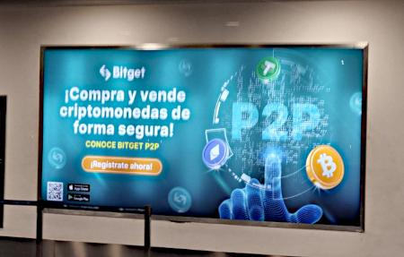
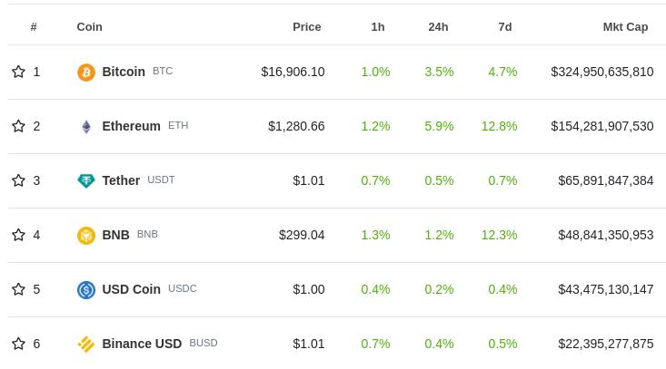
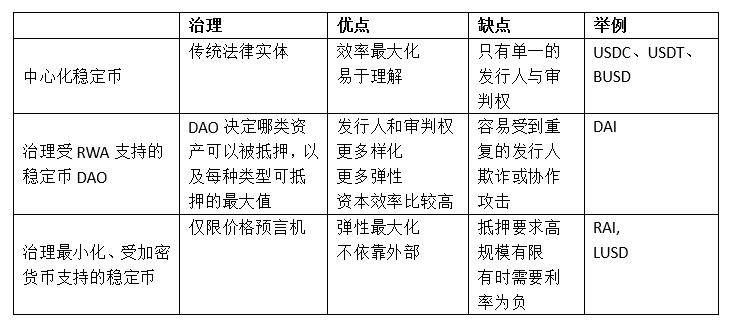
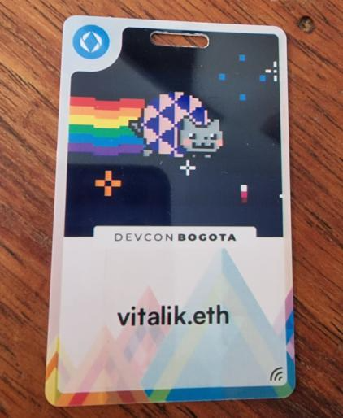
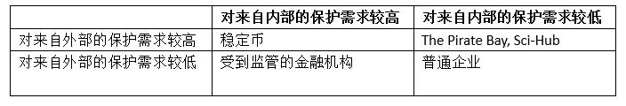
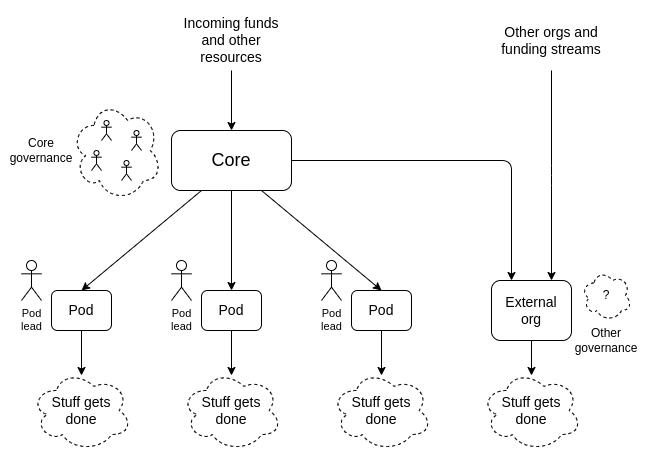
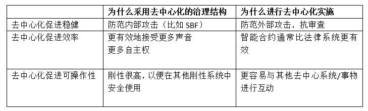
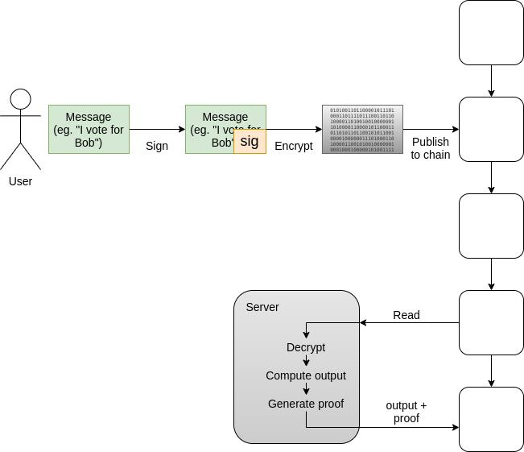

### 总结

金钱、DeFi、身份系统、DAO 以及混合应用。

*原文：《[What in the Ethereum application ecosystem excites me](https://vitalik.eth.limo/general/2022/12/05/excited.html)》*

*作者：Vitalik Buterin*

特别感谢Matt Huang、Santi Siri和Tina Zhen的反馈和评论

十年、五年、甚至两年前，我对以太坊和区块链能为世界做什么的看法是非常抽象的。我会说，“这是一项通用技术，就像C++一样”。当然，它有特定的属性，如去中心化、开放性和抗审查性，但除此之外，要说哪些具体的应用会有最大意义还为时尚早。

今天的世界不再是当时的世界。到现在，几乎已经没有什么想法是我们完全没有探索过的：如果有什么东西大获成功，它可能是已经在博客、论坛和会议上多次讨论过的某个版本。我们也越来越能够确定这个领域的基本限制。许多DAO都受到参与者的欢迎，尽管他们也面临不便与费用门槛，并且许多DAO表现不佳。工业供应链的应用没有完全实现，区块链上去中心化的亚马逊还没有实现。但在我们也看到了一些关键应用不断被采用，这些应用正在满足人们的真正需求——而这些是我们需要关注的应用。

因此，我改变了观点： 我对以太坊感兴趣的地方不再是未被发现的未知潜力而是几类具体的应用，这些应用已经被印证，而且会越来越强大。这些应用是什么，我对哪些应用不再乐观？这就是这篇文章的内容。

### 1. 金钱：第一个也是最重要的应用

我去年12月第一次访问阿根廷，我当时在圣诞节那天四处走动，几乎所有的门店都关门了，我在寻找一家咖啡店，在经过五家关停的咖啡店后，我们终于找到了一家开着的咖啡店。我们走进去时，店主认出了我，并立即向我展示了他的Binance账户上的ETH和其他加密资产。我们点了茶和点心，询问店主是否可以用ETH付款。咖啡店老板答应了，并向我展示了他的Binance存款地址的二维码，我从我手机上的Status钱包向他发送了大约20美元的ETH。

当然这并不是加密货币在该国最有意义的应用。很多人正在用它来存钱、国际转账、为大型和重要的交易付款等。但即使如此，我随机找到一家咖啡店，而它恰好接受加密货币，这一事实显示了采用加密货币被广泛采用。在美国这样的富裕国家，金融交易很容易进行，8%的通货膨胀被认为已经是太过极端，而在阿根廷和世界上许多其他国家，他们与全球金融系统的联系更加有限，每天都经历极端的通货膨胀。此刻，加密货币就是一条生命线。

*除了Binance之外，还有越来越多的当地交易所，你可以随处看到它们的广告，机场也不例外。*

关于我的咖啡交易的一个问题是，它并没有真正的实用意义。因为费用很高，大约是交易价值的三分之一，且这笔交易花了几分钟时间来确认。当时Status还不支持发送EIP-1559交易，能更可靠更快速。如果像其他许多阿根廷加密货币用户一样，我当时有一个Binance钱包，那么转账将免费和即时。

然而，一年之后，情况大为不同。合并之后，交易被纳入的速度明显加快，区块链也更加稳定，只需要较少的确认就能接受安全的交易。诸如Optimistic和ZK Rollup的扩展技术正在快速发展。 随着“账户抽象化”，“社会恢复和多签钱包”变得更加实用。随着技术发展，需要几年事件实现这些趋势，但已经取得了进展。同时，还有一个重要的“推动因素 ”推动了人们对链上交易的兴趣——FTX的崩溃，它提醒了每个人，包括拉丁美洲人，即使是看起来最值得信赖的中心化服务，也可能终究辜负人们的信任。

**富裕国家的加密货币**

在富裕国家，围绕高通胀下如何生存和完全基本金融活动的更极端用例通常并不适用。但加密货币仍然具有重要价值。我用它来捐款（向许多国家的相当正常的组织捐款），因此我可以亲自证实，它比传统银行业务要方便得多。它对那些有可能被禁止参与支付活动的行业和活动也很有价值——这类行业包括许多在大多数国家的法律下完全合法的行业。

加密货币作为私人货币，也是一个更重要、更广泛的哲学用例：许多政府正在利用向“无现金社会”过渡的机会，引入100年前人们无法想象的金融监控水平。 加密货币是目前发展中的、唯一能切实将数字化和现金的隐私性结合起来的发明。

但无论如何加密货币都远非完美。即使解决了所有的技术、用户体验和账户安全问题，加密货币的波动性仍然是一个事实，而这种波动性会使其难以用于储蓄和商业。因此我们有稳定币。

**稳定币**

稳定币的价值在以太坊社区已经被讨论很久，引述2014年的一篇博文：

*“在过去的11个月里，比特币持有者损失了大约67%的财富，而且相当多的时候，其价格在一个星期内的涨跌幅度高达25%。面对这种担忧，人们对一个简单的问题越来越感兴趣：我们能否兼得两个世界的好处？我们能否拥有加密支付网络所提供的完全去中心化，但同时拥有更高水平的价格稳定性，而不需要承受如此极端的上下波动？”*

事实上，稳定币在今天那些务实的加密货币使用者中非常受欢迎。也就是说，和加密货币的内核恰恰相反的一点——今天最成功的稳定币是中心化的，主要是USDC、USDT和BUSD。

*顶级加密货币市值，来自CoinGecko的数据，2022-11-30，前六名中的三个是中心化稳定币*

在链上发行的稳定币有很多便利的特性：它们开放给任何人使用，它们能抵抗最大规模和最不透明的审查形式（发行方可以将地址列入黑名单并冻结，但这种黑名单是透明的，而且冻结每个地址都有字面的交易费用），它们与链上基础设施（账户、DEX等）互动良好。但目前还不清楚这种状态会持续多久，因此有必要继续研究其他替代方案。

我认为稳定币的设计空间基本上分为三个不同的类别：中心化的稳定币，DAO治理的现实世界资产支持的稳定币和治理最小化的加密货币支持的稳定币。

从用户的角度来看，这三种类型的代币都在效率和弹性上权衡。USDC长期有效，但从长远来看，它的持续稳定性取决于美国的宏观经济和政治稳定、取决于美国的监管环境是否继续支持向所有人提供USDC、以及发行机构的可信度。

另一方面，RAI可以经受住所有这些风险，但它有一个负利率：在我写这篇文章的时候为-6.7%。为了使系统稳定（不会像LUNA那样容易崩溃），每一个RAI持有人必须与一个负RAI的持有人（又称“借款人”或 “CDP持有人”）配对，他投入ETH作为抵押。如果有更多的人参与套利，持有负RAI，并用正USDC或甚有利息的银行账户存款进行平衡，这个利率会得到改善，但RAI的利率将始终低于正常运作的银行系统中利率。而且负利率始终存在，以及它们所带来的潜在用户体验问题会长期存在。

RAI模式最终是更悲观的实验者（lunarpurk）的理想选择：它避免了与非加密货币金融系统的所有联系，使其更难被攻击。负利率使其无法成为美元的便捷替代，但也需要接受所有联结的断开：一个治理最小化的稳定币可以跟踪一些非货币资产，如全球平均CPI指数，并宣传自己能代表抽象的“尽力的稳定价”。这也会降低固有的监管风险，因为这种资产不会试图提供“数字美元”（或其他货币）。

由DAO管理、受RWA支持的稳定币如果能够很好地运作，可能是一个值得选择的媒介。这种稳定币可以结合足够的稳健性、抗审查性、规模和经济实用性，以满足大量现实世界加密货币用户的需求。但要做到这一点，既需要现实世界的法律工作来确保发行商的稳定，也需要健康、以弹性为导向的DAO治理。

无论哪种情况，任何一种稳定币的良好运行都将有利于各种货币和储蓄应用，这些应用今天已经对数以百万计的人产生效用。

### 2. Defi：保持简单的方式

去中心化金融开始时荣光无限，但发展也很受限，现在演变成过度资本化的怪物，依赖于不可持续的收益耕作，现在正处于早期阶段，未来会发展成为稳定的媒介，继而提高安全性，重新关注一些特别有价值的应用。去中心化的稳定币现在是、而且可能永远是最重要的defi产品，但还有一些其他的产品也需要重视。

* 预测市场：自2015年Augur推出以来，这些市场一直是去中心化金融的一个小众但稳定的支柱。从那时起，它们的采用率一直在悄悄地增长。在2020年的美国大选中，预测市场显示了它们的价值和局限性，今年的2022年，像Polymarket这样的加密货币预测市场和Metaculus这样的游戏资金市场都得到了越来越广泛的应用。预测市场作为一种认识工具是有价值的，使用加密货币能够使这些市场更值得信赖和更容易被全球采用。我预计预测市场不会产生极端的数十亿美元的爆发，而是继续稳步增长，随着时间的推移变得更加有用。
* 其他合成资产：稳定币背后的公式原则上可以复制到其他现实世界的资产，包括主要股票指数和房地产。后者受限于空间固有的异质性和复杂性，需要更长的时间才能带来实质结果，但它们仍可能是有价值的。主要的问题是，是否有人能够在中心化和效率之间平衡，使用户能够以合理的回报率获得这些资产。
* 用于在其他资产之间有效交易的胶合层：链上有人们想要使用的资产，包括ETH、中心化或去中心化的稳定币、更先进的合成资产等，这样一个能让用户在它们之间轻松交易的胶合层就十分有价值。一些用户可能想持有USDC并以USDC支付交易费用。其他人可能持有一些资产，但希望能够立即转换成其他资产支付给别人。另一个发展空间，就是用一种资产作为抵押来贷款另一种资产。这种项目最有可能成功，如果他们保持非常有限的杠杆率（例如，不超过2倍）。

### 3. 身份的生态系统：ENS、SIWE、PoH、POAP、SBT

**“身份”是一个复杂的概念，意味着许多事情** ， 比如：

* **基本认证** ：简单地证明行动A（例如，发送交易或登录网站）是由某个拥有某种标识符的代理授权的，例如ETH地址或公钥，而不试图解释代理是谁等情况。
* **证明** ：证明其他代理对一个代理的主张（“Bob证明他认识Alice”，“加拿大政府证明Charlie是公民”）。
* **名称** ：建立共识，即一个特定的人类可读名称用来指代一个特定的代理。
* **人格证明** ：证明一个代理人是人类，并保证每个人类只能通过人格证明系统获得一个身份（这通常与证明一起进行，所以它不是一个完全独立的类别，但它是一个极为重要的特例)

长期以来，我一直看好区块链身份，但不看好区块链身份平台。上面提到的用例对许多区块链用例确实很重要，区块链对身份应用很有价值，因为它们具有独立于机构的性质，并具有互操作性的优势。但是，试图创建一个集中式平台来从头实现所有这些任务是行不通的，更有效的是一种一步一步来，目前许多项目致力于各自有价值的具体任务，并随着时间的推移增加越来越多的互操作性。

而这正是此后所发生的事情。**Sign In With Ethereum（SIWE）标准**允许用户登录（传统）网站，就像今天你可以使用谷歌或Facebook账户登录网站一样。这实际上很有用：它允许你与网站互动，而谷歌或Facebook无法访问你的私人信息或接管或锁定你的账户。像社交恢复这样的技术，可以在用户忘记密码时帮助他们恢复账户，这比今天中心化企业提供的服务要好得多。今天，SIWE得到了许多应用的支持，包括Blockscan chat、端到端加密的电子邮件和笔记服务Skiff、以及各种基于区块链的替代社交媒体项目。

ENS让用户拥有用户名。 比如，我有vitalik.eth。 人格证明和其他个人身份证明系统让用户证明他们是独一无二的人类，这在空投、治理等应用中都很有用。 POAP（“出席证明协议”）是一个通用协议，用于发行代表证明的代币：你完成了一个教育课程吗？你参加了一个活动吗？你是否见过一个特定的人？POAP既可以是个人身份证明协议的一部分，也可以作为用来尝试确定某人是否是某一社区成员（对治理或空投有价值）。

*一张包含我ENS名字的NFC卡和你收到的一个POAP，就可以证明你见过我。我不确定我是否想进一步刺激人们，让他们为了得到我的POAP而不断地来找我，但这个想法对其他人来说似乎很有趣也很有用。*

这些应用中的每一个都很有用。但是，使它们真正强大的是它们相互之间的配合程度。当我登录Blockscan chat时，我用Ethereum登录。这意味着，我的名字 vitalik.eth（我的ENS名称）对任何与我聊天的人来说都是立即可见的。在未来，为了打击垃圾邮件，Blockscan chat可以查看链上活动或POAP来验证账户。最低级的验证是验证该账户至少发送过一次链上交易或收过款（因为这需要支付费用）。更高层次的验证可能涉及检查特定代币的余额、特定POAP的所有权、个人身份证明，或像Gitcoin Passport这样的元聚合器。

这些不同服务的网络效应结合起来，创造了一个生态系统，为用户和应用程序提供了一些非常强大的选择。一个基于以太坊的Twitter替代品（如Farcaster），可以使用POAP和其他链上活动的证明，创建一个不需要传统KYC的验证功能，允许匿名者参与。这些平台可以创建一些房间，只对特定社区的成员开放，或者采用混合方式，只有社区成员可以发言，但任何人都可以收听。这就相当于Twitter上的民意调查可以限制在特定的社区进行。

同样重要的是，还有更多帮助人们谋生的简单应用：通过证明验证可以使人们更容易证明他们值得信赖，以获得租金、就业或贷款。

这个生态系统未来面临的巨大挑战是隐私。目前大量的信息放在链上，最终就会出现问题，也许对很多人来说不是直接的风险，结合链上和链下信息并大量使用ZK-SNARK可以解决这个问题，但这也需要努力；像Sismo和HeyAnon这样的项目是一个早期的尝试。扩容也是一个挑战，可以通过rollup和可能的验证来解决。隐私问题更为无解，每个应用都必须专门着力解决。

### 4. DAO

DAO是一个强有力的术语，它代表人们加入加密货币空间的许多希望和梦想——建立更加民主、有弹性和高效的治理形式。这也是一个非常广泛的术语，其含义多年来发生了很大的变化。最常见的是，DAO是一个智能合约，代表对某些资产或进程的所有权或控制权的结构。但这种结构可以是任何东西，从低级的多签钱包到高度复杂的多室治理机制，如为Optimism Collective设想的那些结构。这些结构中有的有效，有的无效，或者至少是与他们试图实现的目标非常不匹。

有两个问题需要回答：‘

1.什么样的治理结构是有意义的，对于什么用例而言？

2.将这些结构作为DAO来实施，还是通过常规的公司和法律合同来实施，是否有意义？

一个特别微妙的问题是，去中心化这个词有时被用来指代这两方面：如果一个治理结构的决定需要一大群参与者决定，那么它就是去中心化的；如果一个治理结构的实施是建立在区块链这样的去中心化结构上，并且不依赖于任何单一民族国家的法律体系，那么它就是去中心化的。

**去中心化促进稳健性**

这个是说：去中心化的治理结构可以防止内部的攻击者，而去中心化的实施可以防止外部的强大攻击者（“抗审查”）。

比如：

The Pirate Bay和Sci-Hub是重要的案例研究，它们具有抗审查能力，但不需要去中心化。Sci-Hub主要由一个人管理，如果Sci-Hub基础设施的某些部分被审查，管理者可以简单地把它移到别的地方。多年来，Sci-Hub的URL已经改变了许多次。The Pirate Bay是一个混合体：它依靠BitTorrent，而BitTorrent是去中心化的，但The Pirate Bay本身是一个在上面的中心化便利层。

这两个例子与区块链项目的区别在于，它们不保护用户免受平台本身的影响。如果Sci-Hub或The Pirate Bay想伤害他们的用户，他们能做的最坏的事情就是提供坏的结果或关闭平台——这两种情况都只会造成轻微的不便，然后他们的用户会转向其他替代品，而这些替代品将不可避免地在他们无法运足时自然会出现。他们也可以公布用户的IP地址，但即使他们这样做，对用户的总伤害仍然比其他行为，比如说窃取所有用户的资金低得多。

稳定币不是这样的。稳定币试图创建稳定可信的中立全球商业基础设施，这就要求在外部不依赖单一的中心化行为者，并保护其免受来自内部的攻击者。如果一个稳定币的治理设计得不好，对治理的攻击可能会导致用户丢掉数十亿资金。

在写这篇文章的时候，MakerDAO有78亿美元的抵押品，是盈利代币MKR市值的17倍以上。因此，如果治理是由MKR持有人决定的，且没有任何保障措施，那么有人就可以买下一半的MKR，用它来操纵价格预言机，为自己窃取很大一部分抵押品。事实上，这种情况确实发生在一个较小的稳定币上！这在MKR上没有发生过。这还没有发生在MKR上，主要是因为MKR的持有量仍然相当集中，MKR的大部分由一个相当小的团体持有，他们不会愿意出售，因为他们相信这个项目。这是一个模式适用于刚开始采用稳定币，但这不是一个长期可用的模式。因此，要使去中心化的稳定币长期运作，需要在去中心化的治理中进行创新，消除这类缺陷。

两个可能的方向包括：

1.某种非金融化的治理，或者也许是两院制的混合体，在这种情况下，决策不仅需要由代币持有者通过，还需要由其他一些类别的用户（例如，Optimism Citizens' HouseStETH持有者，如Lido两院制的提议）。

2.有意的摩擦（intentional friction），使某些类型的决定只有在延迟足够长的时间后才能生效，以便用户可以看到事情的糟糕结果并离开该系统。

在进行有效优化稳健性的治理时，有许多微妙的地方需要考虑。如果系统的稳健性，取决于只有在极端情况下才会被激活的途径，那么系统甚至可能希望偶尔有意地测试一下这些途径，以确保它们能正常工作——就像每20年一次的伊势神宫重建，这方面去中心化的稳健性仍然需要更仔细的思考和发展。

**去中心化促进效率**

为效率而进行去中心化是一个不同的思想流派：**这种治理结构是有价值的，因为它可以纳入不同规模的不同意见，它的实施是有价值的，因为它有时比传统基于法律系统的方法更有效率、成本更低。**

这意味着不同风格的去中心化。为稳健性而去中心化的治理，强调要有大量的决策者，以确保与预先设定的目标保持一致，并有意使行动更加困难。为效率而去中心化的治理，保留了快速行动的能力，并在需要时进行调整，但试图将决策从高层移除，以避免组织成为一个僵化的官僚机构。

*乌克兰DAO中基于“豆荚”的治理，这种治理方式通过最大限度地提高自主性来提高效率。*

为稳健性而设计的去中心化实施和为效率而设计的去中心化实施在一个方面相似：它们都是涉及将资产放入智能合约。但为效率而设计的去中心化实现要简单得多：一般来说，只要有一个基本的多签钱包就足够了。

值得注意的是，“为效率而去中心化”对于同一富裕国家的大型项目来说站不住脚。但对于非常小规模的项目、高度国际化的项目、以及受到效率低下机构和法治薄弱的国家治理的项目来说，它更成立。许多“为效率而去中心化”的应用可能也可以在一个稳定的大国经营的中央银行链上完成；我不确定去中心化的方法和中心化的方法都足够好，哪种方式能成为主导取决于哪种方法首先成为可行的依赖路径。

**去中心化促进互操作性**

这是一类相当无聊的去中心化的理由，但它仍然很重要：链上物品之间的互动比与链外的系统互动更容易、更安全，因为后者不可避免地需要一个（会被攻击的）桥梁层。

如果一个以直接民主方式运行的大型组织在其储备中持有10000个ETH，这将是一个去中心化的治理决策过程，但它不是一个去中心化的实施：在实践中，这个国家将有几个人在管理密钥，而这个存储系统可能会被攻击。

从治理看：如果一个系统向其他DAO提供服务，而这些DAO没有快速变化的能力，那么这个系统本身最好也没有快速变化的能力，以避免“刚性错配”，即一个系统的依赖关系断裂，而这个系统的刚性使其无法适应这种断裂。

这三种“去中心化理论”可以归纳为以下图表：

**去中心化和新颖的治理机制**

在过去的几十年里，我们已经看到了一些治理机制的新尝试：

* 二次方投票
* 未来制
* 流动民主
* 去中心化的对话工具，如Pol.is

这些想法是DAO故事的重要组成部分，它们对稳健性和效率都有价值。二次方投票的案例依赖于一个数学论证，在给更有力的提议与更受欢迎、但不那么有力的提议（或富有的行为者）之间做出准确的权衡。但使用过这种方法的人发现，它也能提高稳健性。一些新颖的想法比如成对匹配，是在数学模型的假设被打破的情况下，有意牺牲数学上可证明的最优性来换取稳健性。

**案例研究：Gitcoin赠款**

我们可以通过一个有趣的边缘案例来分析去中心化的不同风格。Gitcoin Grants应该是一个链上DAO，还是应该只是一个中心化的组织？

以下是Gitcoin Grants是DAO的一些可能论据：

* 它持有并处理加密货币，因为它的大多数用户和资助者是以太坊用户
* 安全的四次方融资在链上进行效果最好，所以如果投票结果直接反馈到系统中，会减少安全风险
* 它与世界各地的社区打交道，因此受益于可信的中立性，而不是以单一国家为中心。
* 它的好处是能够让用户相信它在五年内仍然存在，所以公共产品的资助者现在就可以投资项目并希望以后能得到回报。

这些论点倾向于为稳健性而去中心化，为上层建筑的互操作性而去中心化，尽管个别的四次方融资回合更倾向于“为效率而去中心化”的学派（Gitcoin Grants背后的理论是四次方融资是资助公共物品的更有效方式）。

如果稳健性和互操作性的论点不适用，那么简单地将Gitcoin Grants认为是一个普通公司运行可能会更好。但它们确实适用，所以可以说Gitcoin Grants是DAO。

还有很多其他例子说明这种论点的适用性，包括人们在日常生活中越来越依赖的DAO，以及为其他DAO提供服务的“元宇宙 DAO”：

* Proofofhumanity（二次方资助的设计方案）
* Kleros（去中心化经济纠纷的仲裁协议）
* Chainlink（预言机协议LINK）
* 稳定币
* 区块链第二层协议治理

我对所有这些系统都不够了解，无法证明它们都对去中心化换稳健性做了足够的优化，但它们应该是这样的。

效果不好的主要是那些中枢能力与稳健性相冲突的DAO，它们没有足够的案例来“为效率而去中心化”。主要与美国用户对接的大型公司会是一个例子。在做DAO的时候，首先要确定是否值得把项目架构成DAO，其次要确定它的目标是稳健性还是效率：如果是前者，还需要对治理设计进行深入思考，如果是后者，那么要么通过四维资金等机制对治理进行创新，要么就使用多签钱包。

### 5. 混合应用

有许多应用不是完全在链上的，而是同时利用区块链和其他系统的优势来改善其信任模型。

投票就是一个很好的例子。抗审查、可审计性和隐私的高度保证都是必需的，而像MACI这样的系统有效地结合了区块链、ZK-SNARK和有限的中心化（或M-of-N）层，以实现所有这些保证的可扩展性和强制性。投票被发布到区块链上，所以用户有一个独立于投票系统的方法来确保他们的投票被纳入。但投票是加密的能保护隐私，并使用基于ZK-SNARK的解决方案来确保最终结果是投票的正确计算。

*MACI 工作原理图，将区块链结合在一起以实现审查阻力、隐私加密和 ZK-SNARKs 以确保结果正确而不影响其他目标。*

在现有的国家选举中，投票已经是一个高保障的过程，国家和公民需要很长时间才能对任何电子投票方式（区块链或其他）的安全保证感到满意。但这样的技术很快就能在其他两个地方发挥价值：

1.增加今天已经发生的电子投票过程的保证（例如，社交媒体投票、民意调查、请愿）。

2.创造新的投票形式，使公民或团体成员能够快速反馈，并从一开始就为这些投票提供高保障。

除了投票之外，还有整个潜在的“可审计的中心化服务”领域，人们可以通过某种形式的混合链外验证架构得到良好服务。最简单的例子是交易所的偿付能力证明，但也有很多其他可能的例子：

* 政府登记处
* 企业会计
* 游戏（例子见《黑暗森林》）。
* 供应链应用
* 追踪访问授权
* ...

当我们进一步往下看，我们会发现用例的价值越来越低，但重要的是要记住这些用例的成本也相当低。Validiums不需要在链上发布所有东西。相反，它们可以是现有软件的简单包装、维护数据库的Merkle根（或其他承诺），偶尔在链上发布root，用SNARK证明其更新正确。这是对现有系统的严格改进，因为它为跨机构证明和公共审计打开了大门。

### 我们如何达到这个目的呢？

今天，许多这样的应用正在建立，尽管由于现今技术的限制，许多这样的应用的使用受限。区块链是不可扩展的，交易需要相当长的时间才能可靠地被纳入链中，而现在的钱包让用户不得不在低便利性和低安全性之间做选择。从长远来看，许多这些应用将需要克服隐私问题。

这些都是可以解决的问题，而且我们有强大的动力去解决它们。FTX的崩溃让很多人看到了真正去中心化解决方案对持有资金的重要性，而ERC-4337和账户抽象钱包的兴起给了我们一个创造这种替代品的机会。rollup技术正在迅速进步，以解决可扩展性，交易已比三年前更快地被纳入链上。

但同样重要的是，要确定应用生态系统本身的发展方向。许多更稳定和简单的应用没有被建立起来，因为围绕它们的兴奋点和短期利润较少：LUNA的市值到了300多亿美元，而努力追求稳健和简单的稳定币往往在几年内基本被忽略。非金融应用往往不可能赚取300亿美元，因为它们根本没有代币。但是，从长远来看，正是这些应用对生态系统最有价值，并将为其用户和那些建立和支持它们的人带来最持久的价值。
