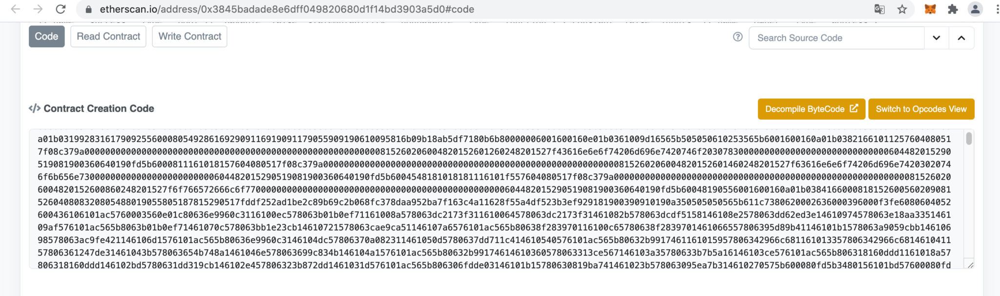
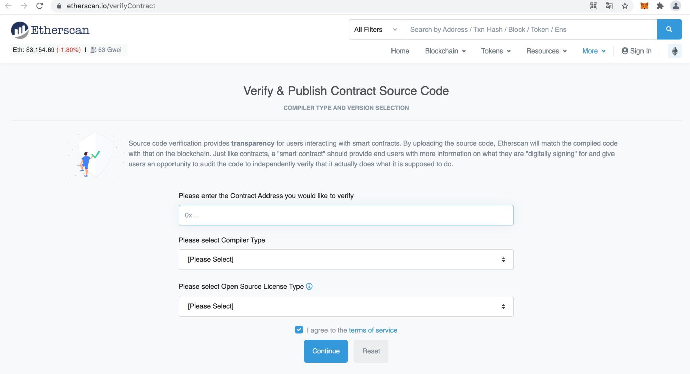

编译器将智能合约代码（`.sol` 文件、`.vy` 文件）编译为：

* 字节码：能够被 evm 虚拟机执行的 EvmBytes
* ABI：人类可读的代码，JSON 格式
* LLL：EvmBytes 上一级的封装

要进行智能合约审计，我们都期待能够获取源代码。而智能合约部署之后是公开的，任何人都可以获得 EvmBytes。也就是一般以 hex 字符展现的这种 ByteCode。在区块链浏览器查询即可：



有一些合约是有源码的，比如这个合约：https://etherscan.io/address/0x3845badade8e6dff049820680d1f14bd3903a5d0#code

通过 https://etherscan.io/verifyContract 即可发布智能合约的源码：



如果没有被项目方发布，还可以在 github 上面搜索源码。

但是对于那些未开源的智能合约怎么办呢？我们一定能获取 EvmByteCodes，但是期待获得汇编、伪代码甚至源码。

目前已知如下一些在线或本地程序：

**在线反编译网站**

* https://etherscan.io/bytecode-decompiler
* https://ethervm.io/decompile
* https://www.contract-library.com/ （可读性较高）

**本地反编译程序**

* https://github.com/Arachnid/evmdis
* https://github.com/crytic/pyevmasm
* https://www.pnfsoftware.com/blog/ethereum-smart-contract-decompiler/

**反编译插件**

* https://github.com/crytic/ethersplay

**以太坊签名数据库**

* https://www.4byte.directory/

目前这些程序的效果均未测试过。参考：https://ethervm.io/ ，这个链接介绍了 EVM 机器码/汇编代码。

计算函数签名的 solidity 代码：

```js
pragma
solidity ^ 0.4
.21;

contract
CalSelector
{
    function getSelector(string

    signature
)
    public
    pure
    returns(bytes4)
    {
        return bytes4(keccak256(bytes(signature)));
    }
}
```

