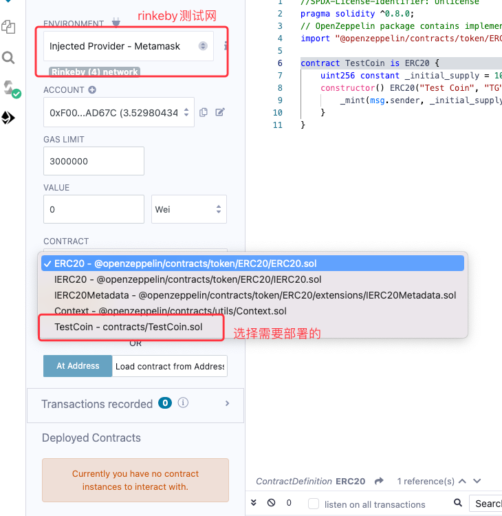
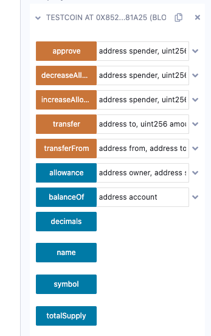

以太坊 TOKEN 是以太坊虚拟机的一个令人难以置信的强大功能，
因为它可以代表几乎任何东西，
从金融资产到游戏角色的技能，到法定货币，等等。以太坊的繁荣也因可自由开发的TOKEN而起

这里主要介绍ERC20，ERC777是ERC20的加强版，添加了对1820的支持，可以防止误将TOKEN打入不支持1820的合约之中

### 所需环境

* `remix`：直接使用在线编辑器即可 [Remix](https://remix.ethereum.org/)
* `metamask`钱包：[Metamask](https://metamask.io/)
*  `Rinkeby` 测试网水龙头：[Rinkeby](https://rinkebyfaucet.com/) 另外chainlink也提供了一个[ChainLink Rinkeby](https://faucetlink.to/select)
* `Rinkeby` 区块链浏览器 [Rinkeby scan](https://rinkeby.etherscan.io/)
* `OpenZeppelin`合约开发库，这部分直接使用github上的数据来用（如果不行，后面会介绍下解决方案，通过remix插件使用本地的库来写）


### 为什么要构建自己的ERC-20 TOKEN

[ERC-20 标准](https://ethereum.org/en/developers/docs/standards/tokens/erc-20/)

ERC-20代币标准是在以太坊和evm兼容的区块链上创建同质化加密货币的方式，当前ETH上大都是ERC-20协议，ERC-777很少出现
因此允许构建者和创造者为他们的协议、市场、元宇宙或社区DAO开发数字资产。

### 什么是ERC-20？

ERC-20TOKEN标准确保所有TOKEN具有相同的属性，
包括所有TOKEN是可替换的(任何一个TOKEN完全等于任何其他TOKEN)，
并且没有TOKEN具有与之相关联的特殊属性或权限。ERC-20TOKEN是可替换的(可以交换)，因为它们具有相同的值和属性。

这意味着一个TOKEN要遵循ERC-20 TOKEN 标准，它必须实现以下API方法和事件

- `totalSupply`-一种定义TOKEN总供应的方法，并在达到总计限制时停止创建新TOKEN。
- `balanceOf`-一种返回包含钱包地址的TOKEN数量的方法。
- `transfer` - 一种从总供应中以一定数量的TOKEN传输并将其发送给用户的方法。
- `transferFrom` - 一种转移方法，可以在用户之间传输ERC -20代币
- `approve` - 授权给智能合约，允许合约操作用户的TOKEN，并可以设置数量
- `allowance` - 查询用户授权给智能合约的数量，在此范围内，合约可以操作用户的TOKEN

### 创建自己的ERC20 TOKEN

```js
//SPDX-License-Identifier: Unlicense
pragma
solidity ^ 0.8
.0;
// OpenZeppelin package contains implementation of the ERC20 standard
import "@openzeppelin/contracts/token/ERC20/ERC20.sol";

contract
TestCoin
is
ERC20
{
    uint256
    constant
    _initial_supply = 100000e18;
    constructor()
    ERC20("Test Coin", "TG")
    {
        _mint(msg.sender, _initial_supply);
    }
}
```

上面代码就相对简单了：当部署时，铸造100000e18个TG给部署地址，记住，TOKEN是有数据精度的，
即默认情况下，TOKEN的精度为1e18,即 1000000000000000000（18个0）代表 1 个TOKEN，后面的0用于表示小数位：
1230000000000000000代表 1.23 个TOKEN，看下`ERC20`这部分的代码：
```js

    /**
     * @dev Returns the number of decimals used to get its user representation.
     * For example, if `decimals` equals `2`, a balance of `505` tokens should
     * be displayed to a user as `5.05` (`505 / 10 ** 2`).
     *
     * Tokens usually opt for a value of 18, imitating the relationship between
     * Ether and Wei. This is the value {ERC20} uses, unless this function is
     * overridden;
     *
     * NOTE: This information is only used for _display_ purposes: it in
     * no way affects any of the arithmetic of the contract, including
     * {IERC20-balanceOf} and {IERC20-transfer}.
     */
    function decimals() public view virtual override returns (uint8) {
        return 18;
    }
```
可以看出，在没有重写 `decimals()` 方法的情况下，默认精度是18，即1e18。

部署的话就很简单了，这里我们还是使用remix操作：



点击 `Deploy` ，metamask确认即可（详细remix教程可以参考[Remix](/wiki/solidity/deploy/remix)）

然后就可以看到正常的方法了



其中多了两个方法：`decreaseAllowance` 与 `increaseAllowance`
- `decreaseAllowance`：减少授权到合约的TOKEN数量
- `increaseAllowance` 增加授权到合约的TOKEN数量

这两个方法一般用不上

### 授权讲解
源码：
```js
    //...省略部分代码

    mapping(address => mapping(address => uint256)) private _allowances;

    /**
     * @dev See {IERC20-allowance}.
     */
    function allowance(address owner, address spender) public view virtual override returns (uint256) {
        return _allowances[owner][spender];
    }

    /**
     * @dev See {IERC20-approve}.
     *
     * NOTE: If `amount` is the maximum `uint256`, the allowance is not updated on
     * `transferFrom`. This is semantically equivalent to an infinite approval.
     *
     * Requirements:
     *
     * - `spender` cannot be the zero address.
     */
    function approve(address spender, uint256 amount) public virtual override returns (bool) {
        address owner = _msgSender();
        _approve(owner, spender, amount);
        return true;
    }

    /**
     * @dev See {IERC20-transferFrom}.
     *
     * Emits an {Approval} event indicating the updated allowance. This is not
     * required by the EIP. See the note at the beginning of {ERC20}.
     *
     * NOTE: Does not update the allowance if the current allowance
     * is the maximum `uint256`.
     *
     * Requirements:
     *
     * - `from` and `to` cannot be the zero address.
     * - `from` must have a balance of at least `amount`.
     * - the caller must have allowance for ``from``'s tokens of at least
     * `amount`.
     */
    function transferFrom(
        address from,
        address to,
        uint256 amount
    ) public virtual override returns (bool) {
        address spender = _msgSender();
        _spendAllowance(from, spender, amount);
        _transfer(from, to, amount);
        return true;
    }

    /**
     * @dev Sets `amount` as the allowance of `spender` over the `owner` s tokens.
     *
     * This internal function is equivalent to `approve`, and can be used to
     * e.g. set automatic allowances for certain subsystems, etc.
     *
     * Emits an {Approval} event.
     *
     * Requirements:
     *
     * - `owner` cannot be the zero address.
     * - `spender` cannot be the zero address.
     */
    function _approve(
        address owner,
        address spender,
        uint256 amount
    ) internal virtual {
        require(owner != address(0), "ERC20: approve from the zero address");
        require(spender != address(0), "ERC20: approve to the zero address");

        _allowances[owner][spender] = amount;
        emit Approval(owner, spender, amount);
    }

    /**
     * @dev Updates `owner` s allowance for `spender` based on spent `amount`.
     *
     * Does not update the allowance amount in case of infinite allowance.
     * Revert if not enough allowance is available.
     *
     * Might emit an {Approval} event.
     */
    function _spendAllowance(
        address owner,
        address spender,
        uint256 amount
    ) internal virtual {
        uint256 currentAllowance = allowance(owner, spender);
        if (currentAllowance != type(uint256).max) {
            require(currentAllowance >= amount, "ERC20: insufficient allowance");
            unchecked {
                _approve(owner, spender, currentAllowance - amount);
            }
        }
    }
```

- 执行方法`approve`：授权于智能合约，允许智能合约操作的数量（普通地址其实也可以），有两个参数：
`address spender, uint256 amount` 分别代表花费者（智能合约或地址）、允许操作的数量，在合约中，使用`msg.sender`来记录是哪个地址发送的
可在`_approve(...)`方法中看到，内部方法，有三个参数，较刚才的方法多了一个owner，最终记录的为 `_allowances[owner][spender] = amount;`
这个就代表该用户（owner）授权到智能合约或地址（spender）多少TOKEN（amount）。
- 查询方法`allowance`：智能合约可以操作用户的TOKEN数量，查询传递两个参数：`address owner, address spender`
分别代表用户地址地址，授权到的智能合约或地址
- 转移方法 `transferFrom(...)` 上面说明了，授权的操作与查询，那ERC20中是如何判断使用的，这里用到的就是`tranferFrom(...)`方法，
与 `transfer(...)` 方法同的是，transfer 方法适用于地址、合约间转账、合约到地址的转账，`transferFrom` 适用于地址到合约的转账，里面有个
特殊的判断方法：`_spendAllowance()`，查询出用户对授权合约或地址的授权数量，**判断当前发送的TOKEN数量是否超过授权的数量，如果超过则不发送**。


