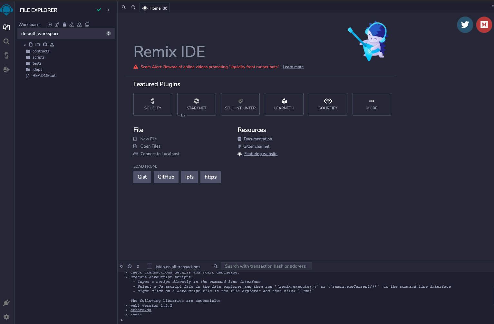
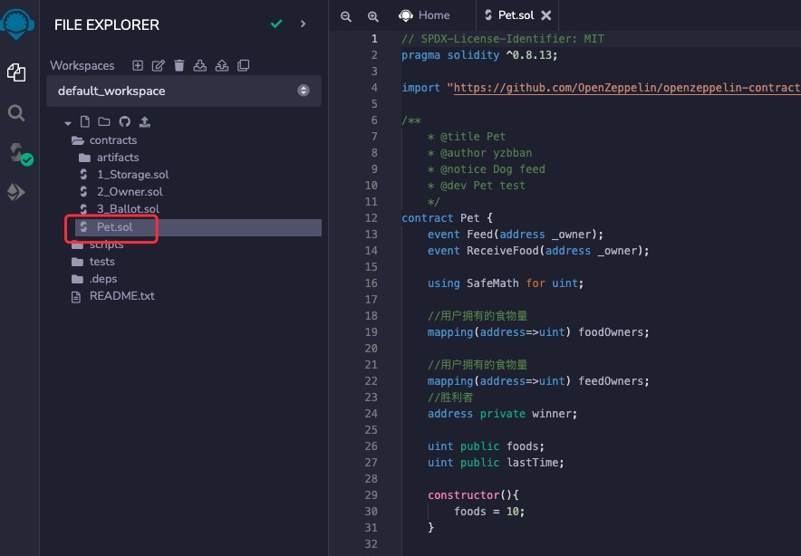
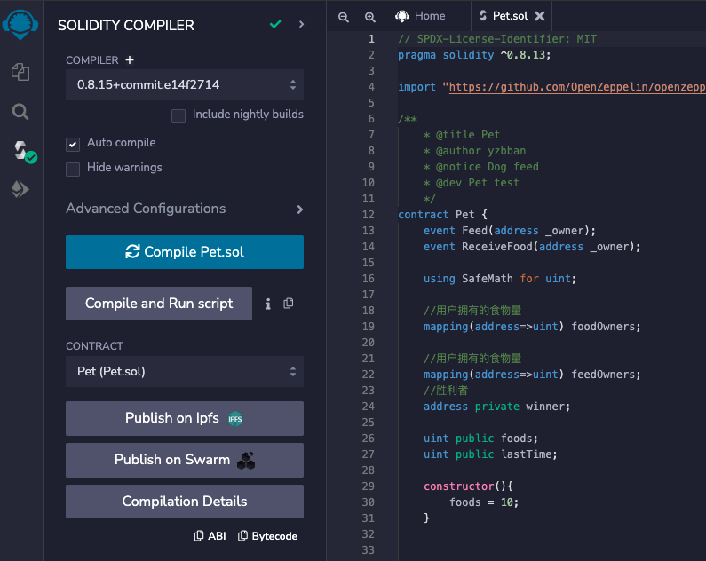
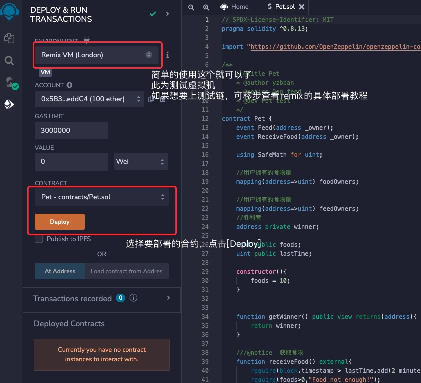
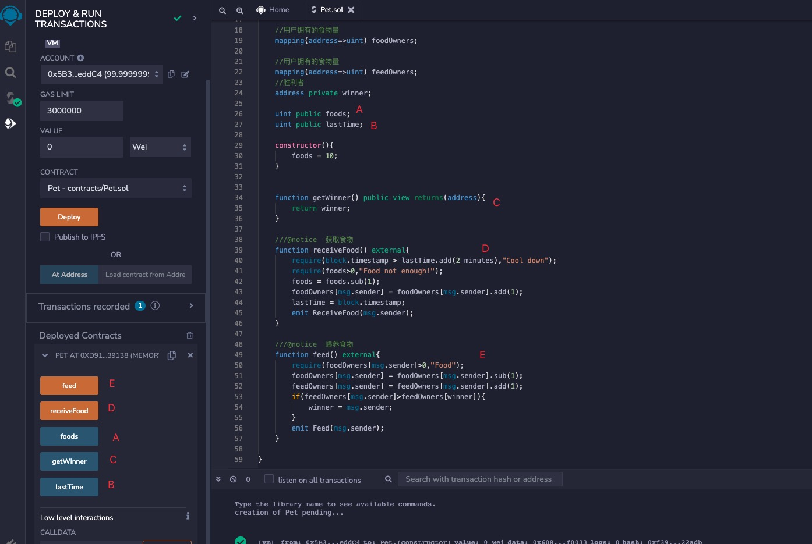
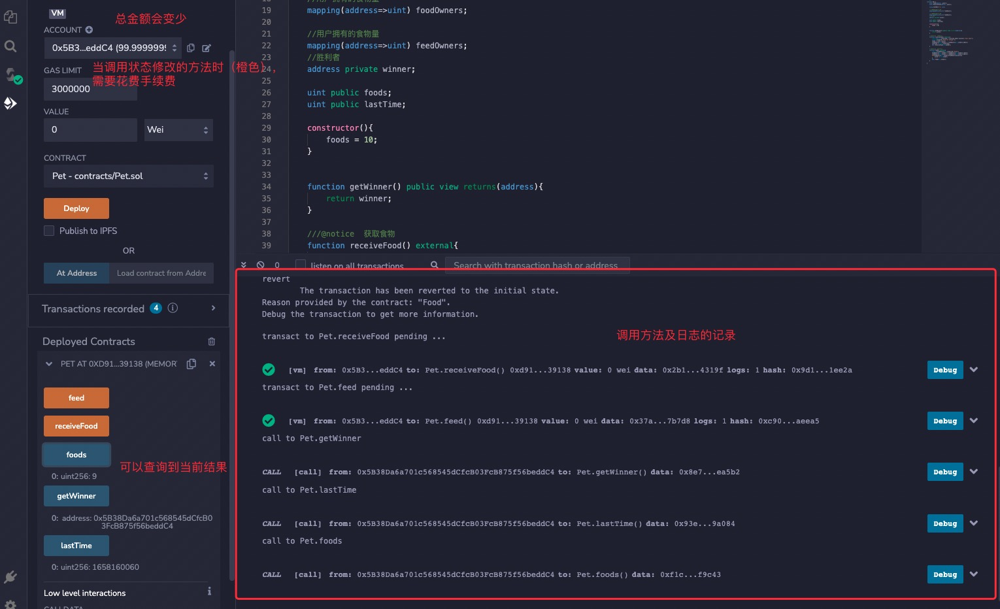

## 一个完整的示例

  接下来会以一个简单的方式
  
  Dapp的功能
  - 可以领取食物，与上一次领取时间间隔2min
  - 给小狗喂食物
  - 每个人都可以去喂小狗
  - 食物总量为10
  - 开始时间为部署合约时间
  - 最后食物消耗完，喂养多着获胜（数量相同，则按照先喂养的顺序）


分析一下（主要为示例作用，尽量简化不做扩展，不用纠结逻辑关系）

需要保存的参数：
当前喂小狗的时间、每个人已喂的量、每个人当前还剩余的食物量、记录胜者


### 合约
```js
    // SPDX-License-Identifier: MIT
    pragma solidity ^0.8.13;

    import "https://github.com/OpenZeppelin/openzeppelin-contracts/blob/release-v4.0/contracts/utils/math/SafeMath.sol";

    /** 
     * @title Pet
     * @author yzbban
     * @notice Dog feed
     * @dev Pet test
     */
    contract Pet {
        event ReceiveFood(address _owner);
        event Feed(address _owner);

        using SafeMath for uint;
    
        //用户拥有的食物量
        mapping(address=>uint) foodOwners;

        //用户拥有的食物量
        mapping(address=>uint) feedOwners;
        //胜利者
        address private winner;

        uint public foods;
        uint public lastTime;

        constructor(){
            foods = 10;
        }


        function getWinner() public view returns(address){
            //返回胜利者
            return winner;
        }

        ///@notice  获取食物
        function receiveFood() external{
            //判断是否当前时间距离上次超过2min，超过则可以继续执行
            require(block.timestamp > lastTime.add(2 minutes),"Cool down");
            //判断食物是否被领取完
            require(foods>0,"Food not enough!");
            //可以领取食物总量减1
            foods = foods.sub(1);
            //当前获取食物的账号增加一个食物
            address _owner = msg.sender;
            foodOwners[_owner] = foodOwners[_owner].add(1);
            //设置上次时间为当前时间
            lastTime = block.timestamp;
            //记录谁领取了食物的日志
            emit ReceiveFood(_owner);
        }

        ///@notice  喂养食物
        function feed() external{
            //喂养账号必须有实物
            require(foodOwners[msg.sender]>0,"Food");
            //扣除喂养者账号中的一个食物
            foodOwners[msg.sender] = foodOwners[msg.sender].sub(1);
            //成功喂养一次+1
            feedOwners[msg.sender] = feedOwners[msg.sender].add(1);
            //当前账号的喂养数量如果大于历史最多的喂养数量，则胜利者为当前账号
            if(feedOwners[msg.sender]>feedOwners[winner]){
                winner = msg.sender;
            }
            //记录喂养账号日志
            emit Feed(msg.sender);
        }

    }

```


:::info
注释说明
基本的语法构成
熟悉代码对状态变量、局部变量、构造函数、函数等有一定的了解。

 1. 此为许可相关的表述方式，具体的可以参考SPDX许可列表网址：[SPDX许可列表](https://spdx.org/licenses/)，一般情况下，可续许可是有必要加上的。
 2. `pragma...`代表当前的编译器源代码适用的版本为^0.8.13，版本有多种方式，一般是指定版本好（防止某个新版本出现问题），其他的方式如：>=0.4.16 <0.9.0 （一般不使用）。
 3. `event ReceiveFood(...` 这部分是声明了一个`事件`，他会在`receiveFood`函数的最后一行被执行，前端用户或者后端可以监听到链上已成功的交易发送的事件（记录下事件，交易都是成功的状态），并且此记录不会花费太多的gas费用，事件被监听到，可以获得其中的`address _owner`参数，方便查询这是谁获取的食物（具体的业务根据需求设置参数）。
 4. `using SafeMath for uint`，指使用SafeMath替换uint的类型，凡是使用uint的声明的变量，都可使用SafeMath函数中的函数，SafeMath是一个防止uint越界的安全四则运算函数，一般函数为：`add、sub、mul、div、mod`等，其他的可在源码中查看。
 5. `mapping(address=>uint) foodOwners;`一个公共的状态变量，此声明的类型为一个映射关系，将address映射为无符号整数，向当时一个hash表，且都有一个默认值全为0的映射，但是此mapping不支持迭代器，无法遍历获取里面的参数及参数值。
 6. `constructor`代表构造函数，了解其他语言的，会知道构造函数是在初始化的时候执行的，合约中的也是如此，会在创建后直接执行，并将数据存储起来。
 7. `address private winner;` 代表的是私有的，address类型的winner变量，在此合约中，用于记录获胜者，私有的只有合约内部可以访问（但是可以通过rpc读取存储位置来获取此值，这里不做多余的解释，初学者可以当做是外部不可读）。
 8. `uint public foods;`代表公共的，无符号的整数变量。公共的表示本合约及其他合约都可以访问。
 9. `function getWinner() public view returns(address){return winner;}`此函数用于查询当前的胜利者是谁，function是一个函数的声明，public代表可以合约内部以及其他合约来调用
 10. `function receiveFood() external{...`表示领取食物，external是一个外部调用，不允许本合约调用，没有可见性（view或者pure声明）的函数，则是改变合约中的数据状态的函数，此函数主要改变的是`foodOwners[...]`、`lastTime`、`foods`，函数中有`require(param1,param2)`错误及异常判断条件，不符合条件的会抛出第二个参数`param2`的异常,符合则继续执行
 11. `address _owner = msg.sender;`此为局部变量（这里为了说明提出来的，实际编写代码不需要单独声明次变量），即为函数内部生命的变量，`msg.sender`为全局变量，详情可以查看 ---- [全局变量](/wiki/solidity/contract/variables/)
 12. `block.timestamp`同样为全局变量，意为当前区块的秒级时间戳

以上为此合约的的基本介绍，具体详细的语法可以继续往下看，每个语法都配有一个示例

:::

### 部署

这里介绍一个较为简单的方式（也是大多数初学者使用的，后面有单独的模块介绍其他的部署方式），没有较多的功能模块的介绍，所以较为适合初学者学习使用，
[REMIX IDE网站](https://remix.ethereum.org/)，打开网站复制上述代码（或者直接在remix中编写）,为了快速使用，就把详细介绍具体的功能


合约就写入contracts文件夹中，其他文件为remix的官方示例，有兴趣的可以查看，新建文件，后缀名为.sol，将上述的代码拷入sol文件（.deps中为下载的github库文件）


点击compile则可编译成功（注意，如果使用github import，最好是科学上网，不然可能会下载不了库文件）


单机 `Deploy` 即可完成在内置虚拟机上的部署


可以看到部署的合约为`0xd9145CCE52D386f254917e481eB44e9943F39138`,下面有一些可以点击的按钮，橙色代表修改存储的函数，蓝色为可见性直接读取的函数，每个public或者external的函数或者变量，都可以找到与之对应的按钮


调用函数，调用状态修改的函数时，需要花费手续费


OK以上就是第一个合约的示例

### 总结

  业务逻辑、架构的使用、数据结构的设计为代码的主要处理模块，初学者可以优先关注业务逻辑，在熟练掌握语法、关键字的同时多多练习就能实现简单的合约内容了，下面讲解具体的代码结构、语法等，每个都会举一个简单的例子。
  更为详尽的可参考官方网站：[smart contracts](https://ethereum.org/en/learn/#smart-contracts)
