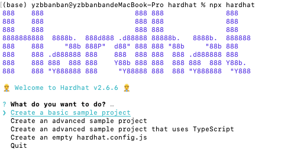
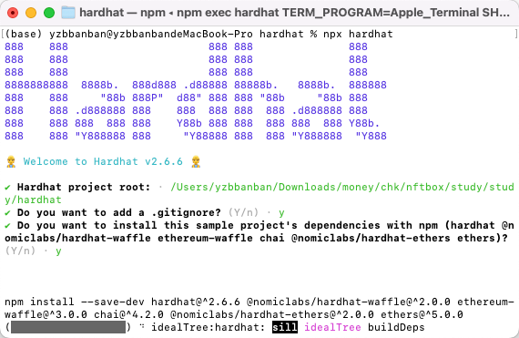
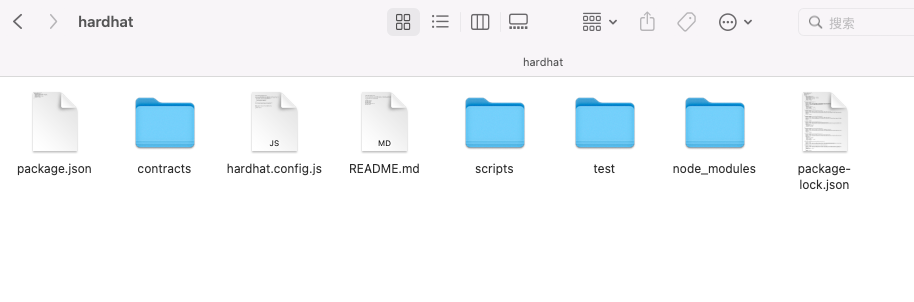
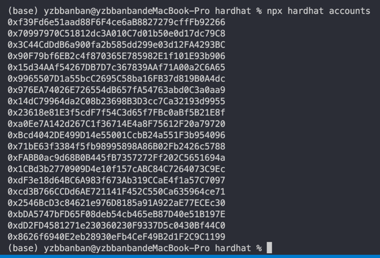
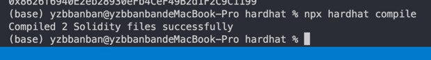
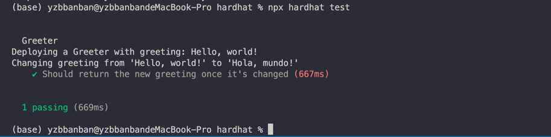
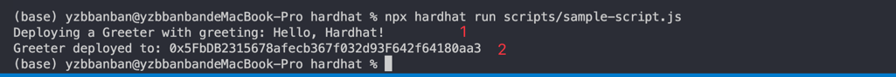
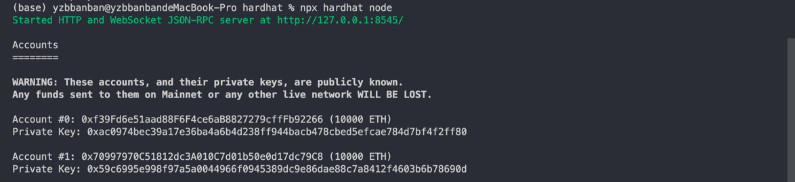
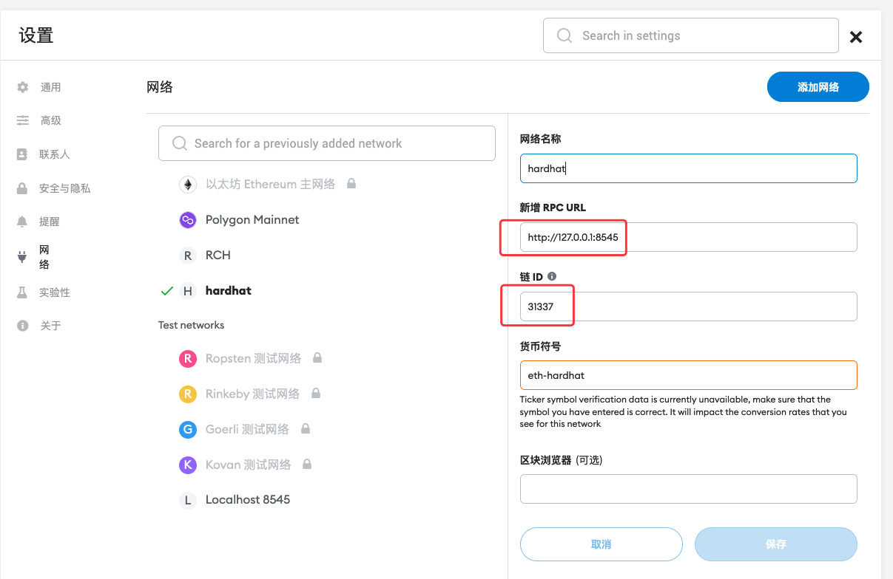

import {EmbedGiscus} from '@site/src/components/Talk'

在简单介绍之前，需要安装相应的开发环境，此处依然使用的是node环境 [Node](../../dev/index.md)，IDE可以使用 [Visual Studio Code](https://code.visualstudio.com/)

### 简述

Hardhat是一个编译、部署、测试和调试以太坊应用的开发环境。它可以帮助开发人员管理和自动化构建智能合约和dApps过程中固有的重复性任务，并围绕这一工作流程轻松引入更多功能。这意味着hardhat在最核心的地方是编译、运行和测试智能合约。

Hardhat内置了Hardhat网络，这是一个专为开发设计的本地以太坊网络。主要功能有Solidity调试，跟踪调用堆栈、console.log()和交易失败时的明确错误信息提示等。

Hardhat Runner是与Hardhat交互的CLI命令，是一个可扩展的任务运行器。它是围绕任务和插件的概念设计的。每次你从CLI运行Hardhat时，你都在运行一个任务。例如，npx hardhat compile运行的是内置的compile任务。任务可以调用其他任务，允许定义复杂的工作流程。用户和插件可以覆盖现有的任务，从而定制和扩展工作流程。

Hardhat的很多功能都来自于插件，而作为开发者，你可以自由选择想使用的插件。Hardhat不限制使用什么工具的，但它确实有一些内置的默认值。所有这些都可以覆盖。

### 安装

初始化项目前，需要先安装本地hardhat：

```shell
npm install --save-dev hardhat
```
Hardhat是通过本地安装在项目中使用的。这样你的环境就可以重现，也可以避免未来的版本冲突。

要安装它，你需要创建一个npm项目，进入一个空文件夹，运行npm init。 并遵循其指示操作。项目初始化之后，运行：

要使用本地安装的Hardhat，需要使用npx来运行它（如：npx hardhat）。
### 快速开始

本篇主要介绍如何快速使用以及hardhat的基础知识
Hardhat即使在没有安装插件下，你也能创建自己的任务，编译Solidity代码，运行测试，并运行Hardhat Network，你可以将合约部署到本地开发网络。
通过在项目文件夹中运行`npx hardhat`来创建Hardhat项目:


我们选择创建示例项目（`Create a basic sample project`），并通过逐个步骤来演示样本任务和编译、测试、并部署样本合约。

示例项目会要求安装`hardhat-waffle`和`hardhat-ethers`，以便让Hardhat与Waffle构建的测试兼容。



全部回车默认即可，等待创建完成，完成后会有如下文件或文件夹创建出来，我们需要使用到的是`contracts`合约编写文件夹、`script`部署脚本文件夹、
`test`测试文件夹、`hardhat.config.js`hardhat配置文件，另外`README.md`为自动创建的文档，会有一些简单的部署、测试的说明，`node_modules`、`package.json`为npm安装的安装库，
现阶段可以不用管它


IDE中的显示：


我们也可以直接使用vscode的终端进行创建，接下来最好也是使用vscode自带的终端执行命令如快速了解可用的命令和任务：

执行 `npx hardhat`：
```
Hardhat version 2.10.1

Usage: hardhat [GLOBAL OPTIONS] <TASK> [TASK OPTIONS]

GLOBAL OPTIONS:

    --config              A Hardhat config file.
--emoji               Use emoji in messages.
--help                Shows this message, or a task's help if its name is provided 
--max-memory          The maximum amount of memory that Hardhat can use.
--network             The network to connect to.
--show-stack-traces   Show stack traces.
--tsconfig            A TypeScript config file.
--verbose             Enables Hardhat verbose logging
--version             Shows hardhat's version. 


AVAILABLE TASKS:

    accounts      Prints the list of accounts
check         Check whatever you need
clean         Clears the cache and deletes all artifacts
compile       Compiles the entire project, building all artifacts
console       Opens a hardhat console
flatten       Flattens and prints contracts and their dependencies
help          Prints this message
node          Starts a JSON-RPC server on top of Hardhat Network
run           Runs a user-defined script after compiling the project
test          Runs mocha tests

To get help for a specific task run: npx hardhat help [task]
```


:::info 提示
Hardhat会让提示你如何安装，但是，如果出错了，你可以用

```shell
npm install --save-dev @nomiclabs/hardhat-waffle ethereum-waffle chai @nomiclabs/hardhat-ethers ethers`
```
来安装它们。
:::

#### 配置信息

`hardhat.config.js`中主要配置**部署地址**、**合约版本**、**部署节点**等信息，便于快速上手，先说明默认的部分

```js
require("@nomiclabs/hardhat-waffle");

// This is a sample Hardhat task. To learn how to create your own go to
// https://hardhat.org/guides/create-task.html
task("accounts", "Prints the list of accounts", async (taskArgs, hre) => {
  const accounts = await hre.ethers.getSigners();

  for (const account of accounts) {
    console.log(account.address);
  }
});

// You need to export an object to set up your config
// Go to https://hardhat.org/config/ to learn more

/**
 * @type import('hardhat/config').HardhatUserConfig
 */
module.exports = {
  solidity: "0.8.4",
};
```
此配置均使用默认的配置，包括`地址`的信息，可以通过`npx hardhat accounts`查看目前默认的地址是哪些，并且如果不配置

部署时，如果不进行特殊配置，优先使用的是第一个地址`0xf39Fd6e51aad88F6F4ce6aB8827279cffFb92266`，
当然学习的时候，为了快速理解，可以使用默认地址进行操作。

#### 编译合约

创建的`sample project`默认有一个，在`contracts`文件夹中，打开`Greeter.sol`
```shell
//SPDX-License-Identifier: Unlicense
pragma solidity ^0.8.0;

import "hardhat/console.sol";

contract Greeter {
    string private greeting;

    constructor(string memory _greeting) {
        console.log("Deploying a Greeter with greeting:", _greeting);
        greeting = _greeting;
    }

    function greet() public view returns (string memory) {
        return greeting;
    }

    function setGreeting(string memory _greeting) public {
        console.log("Changing greeting from '%s' to '%s'", greeting, _greeting);
        greeting = _greeting;
    }
}
```
内容较为简单，部署时打印部署参数`_greeting`、获取`greeting`、更换`greeting`
其中有些特殊的部分：`console.log(...)`这个在控制台是打印日志，但是此处是hardhat特有的，所以，使用其他编译器，可能会出现错误

每个程序都需要编译生成虚拟机支持的语言（这里不赘述），所以合约也需要进行编译，使用命令
```shell
npx hardhat compile
```
执行后可能需要等待一段时间，执行好若无编译错误：


#### 测试合约

当前的示例项目使用Waffle和Ethers.js进行测试。如果你想的话，也可以使用其他的代码库。

在test/目录下，可以找到sample-test.js文件（注释部分可以看一下）:
```js
const { expect } = require("chai");
const { ethers } = require("hardhat");

describe("Greeter", function () {
  it("Should return the new greeting once it's changed", async function () {
    const Greeter = await ethers.getContractFactory("Greeter");
    const greeter = await Greeter.deploy("Hello, world!");
    await greeter.deployed();

    expect(await greeter.greet()).to.equal("Hello, world!");

    const setGreetingTx = await greeter.setGreeting("Hola, mundo!");

    // wait until the transaction is mined
    await setGreetingTx.wait();

    expect(await greeter.greet()).to.equal("Hola, mundo!");
  });
});

```
使用`npx hardhat test`来运行测试:
一个简单的结果



#### 部署合约
打开`scripts`文件夹，选择`sample-script.js`，代码如下:

```js
// We require the Hardhat Runtime Environment explicitly here. This is optional
// but useful for running the script in a standalone fashion through `node <script>`.
//
// When running the script with `npx hardhat run <script>` you'll find the Hardhat
// Runtime Environment's members available in the global scope.
const hre = require("hardhat");

async function main() {
  // Hardhat always runs the compile task when running scripts with its command
  // line interface.
  //
  // If this script is run directly using `node` you may want to call compile
  // manually to make sure everything is compiled
  // await hre.run('compile');

  // We get the contract to deploy
  const Greeter = await hre.ethers.getContractFactory("Greeter");
  const greeter = await Greeter.deploy("Hello, Hardhat!");

  await greeter.deployed();

  console.log("Greeter deployed to:", greeter.address);
}

// We recommend this pattern to be able to use async/await everywhere
// and properly handle errors.
main()
  .then(() => process.exit(0))
  .catch((error) => {
    console.error(error);
    process.exit(1);
  });
```
测试内容：部署Greeter，部署时参数为：`Hello, Hardhat`，部署完成后打印部署后的合约
使用`npx hardhat run scripts/sample-script.js`执行

第一行为部署合约合约中打印的数据日志，第二行为部署文件打印的日志

#### 连接钱包或Dapp到Hardhat网络
接下来讲解下外部链接：

Hardhat在启动时，默认情况下总会启动一个Hardhat Network的内存实例，你也可以以独立的方式运行Hardhat Network，以便外部客户（可能是MetaMask，你的Dapp前端，或者一个脚本）可以连接到它。

要以独立的方式运行Hardhat Network，运行`npx hardhat node`:
启动本地节点后


这将暴露一个JSON-RPC接口链接到Hardhat网络。只要将钱包或应用程序连接到`http://localhost:8545`就可以使用它。
如`metamask`,点击右上角`圆形图标` -> `设置` -> `网络` -> `添加网络` 设置好参数（默认chainId为`31337`）：

:::info注
metamask存在一个默认的`localhost`节点，想要添加，可以换成 `127.0.0.1`，如上图所示的
:::
配置好后，导入启动节点中的私钥，即可查看余额如图所示：

如果想要自己创建地址使用，可以使用此命令，提供水龙头
```shell
npx hardhat --network localhost faucet <your address>
```

如果要把Hardhat连接到这个节点上，例如，要在这个网络上运行一个部署脚本，只需要使用--network localhost来运行脚本。

你可以试一试，先用npx hardhat node启动一个节点，并使用network参数重新运行示例脚本：
```shell
npx hardhat run scripts/sample-script.js --network localhost
```

恭喜你，你已经创建了一个项目，运行了一个Hardhat任务，编译了一个智能合约，安装了一个Waffle插件，使用Waffle和ethers.js插件编写并运行了一个测试，并部署了一个合约。

### 配置项

要设置您的配置，您必须从`hardhat.config.js`导出一个对象。
该对象可以包含`defaultNetwork`、`networks`、`solid`、`paths` 和 `mocha` 等条目。

例如

```js
module.exports = {
  defaultNetwork: "rinkeby",
  networks: {
    hardhat: {
    },
    rinkeby: {
      url: "https://eth-mainnet.alchemyapi.io/v2/123abc123abc123abc123abc123abcde",
      accounts: [privateKey1, privateKey2, ...]
    }
  },
  solidity: {
    version: "0.5.15",
    settings: {
      optimizer: {
        enabled: true,
        runs: 200
      }
    }
  },
  paths: {
    sources: "./contracts",
    tests: "./test",
    cache: "./cache",
    artifacts: "./artifacts"
  },
  mocha: {
    timeout: 20000
  }
}
```

网络配置字段是一个可选对象，其中网络名称映射到它们的配置。
`Hardhat`中有两种网络:基于`JSON-RPC`的网络和内置的Hardhat网络。
通过设置配置的`defaultNetwork`字段，您可以自定义运行Hardhat时默认使用的网络。
如果忽略此配置，其默认值为`hardhat`

- chainId: Hardhat Network的区块链使用的链ID号。默认值:31337。
- from:作为默认发件人使用的地址。如果不提供，则使用Hardhat网络的第一个帐户。
- gas:它的值应该是“auto”或一个数字。如果使用一个数字，它将是每个事务默认使用的天然气限额。如果使用“auto”，则会自动估算汽油限额。默认值:9500000。
- gasPrice:它的值应该是“auto”或一个数字。这个参数表现得像气体。默认值:8000000000。气体倍增器:用来将气体估计结果相乘的数字
- gasMultiplier:由于气体估计过程的不确定性，用来将气体估计结果相乘以使其有一些松弛的数字。默认值:1。
- accounts：该字段可以被配置为以下之一： 
描述高清钱包的对象。这是默认值。它可以具有以下任何字段：
  - mnemonic：BIP39定义的12或24个单词助记符。默认值：`“test test test test test test test test test test test junk”`
  - initialIndex：派生的初始索引。默认值：0。
  - path：所有派生键的高清父母。默认值：`“M/44'/60'/0'/0”`。
  - count：要得出的帐户数量。默认值：`20`。
  - accountsBalance：分配给每个派生帐户的余额（在WEI中）的字符串。默认值：`“1000000000000000000000000”`（10000 ETH）。
  HardHat网络将创建的初始帐户的数组。他们每个人都必须是一个具有`privateKey`和`balance`的对象。
- blockGasLimit:在Hardhat网络的区块链中使用的区块气体限制。默认值:9500000


<EmbedGiscus>deployWithHardhat</EmbedGiscus>


