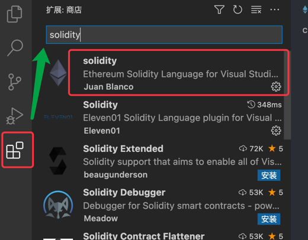

import {EmbedGiscus} from '@site/src/components/Talk'

这里主要对3中常用工具（或框架）进行说明，其他的根据需求解释

如需学习入门测试部分，可以进入[这里](../monitor)进行学习

- 官方文档 [remix](https://remix-ide.readthedocs.io/en/latest/#) 
- 官方文档 [truffle](https://trufflesuite.com/docs/truffle/)， [truffle中文版连接](https://learnblockchain.cn/docs/truffle/quickstart.html#) 
- 官方文档 [hardhat](https://hardhat.org/hardhat-runner/docs), [hardhat中文版](https://learnblockchain.cn/docs/hardhat/getting-started/) 

:::info
这里初学者建议使用remix，开发者可以使用hardhat（使用ethers.js部署、测试更便于前端等全栈的操作），truffle也根据相关喜好来选择
:::

[Visual Studio Code](https://code.visualstudio.com/) 是目前相对重要的编写工具，推荐使用的插件：

初学者基本上这个就够了：[solidity](https://marketplace.visualstudio.com/items?itemName=JuanBlanco.solidity)
可以在**vscode**直接搜索 `solidity`安装就行

#### 扩展

[Ethereum Security Bundle](https://marketplace.visualstudio.com/items?itemName=tintinweb.ethereum-security-bundle)：一个元扩展捆绑市场插件，用于安全的以太坊智能合约开发。

[Sol-profiler-vscode](https://github.com/Aniket-Engg/sol-profiler-vscode) ：可视化代码扩展来生成和存储智能合约方法配置文件。

[vscode-solidity](https://github.com/juanfranblanco/vscode-solidity)： Visual Studio Code 语言支持扩展。

[Solidity Visual Developer](https://marketplace.visualstudio.com/items?itemName=tintinweb.solidity-visual-auditor) ：视觉安全审计，以安全为中心的语法和语义突出显示，详细的类大纲，UML 图生成器 n 更多...

[Solidity Contract Flattener](https://marketplace.visualstudio.com/items?itemName=tintinweb.vscode-solidity-flattener)： 使用 truffle-flattener 展平 Solidity 合约

[Truffle](https://marketplace.visualstudio.com/items?itemName=trufflesuite-csi.truffle-vscode) ：VS Code 的 Truffle 简化了您在 eth 上创建、构建、调试和部署智能合约的方式。++ 适用于所有与 EVM 兼容的区块链和第 2 层扩展解决方案。

本章节主要描述入门与常用的一些操作、指令或者编写，其他深层次的可以关注后续的文档更新或者阅读原文

<EmbedGiscus>deploySol</EmbedGiscus>
