import {EmbedGiscus} from '@site/src/components/Talk'

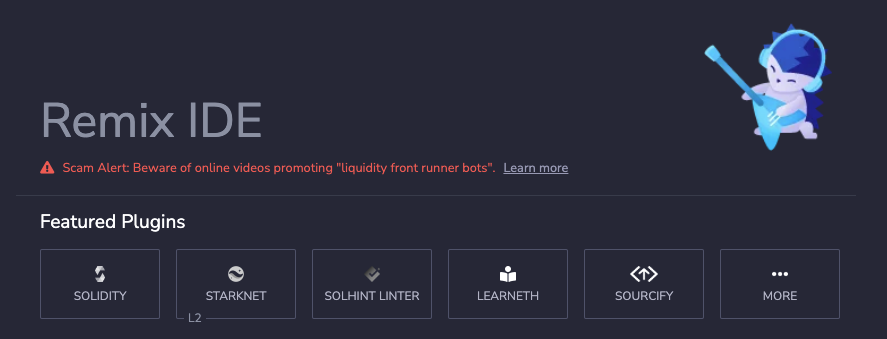

### 前言
用户在每个知识级别上都将混音IDE用于智能合同开发的整个旅程。它不需要设置，可以促进快速的开发周期，并具有带有直觉GUI的丰富插件。IDE有2种口味（Web应用程序或桌面应用程序）和VSCODE扩展名。
- 在线IDE，请参阅：[remix](https://remix.ethereum.org)， 支持的浏览器：Firefox，Chrome，Brave。不支持在平板电脑或移动设备上的使用。
- remix桌面IDE，请参阅发布：[remix-desktop](https://github.com/ethereum/remix-desktop/releases)
- Ethereum-Remix - VSCODE扩展名的文档位于 [remix-vscode](https://github.com/ethereum/remix-vscode#ethereum-remix-project-extension-for-visual-studio-code)。

这里介绍两种方式
- 线上直接编写
- 使用插件使得remix可以使用本地文件

:::info
目前remix大都使用github上的数据源，所以对于网络要求可能会比较高（科学上网），不然有可能会出现加载不出的情况
:::

### 页面布局简介

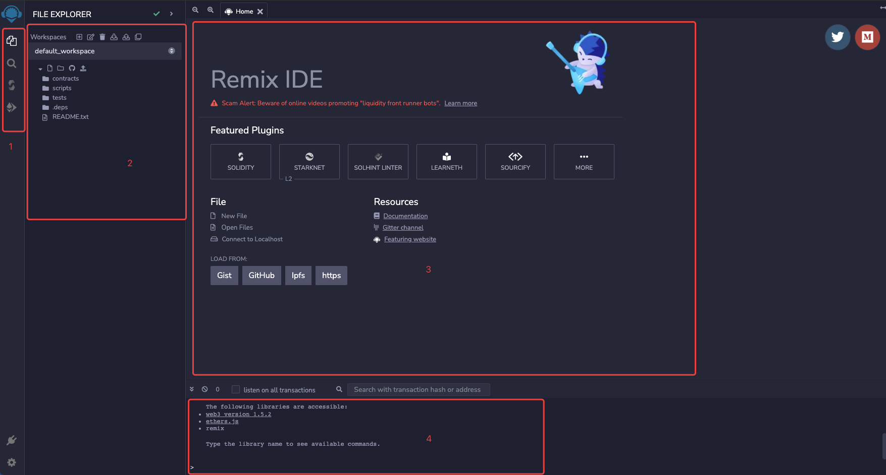
- 【1】最左边区域为图标面板，此处以插件形式展示，添加不同的插件，会有更多的功能图标，
【1】区域，自上而下分别是：
  - `FILE EXPLORER`（文件浏览）
  - `search`（暂时用不到）
  - `SOLIDITY COMPILER`（合约编译）
  - `DEPLOY & RUN TRANSACTIONS`（部署及调用合约） 
  
  其他的插件也会经常用到，如：
  - `DEBUGGERVERIFIED`（断点调试）
  - `ETHERSCAN - CONTRACT VERIFICATION`（etherscan合约验证）
  
  另外底部两个按钮代表：
  - `PLUGIN MANAGER`（插件）、
  - `SETTINGS`（设置），可以根据自己的喜好查看，这里不做过多的叙述（设置中可以设置自己喜欢的IDE配色风格）
  
    :::info
    所有看到的在remix中都是一个插件，所以，`PLUGIN MANAGER`非常重要，如果你看到你的哪个左侧图标找不到了，可以从插件里查出来使用。
    :::
- 【2】为操作面板，可以是操作文件、操作编译器、操作调用合约等
- 【3】为展示面板，主页初次加载是一个简单的导航，若是点击合约文件，则显示合约的内容
- 【4】为结果显示面板，编译、操作合约出现的问题或者结果，都会显示在此中

下面主要讲解下常用的插件面板内容，如需跳过直接跳转至 TODO

###  FILE EXPLORER 文件管理器

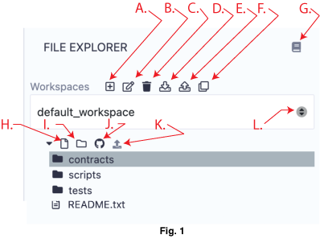
主要用于管理文件
>- A.添加一个工作区
>- B.重命名工作空间
>- C.删除一个工作区
>- D.下载所有工作区，这将创建一个带有所有工作区的文件的.zip文件。
zip文件将具有一个名为.workspaces的文件夹，该文件夹将包含每个工作空间的文件夹。
根据您的操作系统，您可能需要更改.workspaces文件夹上的首选项以使其可见。
>- E.上传从上一个图标制成的工作区备份。
>- F.从git仓库克隆一个
>- G.链接到文档
>- J.将工作区发布到github
>- L.选择一个工作区
>- H.创建文件
>- I.创建一个文件夹
>- K.将本地文件加载到当前工作区

以上的内容，尝试下大部分会了解其功能（毕竟文件管理目前不作为主要内容），妥善保存管理好自己的文档。

### SOLIDITY COMPILER 合约编译

编译前，先选择好合约文件
如果编辑器中没有活动文件或文件尚未编译，则 Solidity 编译器将如下所示：
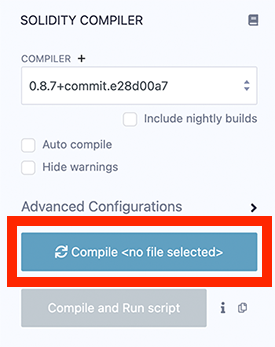

#### 触发编译
当您执行以下操作时会触发编译：
- 单击编译按钮（下图中的 `D`）
- 使用快捷方式。`control + s`
- 右键单击文件资源管理器中的文件并选择编译选项

#### 自动编译
如果选中自动编译复选框（上图中的 `B`），
则每隔几秒（自动保存文件时）以及选择另一个文件时都会进行一次编译。
如果合约有很多依赖项，编译可能需要一段时间——因此您可以自行决定使用自动编译。

详细说明：
>- A 选择编译版本,现一般选择较为新的版本，若是维护一些就程序，也可以使用低版本，但是注意插件是否支持及是否已有版本问题 
>- B 自动编译 
>- C 编译的高级配置，可以选择编译的协议，一般不用高级 
>- D 手动编译按钮 
>- E 编译并运行脚本按钮（图 1 中的 E.）用于编译然后立即运行脚本。这是一个节省时间的方法，您可以编写一些代码，自动运行设置合约状态的脚本 - 从而让您快速了解代码是如何工作的
>- F 选中的合约 
>- G 编译详细信息 
>- H  ABI与字节码，前端调用会使用到
>- x: 添加自定义编译前（用不到）

**C 高级编译器配置**
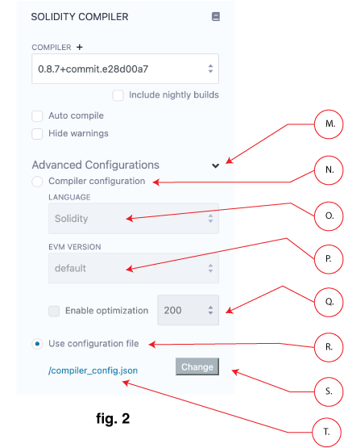
>- M 打开高级配置
>- N 是否使用设置的配置
>- O 从 Solidity 版本0.5.7开始，就可以编译Yul文件（另一种语言）了。请阅读（关于 Yul 的可靠文档），其中包含一些代码示例。您可以使用语言下拉菜单（图 2 中的 O.）来切换语言。此下拉列表仅适用于大于或等于 的版本0.5.7。
>- P 编译协议
>- Q 启用优化
>- R 使用配置的json文件
>- S 使用配置文件
>- T 当您切换到使用配置文件进行编译时，会创建一个示例编译器配置文件。
可以使用所有可用选项编辑此文件
 
### DEPLOY & RUN 部署及调用合约
允许您将事务发送到当前环境
此模块作为重点，因为你90%的时间会花在这上面
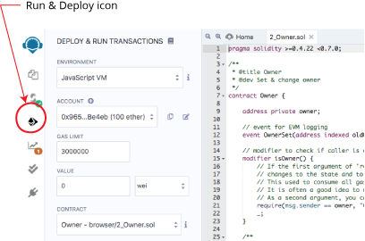

要使用这个模块，你需要编译一个合约。
因此，如果`CONTRACT`选择框（选择框在 VALUE 输入框下方）中有合约名称，则可以使用该模块。
如果什么都没有，或者您没有看到您想要的合约，您需要在编辑器中选择一个合约使其处于活动状态，
进入编译器模块并编译它，然后返回 `Deploy & Run`（此编译的合约，不可以有**语法**的错误）。

#### 环境

- `Remix VM (London)`：用于连接到浏览器中的沙盒区块链。Remix VM（以前称为 JavaScript VM）是它自己的“区块链”，每次重新加载时，旧链将被清除，新的区块链将启动。旧的不会得救。伦敦指的是以太坊的伦敦分叉。
- `Remix VM (Berlin)`：与上述相同，只是该链使用的是以太坊的柏林分叉。
- `Injected Provider` - provider name：用于将 Remix 连接到注入的 web3 提供程序。最常见的注入提供程序是Metamask.
- `Hardhat Provider`：用于将 Remix 连接到本地Hardhat测试链。
- `Ganache Provider`：用于将 Remix 连接到本地 Truffle Ganache 测试链。
- `Foundry Provider`：用于将 Remix 连接到本地 Foundry Anvil 测试链。
- `WalletConnect`：用于使用 WalletConnect 允许您在移动设备上批准交易。
- `External HTTP Provider`：Remix 将连接到远程节点。您需要提供所选提供商的 URL：geth、parity 或任何以太坊客户端。这以前称为Web3 Provider。
- `L2 - Optimism Provider`：用于使用 Optimism Network 主网的设置将 Remix 连接到注入的提供者（通常是 Metamask）。
- `L2 - Arbitrum One Provider`：用于使用 Arbitrum One 网络的设置将 Remix 连接到 Injected Provider（通常是 Metamask）。
- 
#### ACCOUNT
帐户：与当前环境关联的帐户列表（及其关联的余额）。
在 JsVM 上，您可以选择 15 个帐户。
如果将 Injected Web3 与 MetaMask 一起使用，则需要更改 MetaMask 中的帐户（一般部署到测试网或者主网使用此环境）。

#### GAS LIMIT
这设置了在 Remix 中创建的所有交易允许的最大GAS。

#### VALUE
所需的eth
这设置了发送到合约或应付函数的 ETH、WEI、GWEI 等数量。
注意：应付功能有一个红色按钮。
每次交易执行后，Value字段总是重置为 0，`VALUE` 不适用于GAS，精度单位不一样

#### Deploy、At Address
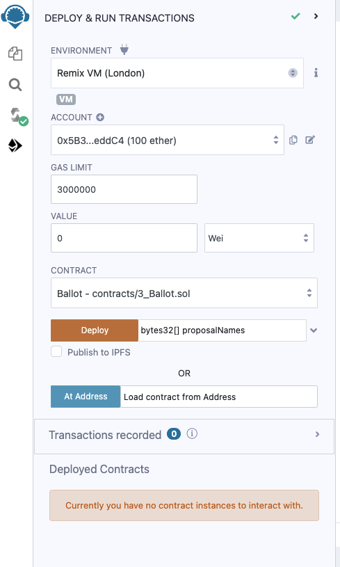

在上图中，选择框设置为`Ballot`（文件先打开Ballot合约）。此选择框将包含已编译合约的列表。
- `Deploy`发送部署所选合约的事务。当交易被挖掘时，新创建的实例将被添加（这可能需要几秒钟）。
注意：如果合约的构造函数有参数，则需要指定。
- `At Address`用于访问已经部署的合约。由于合约已经部署，使用AtAddress访问合约不会花费 gas。
注意：使用 `At Address` 时，请确保您信任该地址的合约。

要使用`At Address`，您需要在编辑器的活动选项卡中拥有已部署合约的源代码或ABI。
使用源代码时，它必须使用与您尝试访问的已部署合约相同的编译设置进行编译。

#### 已部署的合约
运行选项卡中的此部分包含一个已部署合约列表，可通过已部署合约（也称为 udapp）的自动生成 UI 进行交互。

部署的合约出现，但处于折叠形式（如果使用`Injected Provider`环境，要考虑区块确认时间，如果超时，则不会出现部署的合约，但如果部署成功，可以使用`At Address
`模式开操作合约）。

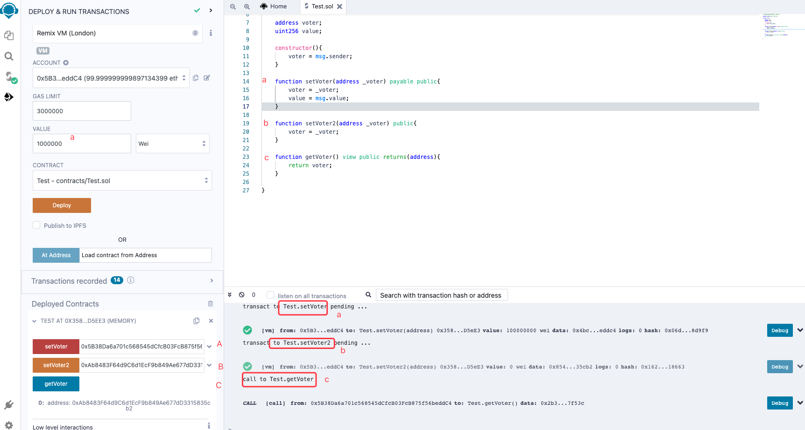

您将看到合同中的功能。功能按钮可以有不同颜色的按钮。
合约较为简单，先不做注释，只对remix的操作进行说明

- `Solidity`中的功能`constant`、`view`或`pure`功能具有蓝色按钮。单击此类型之一不会创建新事务。所以点击不会导致状态改变——它只会返回一个存储在合约中的值——所以它不会花费你任何汽油费。
- 改变合约状态和不接受以太币的函数被称为`non-payable`函数并且有一个橙色按钮。点击它们将创建一个交易，因此会产生`gas`。
- 带有红色按钮的`payable`函数是 Solidity 中的函数。单击其中一个将创建一个新事务，并且该事务可以接受一个值。该值被输入到`Gas Limit`字段下的 `Value` 字段中。

#### 输入参数

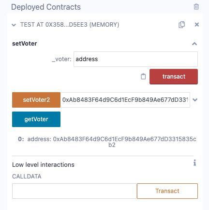
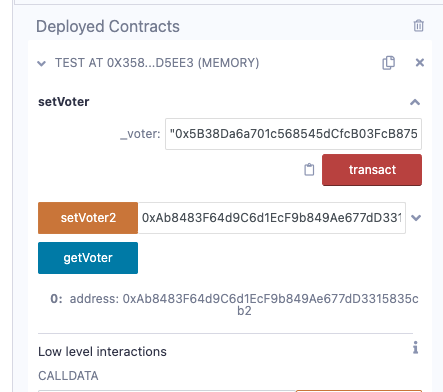
点击展开

- 输入框告诉您每个参数需要是什么类型。
- 数字和地址不需要用双引号括起来。
- 字符串需要被包装。
- 参数用逗号分隔。

#### 底层交互
`Low level` 交互用于通过`receive()`或`fallback()`函数向合约发送资金或调用数据或资金和调用数据。
通常，如果您遵循升级或代理模式，您应该只需要实现回退功能。
低级交互部分位于每个已部署合约中的功能下方。

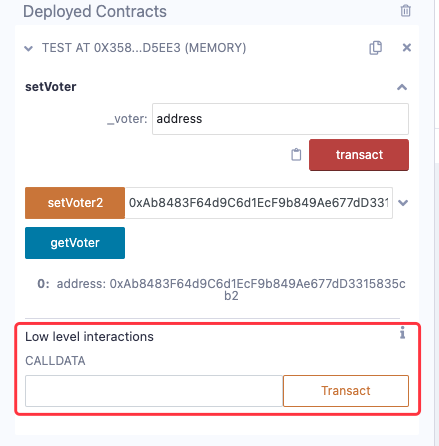

如果您正在执行一个正常的交易把以太传转入一个合约
（注：上述合约不支持，若想支持，需要在您的合约写入`receive()`函数）
如果你的合约已经部署（写入了`receive()`函数），你想给它发送资金，你需要输入Ether或Wei等的金额(见下图A)，
然后在`Low level interaction`的`calldata`字段中输入NOTHING(见下图B)，
然后点击`transaction`按钮(见下图C)。

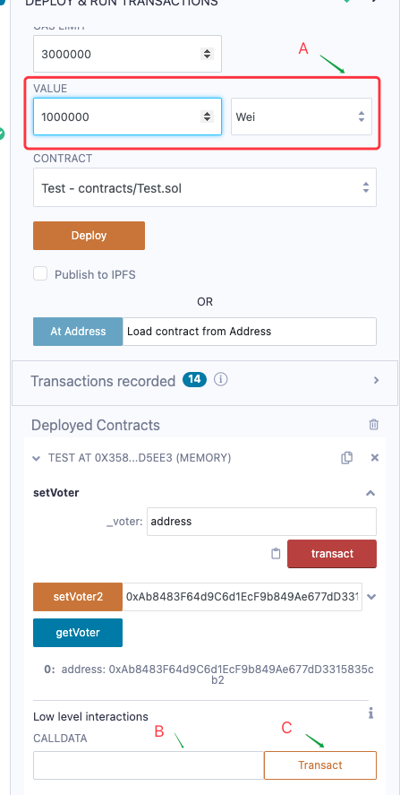

- 如果您将`calldata`发送到您与Ether的合约，
那么您需要使用`fallback()`函数，并将其与应付的状态可变性一起使用。
- 如果你不是发送以太到合同，而是发送`calldata`，那么你需要使用`fallback()`函数。
- 如果你在使用低层次交互时违反了规则，你将会受到警告。

<EmbedGiscus>remixTalk</EmbedGiscus>
