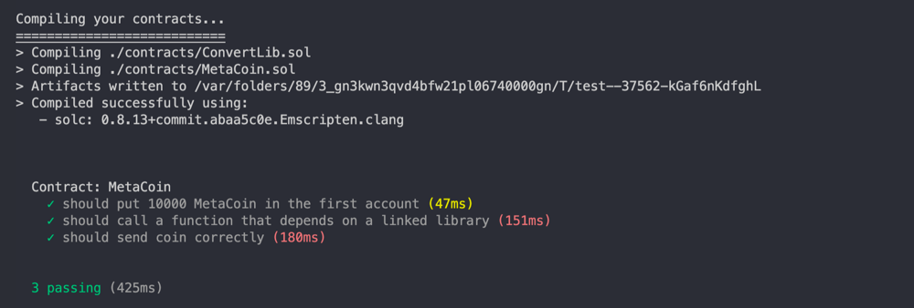

import {EmbedGiscus} from '@site/src/components/Talk'

### 简介
Truffle 是一个在以太坊进行 DApp 开发的世界级开发环境、测试框架。它在使开发人员更轻松。

使用 Truffle 开发有一以下优点：

- 内置智能合约编译，链接，部署和二进制（文件）管理。 
- 可快速开发自动化智能合约测试框架。 
- 可脚本化、可扩展的部署和迁移框架。 
- 可管理多个不同的以太坊网络，可部署到任意数量的公共主网和私有网络。 
- 使用 ERC190 标准，使用 EthPM 和 NPM 进行包装管理。 
- 支持通过命令控制台直接与智能合约进行交互。 
- 可配置的构建管道，支持紧密集成。 
- 支持在Truffle环境中使用外部脚本运行器执行脚本。

### 安装 Truffle
同样，truffle也需要使用`Node.js`环境 [Node](../../dev/index.md)，可以通过以下方式安装`truffle`
```shell
npm install -g truffle
```

### 快速入门

Truffle 支持的模板类型较多，想要快速实现有一个[Truffle Boxes](https://trufflesuite.com/boxes/)库,
这里提供了简单的模板，这里以一个[metacoin](https://trufflesuite.com/boxes/metacoin/)作为示例使用
执行：
```shell
truffle unbox metacoin
```

即可创建完成

:::info注
也可以使用 `truffle unbox <box-name>` 命令下载其他的box

如果要创建没有合约的空工程，可以使用`truffle init`
:::

在操作完成之后，就有这样的一个项目结构：
- `contracts/`: Solidity合约目录

- `migrations/`: 部署脚本文件目录

- `test/`: 测试脚本目录

- `truffle.js`: Truffle 配置文件

> 1. `contracts/MetaCoin.sol`： 这是一个用 Solidity 编写的 MetaCoin 代币 智能合约。注意他还引用了目录下的另外一个合约文件 contracts/ConvertLib.sol 。 
2. `contracts/Migrations.sol`： 这是一个单独的 Solidity 文件，用来管理和升级智能合约. 每一个工程都有这样的一个文件，并且通常不需要编辑它。 
3. `migrations/1_initial_migration.js`： 这是一个部署脚本，用来部署 Migrations 合约，对应 Migrations.sol 文件。
4. `migrations/2_deploy_contracts.js`： 这是一个部署脚本，用来部署 MetaCoin 合约. (部署脚本的运行是有顺序的，以2开头的脚本通常在以1开头的脚本之后运行)
5. `test/TestMetacoin.sol`： 这是一个用Solidity编写的测试用例文件，用来检查合约是否像预期一样工作。
6. `test/metacoin.js`： 这是一个用JavaScript编写的测试用例脚本，用途和上面一样。
7. `truffle-config.js` （之前是 truffle.js）： Truffle 配置文件, 用来设置网络信息，和其他项目相关的设置。当我们使用内建的默认的Truffle命令时，这个文件留空也是可以的。


### 使用测试

运行solidity测试
```shell
truffle test ./test/TestMetacoin.sol
```


运行脚本测试
```shell
truffle test ./test/metacoin.js
```
输出：


### 编译合约
```shell
truffle compile
```
输出：
```shell

Compiling your contracts...
===========================
> Compiling ./contracts/ConvertLib.sol
> Compiling ./contracts/MetaCoin.sol
> Artifacts written to /Users/yzbbanban/Downloads/study/truffle/metacoin/build/contracts
> Compiled successfully using:
   - solc: 0.8.13+commit.abaa5c0e.Emscripten.clang
```
### 部署合约

部署脚本主要依赖于两个内容：
- `migrations/`文件夹中的部署脚本，脚本的部署顺序按照文件命名的数字如 1_的顺序从小到达执行，允许没有自增顺序，
如：**10_xx**、**22_xx**、**35_xx**，每个步骤部署后，会记录在**migrations**合约中，记录当前部署到了哪一个步骤，如果不执行reset指令，
则会根据当前保存的部署的步骤继续执行
- `truffle-config.js`中的配置文件

为了部署我们的合约，我们需要连接到区块链网络。Truffle 提供了一个内置的个人模拟区块链，它可以帮助我们用来测试。
注意，这个区块链是内地在我们本地的系统里面，他不和以太坊的组网进行连接。

我们可以使用`Truffle Develop`来创建区块链，并与之交互。
```shell
truffle develop
```
输出：

这也显示了10个账号，和他们对你的私钥，这些账号可以用来和区块链进行交互。

在 `truffle(develop)>` 提示符（因为提供了一个交互式控制台）下， Truffle 的命令可以不带前缀 `truffle` 执行。比如，可以直接输入`compile` 来执行`truffle compile`，
以及直接输入 `migrate` 来部署编译的智能合约到区块链（相当于`truffle migrate`）：

```shell
migrate
```
输出
```shell
truffle(develop)> migrate

Compiling your contracts...
===========================
> Everything is up to date, there is nothing to compile.


Starting migrations...
======================
> Network name:    'develop'
> Network id:      5777
> Block gas limit: 6721975 (0x6691b7)


1_deploy_contracts.js
=====================

   Deploying 'ConvertLib'
   ----------------------
   > transaction hash:    0x9e9f72e6f4353a0d8ff01841f2321c3f44f17ad770ff20824f6e774672c07b39
   > Blocks: 0            Seconds: 0
   > contract address:    0xc327C94dFa9413bd5CB0AAb62E18fac64d73eC89
   > block number:        1
   > block timestamp:     1659496446
   > account:             0x4828770dcee6f00109d2cb3eC6B859687fb56D6B
   > balance:             99.999684864
   > gas used:            157568 (0x26780)
   > gas price:           2 gwei
   > value sent:          0 ETH
   > total cost:          0.000315136 ETH


   Linking
   -------
   * Contract: MetaCoin <--> Library: ConvertLib (at address: 0xc327C94dFa9413bd5CB0AAb62E18fac64d73eC89)

   Deploying 'MetaCoin'
   --------------------
   > transaction hash:    0xb18547b7b244c3f06c8ae8def6f2701300b14de40e075d58d4dfce99a3993a83
   > Blocks: 0            Seconds: 0
   > contract address:    0x3B7076069e0ECc50aA6F4242802d7df32AA073d1
   > block number:        2
   > block timestamp:     1659496446
   > account:             0x4828770dcee6f00109d2cb3eC6B859687fb56D6B
   > balance:             99.998855876
   > gas used:            414494 (0x6531e)
   > gas price:           2 gwei
   > value sent:          0 ETH
   > total cost:          0.000828988 ETH

   > Saving artifacts
   -------------------------------------
   > Total cost:         0.001144124 ETH


Summary
=======
> Total deployments:   2
> Final cost:          0.001144124 ETH


- Blocks: 0            Seconds: 0
- Blocks: 0            Seconds: 0

truffle(develop)> 
```
这里显示了交易的ID号，部署的合约地址。以及交易的花费和一些相关的状态。
:::info
部署合约的地址与执行地址和地址的nonce有关 [**（查看相关介绍）**](/news/tags/weekly-update)

如果部署文件较多，且需要重新部署，记得在指令最后加上 `--reset`
:::

### 配置项
配置文件名为 `truffle-config.js` ，位于项目目录的根目录下。 它是Javascript文件，可以执行创建配置所需的任何代码。 它必须导出表示项目配置的对象，如下例所示：

```js

module.exports = {
  /**
   * Networks define how you connect to your ethereum client and let you set the
   * defaults web3 uses to send transactions. If you don't specify one truffle
   * will spin up a development blockchain for you on port 9545 when you
   * run `develop` or `test`. You can ask a truffle command to use a specific
   * network from the command line, e.g
   *
   * $ truffle test --network <network-name>
   */

  networks: {
    // Useful for testing. The `development` name is special - truffle uses it by default
    // if it's defined here and no other network is specified at the command line.
    // You should run a client (like ganache, geth, or parity) in a separate terminal
    // tab if you use this network and you must also set the `host`, `port` and `network_id`
    // options below to some value.
    //
    // development: {
    //  host: "127.0.0.1",     // Localhost (default: none)
    //  port: 8545,            // Standard Ethereum port (default: none)
    //  network_id: "*",       // Any network (default: none)
    // },
    //
    // goerli: {
    //   provider: () => new HDWalletProvider(mnemonic, `https://goerli.infura.io/v3/${infuraProjectId}`),
    //   network_id: 5,       // Goerli's id
    //   chain_id: 5
    // }
  },

  // Set default mocha options here, use special reporters etc.
  mocha: {
    // timeout: 100000
  },

  // Configure your compilers
  compilers: {
    solc: {
      version: "0.8.13",      // Fetch exact version from solc-bin
    }
  }
};
```
其中注释的部分已经有了一些相关的配置信息

#### 常用配置选项

指定部署网络，以及与每个网络交互时的特定交易参数（例如，`gas`价格，`provider 账号地址`等）。 
在指定网络上进行编译和部署时，将保存并记录合约工件（`artifacts`）以供以后使用。
当合约抽象检测到我们的以太坊客户端连接到指定网络时，
他们将使用与该网络相关联的合约工件（`artifacts`）来简化应用程序部署。 
网络是通过以太坊的 `net_version` RPC调用以及区块链URI来识别。

如下所示，`networks` 对象由网络名称作为键，并包含定义相应网络参数的对象。 
`networks` 选项是必须项，如果没有网络配置，Truffle将无法部署我们的合约。 
`truffle init` 提供的默认网络配置为我们提供了一个与其连接相匹配的开发网络 - 开发过程中非常有用，
但不适合生产部署。 要将Truffle配置连接到其他网络，就需添加更多命名网络（named networks）并指定相应的网络ID。

可以使用网络名称，来执行部署
```shell
truffle migrate --network live
```
不管哪个网络，如果未指定交易选项，则将使用以下默认值：
- `gas`: 指定部署的 gas limit。 默认为 4712388。
- `gasPrice`: 指定部署的 gas价格。 默认为 100000000000（100香农）。
- `from`: 部署时使用的账号地址。 默认为我们的以太坊客户端提供的第一个可用帐户。
- `provider`: 默认web3提供者使用 `host` 和 `port` 指定，如 `new Web3.providers.HttpProvider("http://<host>:<port>")`
- `websockets`: 我们需要启用此功能才能使用 `confirmmations` 监听器或使用 `.on` 或 `.once` 监听事件。 默认为 `false` 。

:::info
对于每个网络，我们可以指定 `host / port` 或 `provider` ，但不能同时指定两者。 
如果我们需要 HTTP 提供者`Provider`，我们建议使用 `host` 和 `port` ，
而如果我们需要自定义提供者`Provider`，如 `HDWalletProvider`，则必须使用 `provider` 。
:::

#### 提供者 Providers
以下网络列表由本地测试网络和 [Infura](https://infura.io/) 托管的 `Ropsten` 网络组成，两者均由 `HDWalletProvider` 提供。 
确保在函数闭包中包装(wrap) `truffle-hdwallet` 提供者(Provider)，如下所示，以确保一次只连接一个网络。

```shell
networks: {
  ropsten: {
    provider: function() {
       return new HDWalletProvider(mnemonic, "https://ropsten.infura.io/v3/YOUR-PROJECT-ID");
    },
    network_id: '3',
  },
  test: {
    provider: function() {
      return new HDWalletProvider(mnemonic, "http://127.0.0.1:8545/");
    },
    network_id: '*',
  },
}
```

如配置：

```shell
xxxx: {
          network_id: '1111',
          provider: () => new HDWalletProvider(
            //0xaaaaaa
            "aaaa",//私钥
            'https://xxx/rpc/xxx',//rpc节点
          ),
          gasPrice: 10000000000, // gasPrice
          gas: 6900000, //gas
          timeoutBlocks: 800000, //超时区块
          networkCheckTimeout: 10000000 //超时时间
      },
```

<EmbedGiscus>deployWithTruffle</EmbedGiscus>
