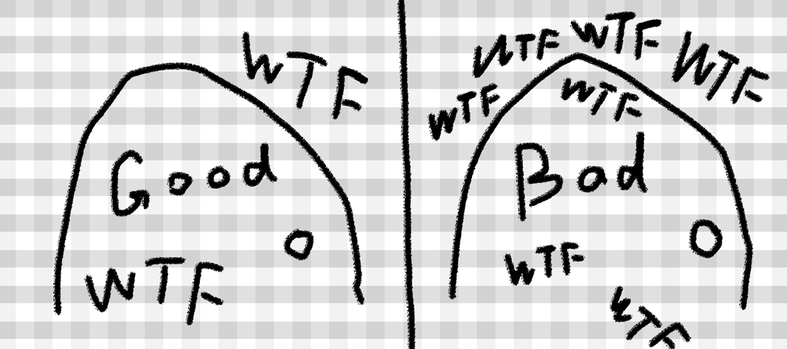

import {EmbedGiscus} from '@site/src/components/Talk'



**就像图中所说的，好的代码，被吐槽的相对就较少，杂乱繁重的代码，可能就充满了吐槽**

整洁的代码是易于阅读的代码，容易理解，并且易于维护。简洁的代码是一种尝试，以了解我们正在处理的系统的复杂。
它是一种防御机制，当你不确定某个更改将如何影响代码库时，它可以提供指导。尽管手册存在有效的批评，
并且示例被认为已过时，但这些原则仍然非常相关。 特别是对于面向对象的语言，例如Solidity。
它们适用于设计和编写安全，开源和不变的代码，如智能合约。

整洁的代码是易于阅读的代码，容易理解，并且易于维护。
简洁的代码是一种尝试，以了解我们正在处理的系统的复杂。
它是一种防御机制，当你不确定某个更改将如何影响代码库时，它可以提供指导。
尽管手册存在有效的批评，并且示例被认为已过时，但这些原则仍然非常相关。
特别是对于面向对象的语言，例如Solidity。 它们适用于设计和编写安全，开源和不变的代码，如智能合约。

本篇介绍几种可应用于区块链和智能合约开发的模式，实践和原则，以降低与之相关的风险。

:::warning 注意
风格指南是关于一致性的。重要的是与此风格指南保持一致。
但项目中的一致性更重要。一个模块或功能内的一致性是最重要的。
但最重要的是：知道什么时候不一致 —— 有时风格指南不适用。
如有疑问，请自行判断。看看其他例子，并决定什么看起来最好。并应毫不犹豫地询问他人！
:::

### 命名

合约、函数或变量的命名应该揭示其意图、存在原因以及如何使用。如果一个名字需要注释来解释，那么它不会透露它的意图。
代码的命名要一致。特别是当你使用一个大型的代码库时。在多个合约中，对抽象概念使用相同的名称。
使用可读得出的名字。
使用可搜索的名称。

> “There are only two hard things in Computer Science: cache invalidation and naming things.”（计算科学中最难的两件事是缓存失效和命名） - Phil Karlton

为了避免混淆，下面的名字用来指明不同的命名方式。

- b (单个小写字母)
- B (单个大写字母)
- lowercase （小写）
- UPPERCASE （大写）
- UPPER_CASE_WITH_UNDERSCORES （大写和下划线）
- CapitalizedWords (驼峰式，首字母大写）
- mixedCase (混合式，与驼峰式的区别在于首字母小写！)

:::info
当在驼峰式命名中使用缩写时，应该将缩写中的所有字母都大写。 
因此 `HTTPServerError` 比 `HttpServerError` 好。
当在混合式命名中使用缩写时，除了第一个缩写中的字母小写（如果它是整个名称的开头的话）以外，
其他缩写中的字母均大写。 因此 `xmlHTTPRequest` 比 `XMLHTTPRequest` 更好。
:::

#### 应避免的名称

- l - el的小写方式
- O - oh的大写方式
- I - eye的大写方式
切勿将任何这些用于单个字母的变量名称。 他们经常难以与数字 1 和 0 区分开。

#### 合约和库名称
合约和库名称应该使用驼峰式风格。
比如： `SimpleToken`，`SmartBank`，`CertificateHashRepository`，`Player`，`Congress`,`Owned`。 
- 合约和库的名称应该和他们的文件名一致。 
- 如果合约文件包含多个合约或库，则文件名应该匹配核心合约，但我们应该尽量避免这个情况。

如下面的例子所示，如果合约名称是 `Congress` ，库名称是 `Owned`，那么它们的相关文件名应该是 `Congress.sol` 和 `Owned.sol` 。

正确写法:

```js
// SPDX-License-Identifier: GPL-3.0
pragma solidity ^0.7.0;

// Owned.sol
contract Owned {
address public owner;

    constructor() {
        owner = msg.sender;
    }

    modifier onlyOwner {
        require(msg.sender == owner);
        _;
    }

    function transferOwnership(address newOwner) public onlyOwner {
        owner = newOwner;
    }
}
```
在 `Congress.sol` 文件中:

```js
// SPDX-License-Identifier: GPL-3.0
pragma solidity >=0.4.0 <0.9.0;

import "./Owned.sol";

contract Congress is Owned, TokenRecipient {
//...
}
```

#### 结构体名称
结构体名称应该使用驼峰式风格。比如：`MyCoin`，`Position`，`PositionXY`。

#### 事件名称
事件名称应该使用驼峰式风格。比如：`Deposit`，`Transfer`，`Approval`，`BeforeTransfer`，`AfterTransfer`。

#### 函数名称
函数应该使用混合式命名风格。比如：`getBalance`，`transfer`，`verifyOwner`，`addMember`，`changeOwner`。

#### 函数参数命名
函数参数命名应该使用混合式命名风格。比如：`initialSupply`，`account`，`recipientAddress`，`senderAddress`，`newOwner`。 
在编写操作自定义结构的库函数时，这个结构体应该作为函数的第一个参数，并且应该始终命名为 `self`。

#### 局部变量和状态变量名称
使用混合式命名风格。比如：`totalSupply`，`remainingSupply`，`balancesOf`，`creatorAddress`，`isPreSale`，`tokenExchangeRate`。

#### 常量命名
常量应该全都使用大写字母书写，并用下划线分割单词。比如：`MAX_BLOCKS`，`TOKEN_NAME`，`TOKEN_TICKER`，`CONTRACT_VERSION`。

#### 修饰符命名
使用混合式命名风格。比如：`onlyBy`，`onlyAfter`，`onlyDuringThePreSale`。

#### 枚举命名
在声明简单类型时，枚举应该使用驼峰式风格。比如：`TokenGroup`，`Frame`，`HashStyle`，`CharacterLocation`。

#### 避免命名冲突
`singleTrailingUnderscore_`
当所起名称与内建或保留关键字相冲突时，建议照此惯例在名称后边添加下划线。


### 代码结构顺序
按以下顺序排列合约元素
- Pragma 语句
- Import 语句
- Interfaces
- Libraries
- Contracts

在每个合约、库或接口中，使用以下顺序
- 类型声明
- 状态变量
- Events 事件
- Modifier 修改器
- Functions 函数

:::info
在声明类型时，挨着其使用的时间或状态时，会更清晰。
:::

### 缩进
每个缩进级别使用4个空格。

### 制表符或空格
空格是首选的缩进方法。

应该避免混合使用制表符和空格。

### 空行
在 Solidity 源码中合约声明之间留出两个空行。

### 代码行的最大长度

将代码行的字符长度控制在 79（或 99）字符来帮助读者阅读代码。
折行时应该遵从以下指引：
- 第一个参数不应该紧跟在左括号后边
- 用一个、且只用一个缩进
- 每个函数应该单起一行
- 结束符号 ); 应该单独放在最后一行

### 源文件编码格式

首选 UTF-8 或 ASCII 编码。
**导入文件规范**
Import 语句应始终放在文件的顶部。

### 函数顺序
排序有助于读者识别他们可以调用哪些函数，并更容易地找到构造函数和 fallback 函数的定义。

函数应根据其可见性和顺序进行分组：

- 构造函数
- receive 函数（如果存在）
- fallback 函数（如果存在）
- 外部函数(external)
- 公共函数(public)
- 内部函数(internal)
- 私有函数(private)
- 在一个分组中，把 view 和 pure 函数放在最后。

### 表达式中的空格
在以下情况下避免无不必要的空格：
除单行函数声明外，紧接着小括号，中括号或者大括号的内容应该避免使用空格。
正确写法:
```js
spam(ham[1], Coin({name: "ham"}));
```

### 控制结构
用大括号表示一个合约，库、函数和结构。 应该：

- 开括号与声明应在同一行。
- 闭括号在与之前函数声明对应的开括号保持同一缩进级别上另起一行。
- 开括号前应该有一个空格。

对于控制结构 `if`， `else`， `while`， `for` 的实施建议与以上相同。

另外，诸如 `if`， `else`， `while`， `for` 这类的控制结构和条件表达式的块之间应该有一个单独的空格，
同样的，条件表达式的块和开括号之间也应该有一个空格。

正确写法:
```js
if (...) {
    ...
}

for (...) {
    ...
}
```

对于控制结构， 如果 其主体内容只包含一行，则可以省略括号。

正确写法:
```js
if (x < 10)
    x += 1;
```

对于具有 `else` 或 `else if` 子句的 `if` 块， 
`else` 应该是与 `if` 的闭大括号放在同一行上。 这一规则区别于 其他块状结构。

正确写法:
```js

if (x < 3) {
    x += 1;
} else if (x > 7) {
    x -= 1;
} else {
    x = 5;
}

if (x < 3)
    x += 1;
else
    x -= 1;
```

### 函数声明
对于简短的函数声明，建议函数体的开括号与函数声明保持在同一行。

闭大括号应该与函数声明的缩进级别相同。

开大括号之前应该有一个空格。

正确写法:
```js
function increment(uint x) public pure returns (uint) {
    return x + 1;
}

function increment(uint x) public pure onlyowner returns (uint) {
    return x + 1;
}
```

你应该严格地标示所有函数的可见性，包括构造函数。

正确写法:
```js
function explicitlyPublic(uint val) public {
    doSomething();
}
```

### 函数修改器的顺序

- 可见性（Visibility）
- 可变性（Mutability）
- 虚拟（Virtual）
- 重载（Override）
- 自定义修改器（Custom modifiers）

正确写法:
```js
function balance(uint from) public view override returns (uint)  {
    return balanceOf[from];
}

function shutdown() public onlyowner {
    selfdestruct(owner);
}
```

对于长函数声明，建议将每个参数独立一行并与函数体保持相同的缩进级别。闭括号和开括号也应该 独立一行并保持与函数声明相同的缩进级别。

正确写法:
```js

function thisFunctionHasLotsOfArguments(
    address a,
    address b,
    address c,
    address d,
    address e,
    address f
)
public
{
    doSomething();
}
```

如果一个长函数声明有修饰符，那么每个修饰符应该下沉到独立的一行。

正确写法:
```js
function thisFunctionNameIsReallyLong(address x, address y, address z)
    public
    onlyowner
    priced
    returns (address)
{
    doSomething();
}

function thisFunctionNameIsReallyLong(
    address x,
    address y,
    address z
)
    public
    onlyowner
    priced
    returns (address)
{
    doSomething();
}
```

多行输出参数和返回值语句应该遵从 代码行的最大长度 一节的说明。

正确写法:
```js
function thisFunctionNameIsReallyLong(
    address a,
    address b,
    address c
)
    public
    returns (
        address someAddressName,
        uint256 LongArgument,
        uint256 Argument
)
{
    doSomething()

    return (
        veryLongReturnArg1,
        veryLongReturnArg2,
        veryLongReturnArg3
    );
}
```

对于继承合约中需要参数的构造函数，如果函数声明很长或难以阅读，建议将基础构造函数像多个修饰符的风格那样 每个下沉到一个新行上书写。

正确写法:

```js
// SPDX-License-Identifier: GPL-3.0
pragma solidity ^0.7.0;

// Base contracts just to make this compile
contract B {
    constructor(uint) {
    }
}
contract C {
    constructor(uint, uint) {
    }
}
contract D {
    constructor(uint) {
    }
}

contract A is B, C, D {
    uint x;

    constructor(uint param1, uint param2, uint param3, uint param4, uint param5)
        B(param1)
        C(param2, param3)
        D(param4)
    {
        // do something with param5
        x = param5;
    }
}
```

当用单个语句声明简短函数时，允许在一行中完成。
允许的写法:
```js
function shortFunction() public { doSomething(); }
```

### 映射
在变量声明中，不要用空格将关键字 mapping 和其类型分开。 类型之间用一个空格隔开。不要用空格分隔任何嵌套的 mapping 关键词和它的类型。

正确写法:
```js
mapping(uint => uint) map;
mapping(address => bool) registeredAddresses;
mapping(uint => mapping(bool => Data[])) public data;
mapping(uint => mapping(uint => s)) data;
```
### 变量声明
数组变量的声明在变量类型和括号之间不应该有空格。

正确写法:
```js
uint[] x;
```

### 其他建议
**字符串应该用双引号而不是单引号**。
正确写法:
```js
str = "foo";
str = "Hamlet says, 'To be or not to be...'";
```
**操作符两边应该各有一个空格。**
正确写法:
```js
x = 3;
x = 100 / 10;
x += 3 + 4;
x |= y && z;
```

为了表示优先级，高优先级操作符两边可以省略空格。这样可以提高复杂语句的可读性。
你应该在操作符两边总是使用相同的空格数：
正确写法:
```js
x = 2**3 + 5;
x = 2*y + 3*z;
x = (a+b) * (a-b);
```

### 描述注释 NatSpec
Solidity 智能合约包含了NatSpec注释形式。 
单行使用 /// 开始，多行使用 /** 开头以 */ 结尾。

例如, 以来自 简单合约 加上注释为例，看上去是这样：

```js
pragma solidity >=0.4.16 <0.9.0;

/// @author The Solidity Team
/// @title A simple storage example
contract TinyStorage {
uint storedData;

    /// Store `x`.
    /// @param x the new value to store
    /// @dev stores the number in the state variable `storedData`
    function set(uint x) public {
        storedData = x;
    }

    /// Return the stored value.
    /// @dev retrieves the value of the state variable `storedData`
    /// @return the stored value
    function get() public view returns (uint) {
        return storedData;
    }
}
```
注释详细的表述可查看：[natspec-format](https://docs.soliditylang.org/en/latest/natspec-format.html)


### 自动化格式
阅读代码应该像阅读这个博客、一篇文章或一本书一样。它应该被很好地格式化。Solidity风格指南为编写Solidity代码提供了指导。它的目标不是正确的或唯一的方法，而是要保持一致。

可以通过使用lint来实现一致性。 这不仅提供格式和样式指南验证，还包括安全验证。

Solidity可用的lint

- [Ethlint](https://github.com/duaraghav8/Ethlint) (原名 Solium)
- [Solhint](https://github.com/protofire/solhint)
- [VS Code Solidity](https://github.com/juanfranblanco/vscode-solidity/)
为您的dapp开发使用常规的lint（例如eslint，具体取决于您的语言）。

### 错误处理
异常是现代软件工程的关键部分。它们需要特殊处理，并且功能非常强大。
与其对抗，我们应该尝试利用它们，因为未处理的异常可能会导致意外行为。

当在Solidity代码中引发异常时，所有状态更改都将回滚并停止进一步执行。
幸运的是，Solidity内置了异常处理功能（自0.6版本开始）。这仅适用于外部调用（external calls）。

为异常提供足够的上下文，以确定错误的来源和原因。尝试编写引发这些异常的测试。

尝试编写抛出这些异常的测试。

不要返回null。不要将null传递给函数。

保护检查（Guard Checks）可以帮助确保智能合约的行为及其输入参数符合预期。

正确使用 `assert()`, `require()`, `revert()`。
`assert` 应该用于测试内部错误，并检查常量。
`require` 应该用于测试输入，合约状态变量或来自外部合约的返回值是否有效。

如果交易没有足够的gas来执行，则不会捕获gas溢出错误。

<EmbedGiscus>giscusStandards</EmbedGiscus>
